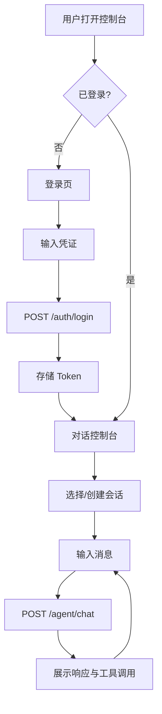
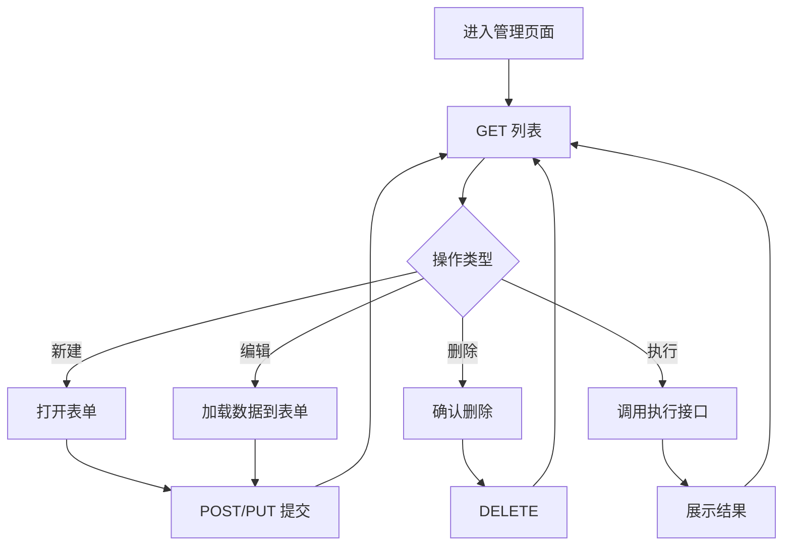

# HarnessClaw Agent 控制台 - 产品需求文档（PRD）

## 1. 产品概述

HarnessClaw 是一个服务端 AI Agent 框架，提供多用户对话、技能管理、工具调用、工作流编排与系统监控能力。本前端为其配套的 **Agent 控制台 Web UI**，面向开发者与系统管理员，用于可视化地驱动 Agent、管理资源并监控运行状态。

- 目标用户：开发者（管理技能/工具/工作流）、系统管理员（监控运行、配置 LLM）、终端用户（发起对话）
- 核心价值：将分散的 REST API 统一为一个高效、专业的操作控制台，实时反馈 Agent 执行状态

## 2. 核心功能

### 2.1 用户角色

| 角色 | 注册方式 | 核心权限 |
|------|----------|----------|
| 普通用户 | 用户名注册 | 发起对话、查看历史、管理自有技能/工具/工作流 |
| 管理员 | 普通用户提升 | 上述全部 + 系统监控、LLM 配置、日志查看 |

### 2.2 功能模块

1. **认证模块**：登录、注册、Token 刷新、当前用户信息
2. **对话控制台**：Agent 对话交互、会话管理、消息历史、工具调用展示
3. **技能管理**：技能列表、创建/编辑/删除、执行、训练
4. **工具管理**：工具列表、注册/编辑/删除、执行测试
5. **工作流管理**：工作流列表、创建/编辑/删除、执行、执行记录
6. **LLM 配置**：配置列表、创建/编辑/删除、激活配置、获取可用模型
7. **监控仪表盘**：系统日志、LLM 日志、调用统计、Agent 状态
8. **用户设置**：个人信息、主题设置

### 2.3 页面详情

| 页面名称 | 模块名称 | 功能描述 |
|----------|----------|----------|
| 登录页 | 认证模块 | 用户名密码登录，获取 Token，跳转控制台 |
| 注册页 | 认证模块 | 用户名密码注册，注册成功后跳转登录 |
| 对话控制台 | Agent+Sessions | 左侧会话列表，右侧消息流，底部输入框，工具调用折叠展示，Agent 状态指示 |
| 技能管理 | Skills | 技能卡片列表，新建/编辑抽屉表单，执行/训练操作 |
| 工具管理 | Tools | 工具表格列表，参数 Schema 展示，注册/编辑表单，执行测试面板 |
| 工作流管理 | Workflows | 工作流列表，节点/边 JSON 编辑，执行与执行记录查看 |
| LLM 配置 | LLM | 配置列表，新建/编辑表单，激活切换，可用模型查询 |
| 监控仪表盘 | Logs | 统计卡片，系统日志表格（筛选），LLM 日志表格，Agent 状态 |
| 设置页 | Settings | 用户信息展示，登出 |

## 3. 核心流程

### 3.1 登录与对话流程

用户打开控制台 → 未登录跳转登录页 → 输入凭证获取 Token → 进入对话控制台 → 选择/创建会话 → 输入消息 → Agent 处理并返回响应（含工具调用）→ 消息追加到流中。

### 3.2 资源管理流程

进入管理页面 → 加载列表（分页）→ 新建/编辑（表单提交）→ 删除（确认）→ 执行/训练（操作反馈）。

## 4. 用户界面设计

### 4.1 设计风格

**设计方向：暗夜控制台（Midnight Console）**

一个面向 AI Agent 运维的专业控制台美学，融合终端磷光感与现代仪表盘的精致感。

- **主色调**：深炭黑底（#0a0a0b / #111113），琥珀金主强调色（#f5a623 / #ffb627），青色次强调（#22d3ee）用于状态/链接
- **按钮风格**：低圆角（4-6px），实色填充主按钮，幽灵边框次按钮，hover 时微光晕
- **字体**：显示/数据字体使用 `JetBrains Mono`（等宽，技术感），正文使用 `Manrope`（现代无衬线）
- **布局风格**：左侧固定导航栏 + 顶部状态条 + 主内容区，卡片式信息块，网格化数据展示
- **图标风格**：Lucide 图标，线性风格，1.5px 描边
- **氛围细节**：微弱噪点纹理叠加、状态指示灯（呼吸动画）、等宽字体数据标签、分隔线使用低透明度

### 4.2 页面设计概览

| 页面名称 | 模块名称 | UI 元素 |
|----------|----------|----------|
| 登录页 | 表单区 | 居中卡片，深色背景，琥珀色登录按钮，等宽字体标签，顶部 Logo |
| 对话控制台 | 会话侧栏 + 消息流 + 输入区 | 三栏布局，左侧会话列表，中间消息气泡流，底部输入框，右侧可折叠工具调用详情 |
| 技能管理 | 列表区 + 表单抽屉 | 卡片网格列表，右上角新建按钮，侧滑抽屉表单，启用状态开关 |
| 工具管理 | 表格区 + 执行面板 | 数据表格，参数 Schema 树形展示，底部执行测试面板 |
| 工作流管理 | 列表区 + JSON 编辑器 | 卡片列表，节点/边 JSON 代码编辑器，执行记录时间线 |
| LLM 配置 | 列表区 + 表单弹窗 | 配置卡片列表，激活状态徽章，模型选择下拉，温度滑块 |
| 监控仪表盘 | 统计卡 + 日志表 | 顶部统计卡片行，下方双 Tab 日志表格，筛选器，分页器 |
| 设置页 | 信息卡 | 用户信息展示，登出按钮 |

### 4.3 响应式

- 桌面优先（1280px+），主内容区最大宽度 1400px
- 平板自适应（768-1280px），侧栏可折叠
- 移动端基础适配（<768px），单栏堆叠

## 5. API 映射

| 页面 | 调用接口 |
|------|----------|
| 登录页 | POST /auth/login |
| 注册页 | POST /auth/register |
| 全局 | POST /auth/refresh, GET /auth/me |
| 对话控制台 | POST /agent/chat, GET /agent/status, GET/POST /sessions, GET /sessions/{id}, PUT/DELETE /sessions/{id}, GET /sessions/{id}/messages, POST /sessions/{id}/messages |
| 技能管理 | GET/POST /skills, GET/PUT/DELETE /skills/{id}, POST /skills/{id}/execute, POST /skills/train |
| 工具管理 | GET/POST /tools, GET/PUT/DELETE /tools/{id}, POST /tools/{id}/execute |
| 工作流管理 | GET/POST /workflows, GET/PUT/DELETE /workflows/{id}, POST /workflows/{id}/execute, GET /workflows/{id}/executions |
| LLM 配置 | GET/POST /llm/configs, GET/PUT/DELETE /llm/configs/{id}, POST /llm/configs/{id}/activate, GET /llm/models |
| 监控仪表盘 | GET /logs/system, GET /logs/llm, GET /logs/llm/statistics |
