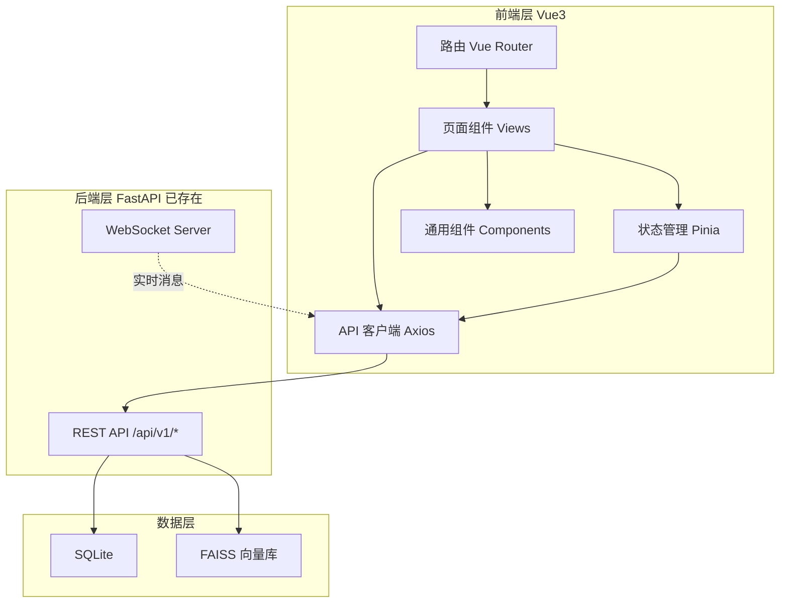

# HarnessClaw Agent 控制台 - 技术架构文档

## 1. 架构设计



前端为纯 SPA，通过 REST API 调用已有 FastAPI 后端。所有数据持久化在后端 SQLite + FAISS 中，前端无本地数据库。

## 2. 技术说明

- **前端框架**：Vue 3 + TypeScript（`<script setup>` 组合式 API）
- **构建工具**：Vite
- **样式方案**：Tailwind CSS 3（自定义暗夜控制台主题）
- **路由**：Vue Router 4
- **状态管理**：Pinia
- **HTTP 客户端**：Axios（统一拦截器处理 Token 与错误）
- **图标**：lucide-vue-next
- **初始化工具**：vite-init（vue-ts 模板）
- **后端**：已存在 FastAPI（无需新建），API 前缀 `/api/v1`

## 3. 路由定义

| 路由 | 页面 | 说明 | 需认证 |
|------|------|------|--------|
| `/login` | LoginView | 登录页 | 否 |
| `/register` | RegisterView | 注册页 | 否 |
| `/` | ChatView | 对话控制台（重定向到 /chat） | 是 |
| `/chat` | ChatView | Agent 对话控制台 | 是 |
| `/skills` | SkillsView | 技能管理 | 是 |
| `/tools` | ToolsView | 工具管理 | 是 |
| `/workflows` | WorkflowsView | 工作流管理 | 是 |
| `/llm` | LlmView | LLM 配置 | 是 |
| `/monitor` | MonitorView | 监控仪表盘 | 是 |
| `/settings` | SettingsView | 用户设置 | 是 |

路由守卫：未登录访问受保护页面时跳转 `/login`，已登录访问 `/login`/`/register` 时跳转 `/chat`。

## 4. API 定义

### 4.1 统一响应格式

```typescript
// 后端统一响应结构
interface ApiResponse<T = unknown> {
  success: boolean
  message: string
  data: T
}

// 分页响应结构
interface PaginatedData<T> {
  items: T[]
  total: number
  page: number
  limit: number
}
```

### 4.2 核心数据类型

```typescript
// 认证
interface LoginRequest { username: string; password: string }
interface AuthTokens { access_token: string; refresh_token: string; token_type: string }
interface UserInfo { id: number; username: string; email: string | null; created_at: string }

// 会话
interface Session {
  id: number; user_id: number; session_key: string
  title: string | null; status: string
  created_at: string; updated_at: string | null
}
interface Message {
  id: number; session_id: number; role: string
  content: string; tool_call: unknown | null
  created_at: string
}

// Agent
interface ChatRequest { message: string; session_id?: number }
interface ChatResponse {
  response: string; session_id: number; iterations: number
  tool_calls: Array<{ tool_name: string; result: string }>; error: string | null
}

// 技能
interface Skill {
  id: number; user_id: number; name: string
  description: string | null; prompt: string | null
  is_enabled: boolean; created_at: string
}

// 工具
interface ToolParameter { name: string; type: string; required: boolean; description: string }
interface Tool {
  id: number; name: string; description: string | null
  function_name: string; module_path: string
  parameters: ToolParameter[]; return_type: string | null
  is_enabled: boolean; created_at: string
}

// 工作流
interface Workflow {
  id: number; user_id: number; name: string
  description: string | null; nodes: unknown[]; edges: unknown[]
  is_enabled: boolean; created_at: string
}

// LLM 配置
interface LlmConfig {
  id: number; user_id: number; name: string
  api_key: string; api_base: string; model_name: string
  max_tokens: number; temperature: number
  is_active: boolean; created_at: string
}

// 日志
interface SystemLog {
  id: number; user_id: number; log_type: string
  module: string; message: string; created_at: string
}
interface LlmLog {
  id: number; user_id: number; config_id: number
  model_name: string; prompt_tokens: number
  completion_tokens: number; total_tokens: number
  latency_ms: number; status: string; created_at: string
}
interface LlmStatistics {
  total_calls: number; total_tokens: number
  avg_latency_ms: number; success_rate: number
}
```

### 4.3 API 端点清单

```typescript
// API 基础地址
const API_BASE = '/api/v1'

// Auth
POST   /auth/login          → AuthTokens
POST   /auth/register       → UserInfo
POST   /auth/refresh        → AuthTokens
GET    /auth/me             → UserInfo

// Agent
POST   /agent/chat          → ChatResponse
GET    /agent/status        → AgentStatus

// Sessions
GET    /sessions            → PaginatedData<Session>
POST   /sessions            → Session
GET    /sessions/:id        → Session
PUT    /sessions/:id        → Session
DELETE /sessions/:id        → void
GET    /sessions/:id/messages → PaginatedData<Message>
POST   /sessions/:id/messages → Message

// Skills
GET    /skills              → PaginatedData<Skill>
POST   /skills              → Skill
GET    /skills/:id          → Skill
PUT    /skills/:id          → Skill
DELETE /skills/:id          → void
POST   /skills/:id/execute  → ExecutionResult
POST   /skills/train        → TrainResult

// Tools
GET    /tools               → Tool[]
POST   /tools               → Tool
GET    /tools/:id           → Tool
PUT    /tools/:id           → Tool
DELETE /tools/:id           → void
POST   /tools/:id/execute   → ExecutionResult

// Workflows
GET    /workflows           → PaginatedData<Workflow>
POST   /workflows           → Workflow
GET    /workflows/:id       → Workflow
PUT    /workflows/:id       → Workflow
DELETE /workflows/:id       → void
POST   /workflows/:id/execute → ExecutionResult
GET    /workflows/:id/executions → ExecutionRecord[]

// LLM
GET    /llm/configs         → LlmConfig[]
POST   /llm/configs         → LlmConfig
GET    /llm/configs/:id     → LlmConfig
PUT    /llm/configs/:id     → LlmConfig
DELETE /llm/configs/:id     → void
POST   /llm/configs/:id/activate → LlmConfig
GET    /llm/models          → string[]

// Logs
GET    /logs/system         → PaginatedData<SystemLog>
GET    /logs/llm            → PaginatedData<LlmLog>
GET    /logs/llm/statistics → LlmStatistics
```

## 5. 前端目录结构

```
frontend/
├── src/
│   ├── api/                # API 调用层
│   │   ├── client.ts       # Axios 实例与拦截器
│   │   ├── auth.ts
│   │   ├── agent.ts
│   │   ├── sessions.ts
│   │   ├── skills.ts
│   │   ├── tools.ts
│   │   ├── workflows.ts
│   │   ├── llm.ts
│   │   └── logs.ts
│   ├── components/         # 通用组件
│   │   ├── layout/         # AppLayout, Sidebar, TopBar
│   │   ├── ui/             # BaseButton, BaseCard, BaseTable, BaseModal, BaseInput, Badge, Pagination
│   │   └── shared/         # EmptyState, LoadingState, ErrorState, ConfirmDialog
│   ├── composables/        # 组合式函数
│   │   ├── useApi.ts       # 通用请求封装
│   │   └── usePagination.ts
│   ├── router/             # 路由
│   │   └── index.ts
│   ├── stores/             # Pinia 状态
│   │   ├── auth.ts
│   │   ├── chat.ts
│   │   └── ui.ts
│   ├── types/              # TypeScript 类型定义
│   │   └── index.ts
│   ├── views/              # 页面视图
│   │   ├── LoginView.vue
│   │   ├── RegisterView.vue
│   │   ├── ChatView.vue
│   │   ├── SkillsView.vue
│   │   ├── ToolsView.vue
│   │   ├── WorkflowsView.vue
│   │   ├── LlmView.vue
│   │   ├── MonitorView.vue
│   │   └── SettingsView.vue
│   ├── App.vue
│   ├── main.ts
│   └── style.css           # Tailwind + 全局样式
├── index.html
├── package.json
├── tsconfig.json
├── vite.config.ts
├── tailwind.config.js
└── postcss.config.js
```

## 6. 设计系统（Tailwind 主题）

```javascript
// tailwind.config.js 关键配置
colors: {
  // 暗夜控制台配色
  base: {       // 背景层次
    950: '#0a0a0b',  // 最深背景
    900: '#111113',  // 主背景
    850: '#161618',  // 卡片背景
    800: '#1c1c1f',  // 悬浮背景
    700: '#26262a',  // 边框
    600: '#34343a',  // 分隔线
  },
  amber: {      // 主强调色（磷光琥珀）
    DEFAULT: '#f5a623',
    glow: '#ffb627',
    dim: '#b87b1a',
  },
  cyan: {       // 次强调色（状态/链接）
    DEFAULT: '#22d3ee',
    dim: '#0e7490',
  },
  status: {     // 状态色
    success: '#34d399',
    warning: '#fbbf24',
    error: '#f87171',
  },
}
fontFamily: {
  mono: ['JetBrains Mono', 'monospace'],   // 数据/标签
  sans: ['Manrope', 'sans-serif'],         // 正文
}
```

## 7. 关键实现说明

### 7.1 API 客户端

- Axios 实例统一配置 `baseURL: '/api/v1'`
- 请求拦截器：自动注入 `Authorization: Bearer <token>`
- 响应拦截器：统一解包 `{ success, message, data }`，失败时抛出含 message 的错误
- 401 拦截：清除 Token 并跳转登录页

### 7.2 认证状态管理

- Pinia `auth` store：token、refreshToken、user 信息
- Token 持久化到 localStorage
- 路由守卫读取 store 判断认证状态

### 7.3 对话控制台

- 会话列表从 `GET /sessions` 加载，支持新建
- 选中会话后从 `GET /sessions/:id/messages` 加载历史消息
- 发送消息调用 `POST /agent/chat`，响应追加到消息流
- 工具调用结果以可折叠区块展示
- Agent 状态从 `GET /agent/status` 轮询/展示
