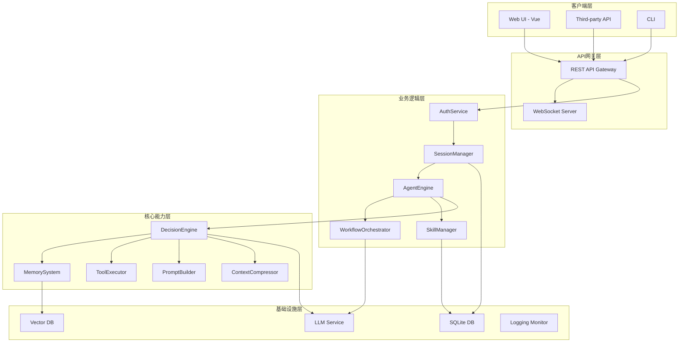
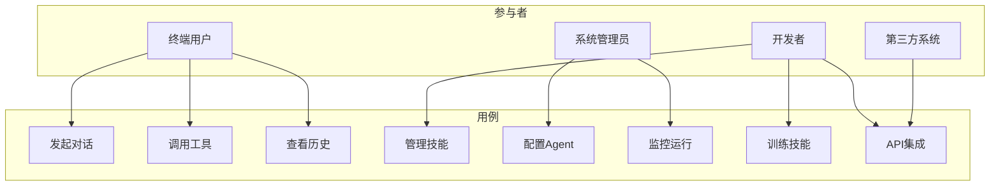
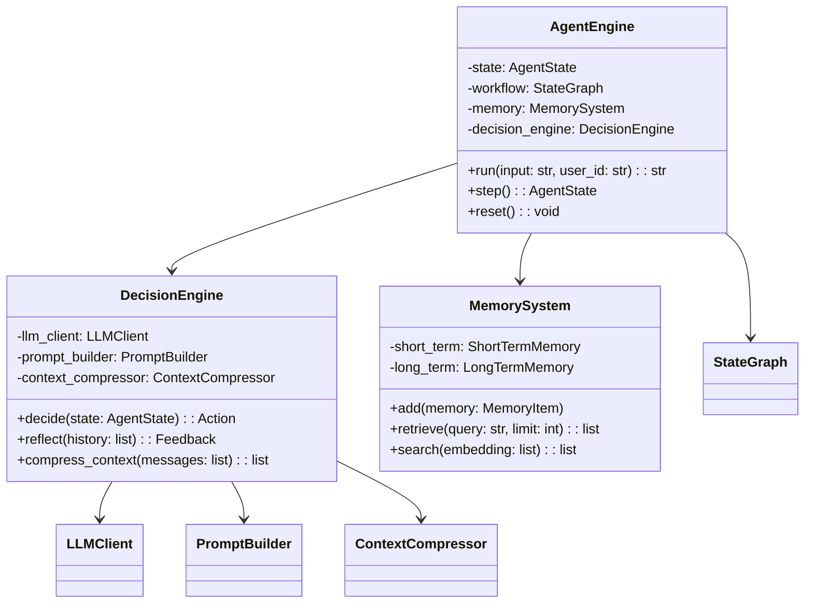
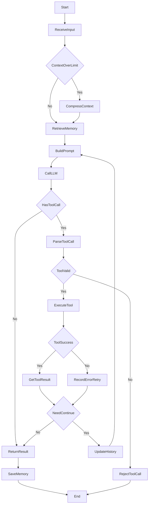
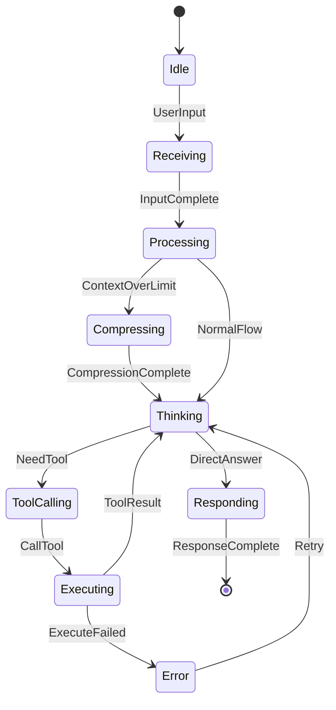
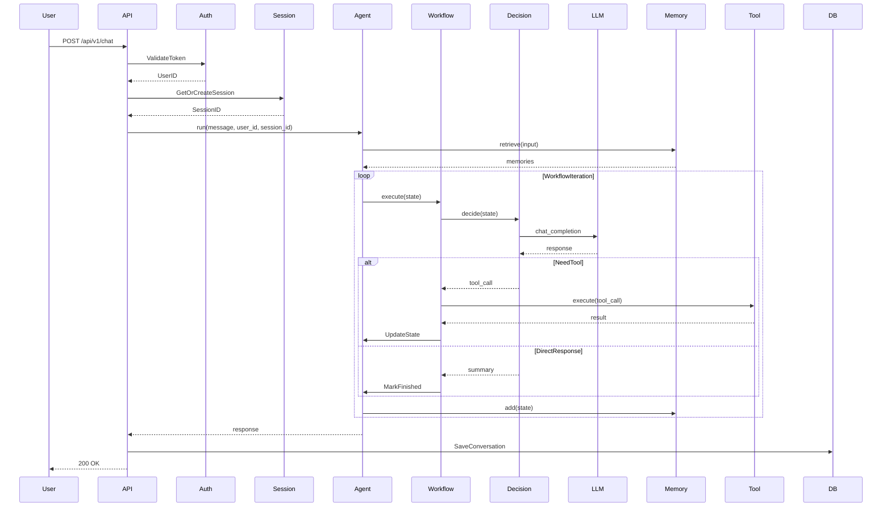
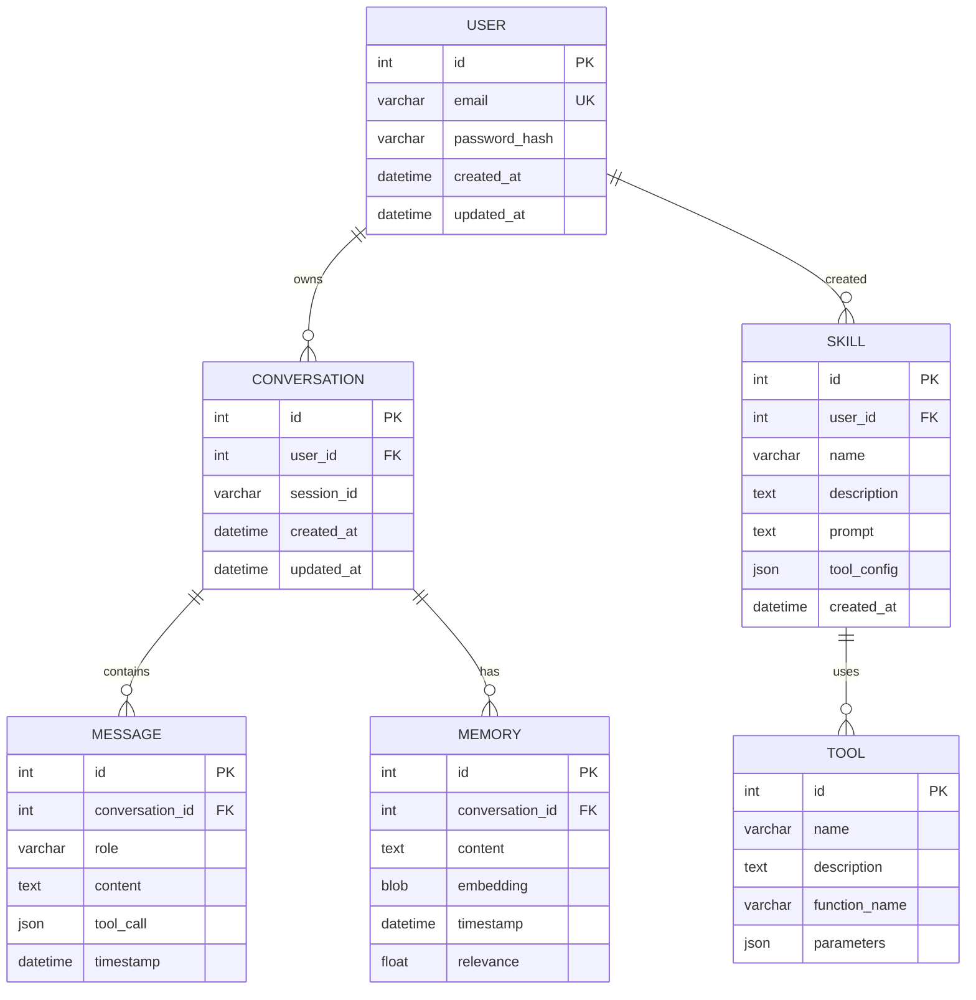
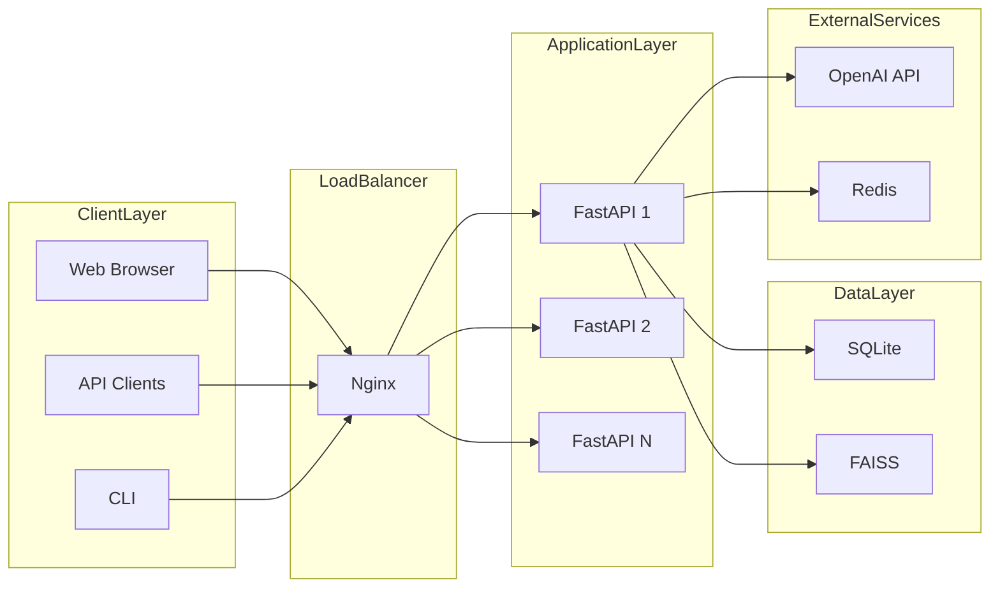

# AI Agent Framework - 整体架构设计文档

## 1. 文档概述

### 1.1 文档目的

本文档描述基于 LangChain + LangGraph 构建的**服务端 AI Agent 框架**的整体架构设计，涵盖：

- 系统模块划分
- 整体用例分析
- 代码模型架构
- 运行视图架构
- 技术模型架构

### 1.2 设计约束

| 约束项   | 约束值               | 说明                |
| ----- | ----------------- | ----------------- |
| 前端框架  | Vue 3             | 单页应用，组件化开发        |
| 后端语言  | Python 3.11.4     | 异步支持、类型提示         |
| 数据库   | SQLite            | 本地轻量级存储           |
| 向量库   | FAISS / Chroma    | 本地向量检索            |
| LLM协议 | OpenAI Compatible | 支持OpenAI API协议    |
| 部署模式  | 服务端运行             | 多用户支持、RESTful API |

### 1.3 架构定位

与 OpenClaw（本地个人助手）和 Hermes-agent（本地/混合部署）不同，本框架定位为**服务端 Agent 平台**：

- 支持多用户并发访问
- 提供 RESTful API 接口
- 集中式状态管理
- 可水平扩展部署

***

## 2. 整体逻辑架构

### 2.1 架构层次



### 2.2 模块划分

| 层级     | 模块                   | 职责描述         | OpenClaw参考   | Hermes参考               |
| ------ | -------------------- | ------------ | ------------ | ---------------------- |
| 客户端层   | Web UI               | Vue 3前端界面    | -            | -                      |
| <br /> | Third-party API      | 外部系统集成       | -            | -                      |
| <br /> | CLI                  | 命令行接口        | src/cli/     | cli.py                 |
| API网关层 | REST API Gateway     | 请求路由、认证、限流   | src/gateway/ | gateway/               |
| <br /> | WebSocket Server     | 实时消息推送       | src/gateway/ | -                      |
| 业务逻辑层  | AuthService          | 用户认证、权限管理    | -            | -                      |
| <br /> | SessionManager       | 多用户会话隔离      | -            | session.py             |
| <br /> | AgentEngine          | 核心Agent循环    | src/agents/  | run\_agent.py          |
| <br /> | WorkflowOrchestrator | LangGraph工作流 | -            | -                      |
| <br /> | SkillManager         | 技能注册、执行、学习   | skills/      | skill\_commands.py     |
| 核心能力层  | DecisionEngine       | LLM调用、工具选择   | -            | conversation\_loop.py  |
| <br /> | MemorySystem         | 短期/长期记忆、检索   | src/memory/  | memory\_manager.py     |
| <br /> | ToolExecutor         | 工具调用、结果处理    | src/tools/   | tools/                 |
| <br /> | PromptBuilder        | 动态提示词组装      | -            | prompt\_builder.py     |
| <br /> | ContextCompressor    | Token管理、摘要生成 | -            | context\_compressor.py |
| 基础设施层  | LLM Service          | OpenAI协议兼容调用 | providers/   | model\_tools.py        |
| <br /> | Vector DB            | 向量存储与检索      | src/memory/  | hermes\_state.py       |
| <br /> | SQLite DB            | 结构化数据存储      | -            | hermes\_state.py       |
| <br /> | Logging Monitor      | 运行日志、指标收集    | -            | -                      |

***

## 3. 系统用例分析

### 3.1 用例图



### 3.2 用例详情

| 用例ID | 用例名称    | 执行者   | 前置条件     | 主流程                                           | 后置条件   |
| ---- | ------- | ----- | -------- | --------------------------------------------- | ------ |
| UC1  | 发起对话    | 终端用户  | 用户已认证    | 1. 用户输入消息 2. 系统路由到Agent 3. Agent执行工作流 4. 返回响应 | 对话记录存储 |
| UC2  | 调用工具    | Agent | 工具已注册    | 1. 决策引擎选择工具 2. 执行工具调用 3. 处理返回结果 4. 总结回复       | 工具调用记录 |
| UC3  | 查看历史    | 终端用户  | 存在历史记录   | 1. 请求历史列表 2. 分页返回记录                           | 历史数据返回 |
| UC4  | 管理技能    | 开发者   | 已授权      | 1. 上传/编辑技能 2. 注册到技能库                          | 技能更新生效 |
| UC5  | 配置Agent | 管理员   | 管理员权限    | 1. 修改配置参数 2. 保存配置                             | 配置持久化  |
| UC6  | 监控运行    | 管理员   | 系统运行中    | 1. 查看运行指标 2. 查看日志                             | 监控数据展示 |
| UC7  | 训练技能    | 开发者   | 有训练数据    | 1. 执行自学习 2. 生成新技能 3. 验证技能                     | 新技能入库  |
| UC8  | API集成   | 第三方系统 | 已获取API密钥 | 1. 调用REST API 2. 处理响应                         | 数据同步完成 |

***

## 4. 代码模型架构

### 4.1 项目目录结构

```
backend/
├── src/
│   ├── agent/
│   │   ├── __init__.py
│   │   ├── agent_loop.py          # 核心Agent循环
│   │   ├── decision_engine.py     # 决策引擎
│   │   ├── state_manager.py       # 状态管理
│   │   ├── prompt_builder.py      # 提示词构建
│   │   └── context_compressor.py  # 上下文压缩
│   ├── workflow/
│   │   ├── __init__.py
│   │   ├── graph_builder.py       # LangGraph构建
│   │   ├── nodes.py               # 节点定义
│   │   └── state_schema.py        # 状态Schema
│   ├── memory/
│   │   ├── __init__.py
│   │   ├── short_term_memory.py   # 会话记忆
│   │   ├── long_term_memory.py    # 长期记忆
│   │   └── memory_retrieval.py    # 记忆检索
│   ├── skills/
│   │   ├── __init__.py
│   │   ├── skill_registry.py      # 技能注册
│   │   ├── skill_executor.py      # 技能执行
│   │   └── skill_learning.py      # 自学习闭环
│   ├── tools/
│   │   ├── __init__.py
│   │   ├── tool_registry.py       # 工具注册
│   │   ├── tool_executor.py       # 工具执行
│   │   └── base_tool.py           # 工具基类
│   ├── gateway/
│   │   ├── __init__.py
│   │   ├── router.py              # 请求路由
│   │   ├── session_manager.py     # 会话管理
│   │   ├── websocket_handler.py   # WebSocket处理
│   │   └── platforms/             # 消息平台适配器
│   ├── llm/
│   │   ├── __init__.py
│   │   ├── client.py              # OpenAI客户端
│   │   └── model_routing.py       # 模型路由
│   ├── auth/
│   │   ├── __init__.py
│   │   ├── jwt_manager.py         # JWT管理
│   │   └── permission_manager.py  # 权限管理
│   ├── security/
│   │   ├── __init__.py
│   │   ├── input_validator.py     # 输入校验
│   │   ├── output_filter.py       # 输出过滤
│   │   └── audit_logger.py        # 审计日志
│   ├── db/
│   │   ├── __init__.py
│   │   ├── sqlite_client.py       # SQLite客户端
│   │   └── vector_db.py           # 向量库客户端
│   ├── api/
│   │   ├── __init__.py
│   │   └── v1/
│   │       ├── chat.py            # 对话API
│   │       ├── skills.py          # 技能API
│   │       ├── tools.py           # 工具API
│   │       ├── users.py           # 用户API
│   │       └── config.py          # 配置API
│   ├── cli/
│   │   ├── __init__.py
│   │   ├── main.py                # CLI入口
│   │   └── commands.py            # CLI命令定义
│   ├── monitoring/
│   │   ├── __init__.py
│   │   ├── metrics_collector.py   # 指标收集
│   │   └── logger.py              # 日志管理
│   └── main.py                    # FastAPI入口
├── tests/
├── config/
└── requirements.txt
```

### 4.2 核心类关系



***

## 5. 核心Agent循环设计

### 5.1 循环流程图



### 5.2 循环状态流转



### 5.3 核心循环伪代码

```python
class AgentEngine:
    async def run(self, input_text: str, user_id: str) -> str:
        # 1. 初始化状态
        state = self._initialize_state(input_text, user_id)
        
        # 2. 主循环
        while not state.finished:
            # 2.1 上下文管理
            if self._is_context_over_limit(state):
                state = await self.context_compressor.compress(state)
            
            # 2.2 记忆检索
            memories = await self.memory.retrieve(state.input)
            state.memory_items.extend(memories)
            
            # 2.3 提示词构建
            prompt = self.prompt_builder.build(state)
            
            # 2.4 LLM调用
            response = await self.llm_client.chat_completion(prompt)
            state.messages.append({"role": "assistant", "content": response})
            
            # 2.5 工具调用处理
            if self._has_tool_calls(response):
                tool_calls = self._parse_tool_calls(response)
                for tool_call in tool_calls:
                    if not self.tool_executor.validate(tool_call):
                        state.error = "Invalid tool call"
                        break
                    result = await self.tool_executor.execute(tool_call)
                    state.tool_results.append(result)
                    state.messages.append({"role": "tool", "content": result})
            
            # 2.6 检查终止条件
            if self._should_finish(state):
                state.finished = True
        
        # 3. 保存记忆
        await self.memory.add(state)
        
        # 4. 返回结果
        return state.summary
```

***

## 6. 运行视图架构

### 6.1 对话执行流程



### 6.2 技能学习流程

```mermaid
sequenceDiagram
    participant Dev
    participant API
    participant Registry
    participant Learning
    participant LLM
    participant DB
    
    Dev->>API: POST /api/v1/skills/train
    API->>Registry: GetExecutionHistory
    Registry-->>API: history
    API->>Learning: start_training(history)
    Learning->>LLM: analyze_trajectories
    LLM-->>Learning: patterns
    Learning->>Learning: generate_skill
    Learning->>Registry: register_skill
    Registry->>DB: SaveSkill
    DB-->>Registry: OK
    Registry-->>API: registered
    API-->>Dev: 201 Created
```



***

## 7. 技术模型架构

### 7.1 技术选型

| 分类    | 技术           | 版本     | 选型理由        |
| ----- | ------------ | ------ | ----------- |
| 前端框架  | Vue 3        | 3.4+   | 组件化、响应式     |
| 前端构建  | Vite         | 6.0+   | 快速开发、热更新    |
| 状态管理  | Pinia        | 2.1+   | Vue官方状态管理   |
| UI组件  | Element Plus | 2.6+   | 丰富组件库       |
| 后端框架  | FastAPI      | 0.110+ | 高性能、自动文档    |
| 数据库   | SQLite       | 3.45+  | 轻量、无需额外服务   |
| 向量数据库 | FAISS        | 1.8+   | 高性能向量检索     |
| ORM   | SQLAlchemy   | 2.0+   | Python主流ORM |
| LLM框架 | LangChain    | 0.1+   | 丰富工具集成      |
| 工作流   | LangGraph    | 0.1+   | 图状工作流、状态管理  |
| 认证    | PyJWT        | 2.8+   | JWT令牌管理     |
| 日志    | Structlog    | 24.1+  | 结构化日志       |

### 7.2 关键数据结构

```python
class AgentState(TypedDict):
    input: str                    # 用户输入
    messages: list[dict]          # 对话历史
    tool_calls: list[dict]        # 工具调用列表
    tool_results: list[dict]      # 工具结果列表
    memory_items: list[dict]      # 检索到的记忆项
    finished: bool                # 是否完成
    summary: str                  # 总结回复
    error: str | None             # 错误信息
    user_id: str                  # 用户ID
    session_id: str               # 会话ID
    iteration: int                # 当前迭代次数
    max_iterations: int           # 最大迭代次数
```

### 7.3 数据库ER图



***

## 8. 部署与集成

### 8.1 服务端部署架构



### 8.2 配置与运行

**环境变量**:

```bash
HOST=0.0.0.0
PORT=8000
WORKERS=4

OPENAI_API_KEY=your-key
OPENAI_BASE_URL=https://api.openai.com/v1
DEFAULT_MODEL=gpt-4o

DATABASE_URL=sqlite:///./data/example_db.sqlite
VECTOR_STORE_PATH=./data/vector_store

JWT_SECRET_KEY=your-secret
JWT_ALGORITHM=HS256
JWT_EXPIRE_MINUTES=1440

LOG_LEVEL=INFO
LOG_FILE=./logs/app.log
```

**启动方式**:

```bash
# 开发模式
cd backend
pip install -r requirements.txt
uvicorn src.main:app --reload --host 0.0.0.0 --port 8000

# 生产模式
gunicorn -w 4 -k uvicorn.workers.UvicornWorker src.main:app --bind 0.0.0.0:8000

# 前端开发
cd frontend
npm install
npm run dev
```

***

## 9. 安全性考虑

| 风险点     | 风险等级 | 缓解措施                  |
| ------- | ---- | --------------------- |
| LLM注入攻击 | 高    | 输入校验、输出过滤、prompt注入检测  |
| 敏感信息泄露  | 高    | 数据加密、脱敏处理、访问审计日志      |
| 工具滥用    | 中    | 工具权限控制、调用频率限制         |
| 会话劫持    | 中    | JWT Token、WebSocket认证 |
| 资源耗尽    | 中    | 请求限流、超时控制             |
| SQL注入   | 中    | ORM参数化查询、输入验证         |
| 跨站脚本    | 中    | 前端XSS防护、输出转义          |

***

## 10. 附录

### 10.1 参考文档

- LangChain Documentation: <https://python.langchain.com/>
- LangGraph Documentation: <https://langchain.com/langgraph>
- FastAPI Documentation: <https://fastapi.tiangolo.com/>
- Vue 3 Documentation: <https://vuejs.org/>

### 10.2 版本历史

| 版本   | 日期      | 作者  | 变更说明                         |
| ---- | ------- | --- | ---------------------------- |
| v1.0 | 2026-06 | 架构师 | 初始版本                         |
| v1.1 | 2026-06 | 架构师 | 修复Mermaid语法、补充服务端特性、核心Loop设计 |

### 10.3 与参考项目对比

| 特性    | OpenClaw  | Hermes-agent | 本框架              |
| ----- | --------- | ------------ | ---------------- |
| 部署模式  | 本地客户端     | 本地/混合        | 服务端              |
| 多用户支持 | 否         | 有限           | 是                |
| API接口 | WebSocket | CLI/Gateway  | REST + WebSocket |
| 工作流引擎 | 无         | 线性循环         | LangGraph图状      |
| 上下文压缩 | 无         | 有            | 有                |
| 自学习闭环 | 有限        | 有            | 有                |

