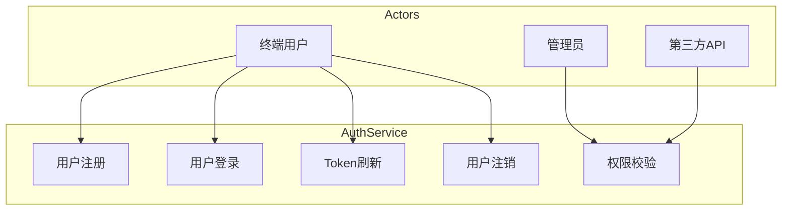
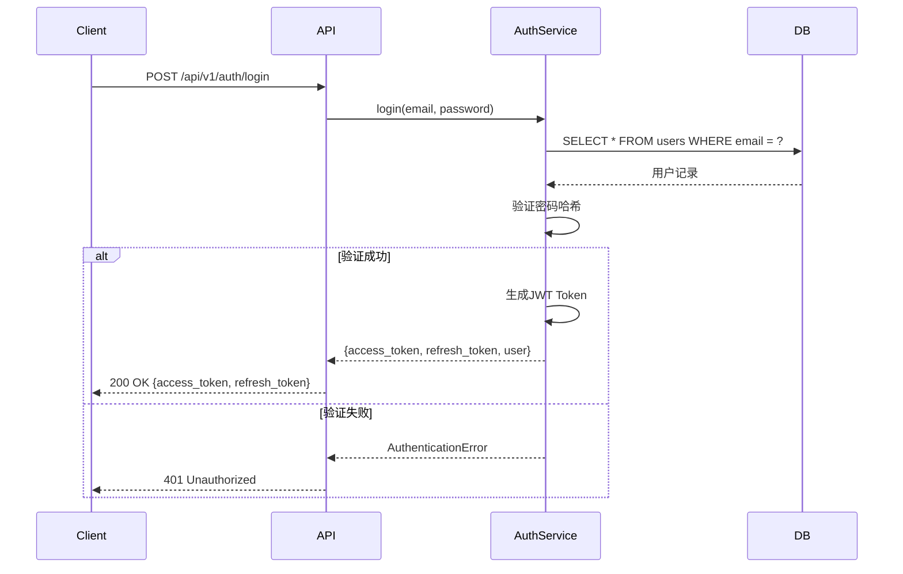
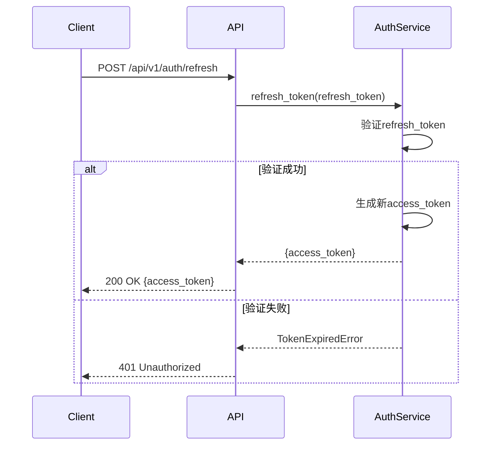
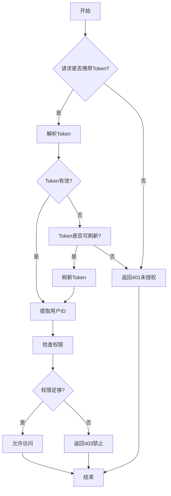
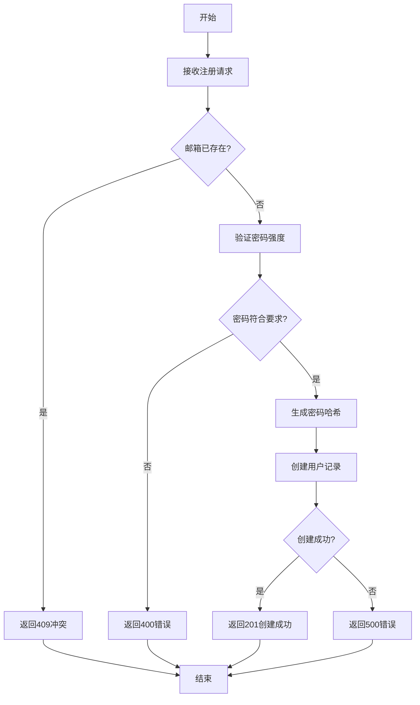
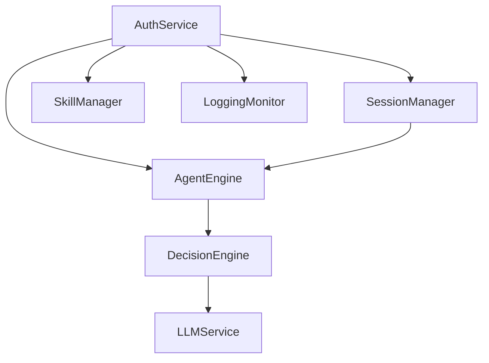

# AuthService 模块特性设计文档

## 1. 模块概述

### 1.1 模块定位
AuthService 是系统的认证授权核心模块，负责用户身份验证、权限管理和会话安全。

### 1.2 核心职责
- 用户注册与登录
- JWT Token 管理
- 权限校验
- 会话安全

### 1.3 涉及用例
| 用例ID | 用例名称 | 关联程度 |
|--------|----------|----------|
| UC1 | 发起对话 | 强 |
| UC2 | 调用工具 | 强 |
| UC3 | 查看历史 | 强 |
| UC4 | 管理技能 | 强 |
| UC5 | 配置Agent | 强 |
| UC6 | 监控运行 | 强 |
| UC7 | 训练技能 | 强 |
| UC8 | API集成 | 强 |

---

## 2. 用例图



### 用例说明

| 用例 | 说明 | 前置条件 | 后置条件 |
|------|------|----------|----------|
| 用户注册 | 创建新用户账户 | 邮箱未被注册 | 用户记录创建成功 |
| 用户登录 | 验证身份并获取Token | 用户已注册 | 返回JWT Token |
| Token刷新 | 获取新的访问Token | Token未过期 | 返回新Token |
| 权限校验 | 检查用户操作权限 | 用户已登录 | 返回权限检查结果 |
| 用户注销 | 失效Token | 用户已登录 | Token失效 |

---

## 3. 时序图

### 3.1 用户登录流程



### 3.2 Token刷新流程



---

## 4. 流程图

### 4.1 用户认证流程



### 4.2 用户注册流程



---

## 5. 模型设计

### 5.1 数据库表设计

**users 表**

| 字段名 | 类型 | 约束 | 说明 |
|--------|------|------|------|
| id | INTEGER | PRIMARY KEY AUTOINCREMENT | 用户ID |
| email | VARCHAR(255) | UNIQUE NOT NULL | 邮箱地址 |
| password_hash | VARCHAR(255) | NOT NULL | 密码哈希 |
| username | VARCHAR(100) | NULL | 用户昵称 |
| role | VARCHAR(50) | DEFAULT 'user' | 用户角色 |
| status | VARCHAR(20) | DEFAULT 'active' | 用户状态 |
| created_at | DATETIME | DEFAULT CURRENT_TIMESTAMP | 创建时间 |
| updated_at | DATETIME | DEFAULT CURRENT_TIMESTAMP | 更新时间 |

**refresh_tokens 表**

| 字段名 | 类型 | 约束 | 说明 |
|--------|------|------|------|
| id | INTEGER | PRIMARY KEY AUTOINCREMENT | 记录ID |
| user_id | INTEGER | FOREIGN KEY REFERENCES users(id) | 用户ID |
| token | VARCHAR(512) | UNIQUE NOT NULL | Refresh Token |
| expires_at | DATETIME | NOT NULL | 过期时间 |
| created_at | DATETIME | DEFAULT CURRENT_TIMESTAMP | 创建时间 |

### 5.2 数据模型

```python
from pydantic import BaseModel, EmailStr
from datetime import datetime
from typing import Optional

class User(BaseModel):
    id: int
    email: EmailStr
    username: Optional[str] = None
    role: str = "user"
    status: str = "active"
    created_at: datetime
    updated_at: datetime

class UserCreate(BaseModel):
    email: EmailStr
    password: str
    username: Optional[str] = None

class UserLogin(BaseModel):
    email: EmailStr
    password: str

class TokenResponse(BaseModel):
    access_token: str
    refresh_token: str
    token_type: str = "bearer"
    expires_in: int = 3600

class RefreshTokenRequest(BaseModel):
    refresh_token: str
```

---

## 6. 接口设计

### 6.1 接口列表

| API路径 | HTTP方法 | 功能描述 |
|---------|----------|----------|
| `/api/v1/auth/register` | POST | 用户注册 |
| `/api/v1/auth/login` | POST | 用户登录 |
| `/api/v1/auth/refresh` | POST | Token刷新 |
| `/api/v1/auth/logout` | POST | 用户注销 |
| `/api/v1/auth/me` | GET | 获取当前用户信息 |

### 6.2 接口详细设计

#### 6.2.1 用户注册

**请求**:
```json
POST /api/v1/auth/register
Content-Type: application/json

{
    "email": "string (Email格式)",
    "password": "string (至少8位，包含大小写和数字)",
    "username": "string (可选，最大100字符)"
}
```

**成功响应** (201 Created):
```json
{
    "code": 0,
    "message": "注册成功",
    "data": {
        "id": "integer (用户ID)",
        "email": "string (邮箱)",
        "username": "string (昵称)",
        "role": "string (角色)",
        "created_at": "datetime (创建时间)"
    }
}
```

**失败响应** (400 Bad Request):
```json
{
    "code": 400,
    "message": "参数错误",
    "errors": ["密码强度不足"]
}
```

**失败响应** (409 Conflict):
```json
{
    "code": 409,
    "message": "邮箱已被注册"
}
```

#### 6.2.2 用户登录

**请求**:
```json
POST /api/v1/auth/login
Content-Type: application/json

{
    "email": "string (Email格式)",
    "password": "string"
}
```

**成功响应** (200 OK):
```json
{
    "code": 0,
    "message": "登录成功",
    "data": {
        "access_token": "string (JWT Token)",
        "refresh_token": "string (Refresh Token)",
        "token_type": "bearer",
        "expires_in": 3600,
        "user": {
            "id": "integer",
            "email": "string",
            "username": "string",
            "role": "string"
        }
    }
}
```

**失败响应** (401 Unauthorized):
```json
{
    "code": 401,
    "message": "邮箱或密码错误"
}
```

#### 6.2.3 Token刷新

**请求**:
```json
POST /api/v1/auth/refresh
Content-Type: application/json

{
    "refresh_token": "string"
}
```

**成功响应** (200 OK):
```json
{
    "code": 0,
    "message": "刷新成功",
    "data": {
        "access_token": "string (新JWT Token)",
        "token_type": "bearer",
        "expires_in": 3600
    }
}
```

**失败响应** (401 Unauthorized):
```json
{
    "code": 401,
    "message": "Refresh Token无效或已过期"
}
```

#### 6.2.4 用户注销

**请求**:
```json
POST /api/v1/auth/logout
Authorization: Bearer <access_token>
Content-Type: application/json

{
    "refresh_token": "string (可选，同时失效refresh_token)"
}
```

**成功响应** (200 OK):
```json
{
    "code": 0,
    "message": "注销成功"
}
```

#### 6.2.5 获取当前用户信息

**请求**:
```json
GET /api/v1/auth/me
Authorization: Bearer <access_token>
```

**成功响应** (200 OK):
```json
{
    "code": 0,
    "message": "success",
    "data": {
        "id": "integer",
        "email": "string",
        "username": "string",
        "role": "string",
        "status": "string",
        "created_at": "datetime",
        "updated_at": "datetime"
    }
}
```

### 6.3 错误码定义

| 错误码 | 含义 | HTTP状态码 |
|--------|------|------------|
| 0 | 成功 | 200/201 |
| 400 | 参数错误 | 400 |
| 401 | 未授权 | 401 |
| 403 | 禁止访问 | 403 |
| 409 | 冲突 | 409 |
| 500 | 服务器错误 | 500 |

---

## 7. 代码模型设计

### 7.1 目录结构

```
backend/src/auth/
├── __init__.py
├── jwt_manager.py      # JWT Token管理
├── permission_manager.py # 权限管理
├── schemas.py          # Pydantic模型定义
├── service.py          # 业务逻辑
└── router.py           # API路由
```

### 7.2 关键类与方法

#### JWTManager 类

| 方法名 | 功能 | 参数 | 返回值 |
|--------|------|------|--------|
| `create_access_token` | 生成访问Token | `user_id: int`, `expires_delta: timedelta` | `str` |
| `create_refresh_token` | 生成刷新Token | `user_id: int` | `str` |
| `decode_token` | 解码Token | `token: str` | `dict` |
| `verify_token` | 验证Token | `token: str` | `bool` |

#### PermissionManager 类

| 方法名 | 功能 | 参数 | 返回值 |
|--------|------|------|--------|
| `has_permission` | 检查权限 | `user_id: int`, `permission: str` | `bool` |
| `require_role` | 检查角色 | `user_id: int`, `role: str` | `bool` |

#### AuthService 类

| 方法名 | 功能 | 参数 | 返回值 |
|--------|------|------|--------|
| `register` | 用户注册 | `email: str`, `password: str`, `username: str` | `User` |
| `login` | 用户登录 | `email: str`, `password: str` | `TokenResponse` |
| `refresh_token` | 刷新Token | `refresh_token: str` | `TokenResponse` |
| `logout` | 用户注销 | `user_id: int`, `refresh_token: str` | `None` |
| `get_user` | 获取用户信息 | `user_id: int` | `User` |

---

## 8. 与其他模块的关系



| 模块 | 关系 | 说明 |
|------|------|------|
| SessionManager | 依赖 | 验证用户后创建会话 |
| AgentEngine | 依赖 | 验证用户身份后执行对话 |
| SkillManager | 依赖 | 验证用户权限后管理技能 |
| LoggingMonitor | 依赖 | 记录认证日志 |

---

## 9. 安全考虑

| 风险点 | 缓解措施 |
|--------|----------|
| 密码泄露 | 使用bcrypt加密存储密码 |
| Token劫持 | 使用HTTPS传输，设置HttpOnly Cookie |
| 暴力破解 | 登录失败次数限制，账户锁定 |
| SQL注入 | 使用ORM参数化查询 |
| 会话固定 | 登录成功后生成新Session |

---

## 10. 版本历史

| 版本 | 日期 | 变更说明 |
|------|------|----------|
| v1.0 | 2026-06 | 初始版本 |
