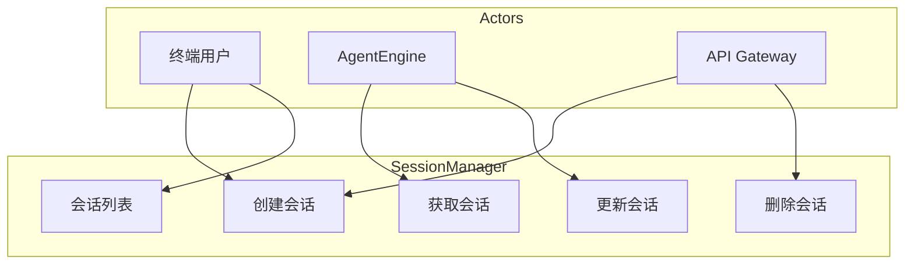
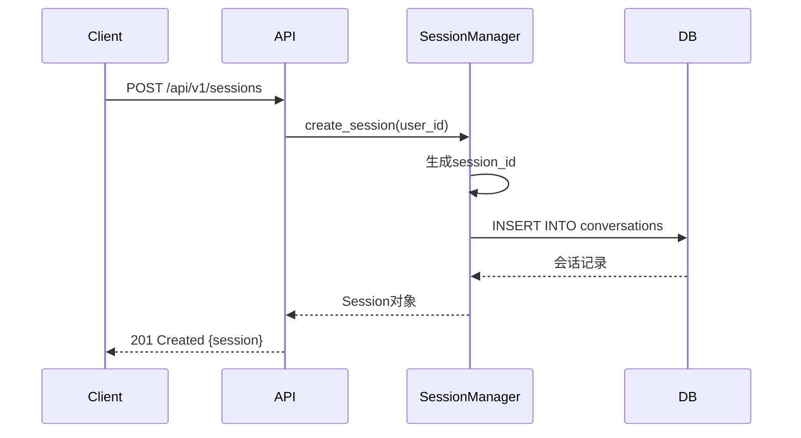
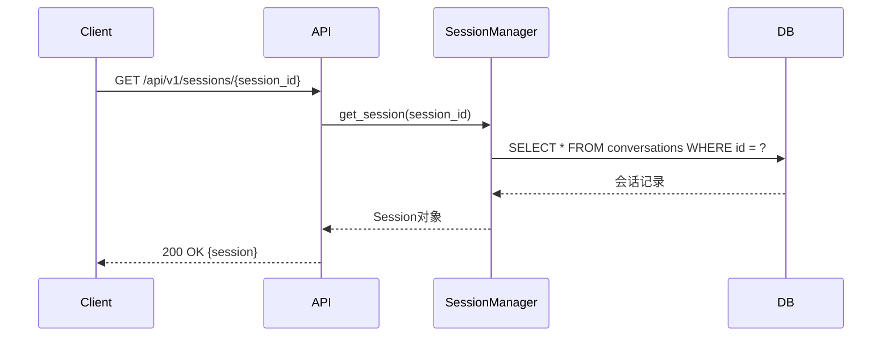
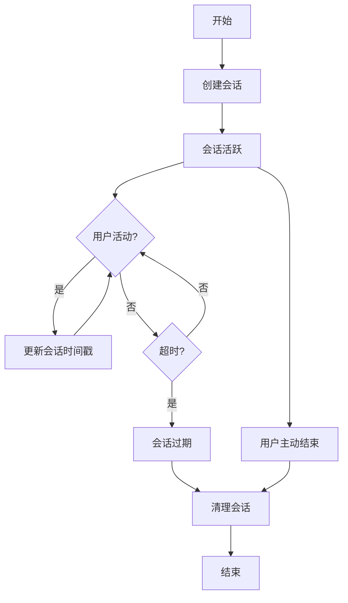
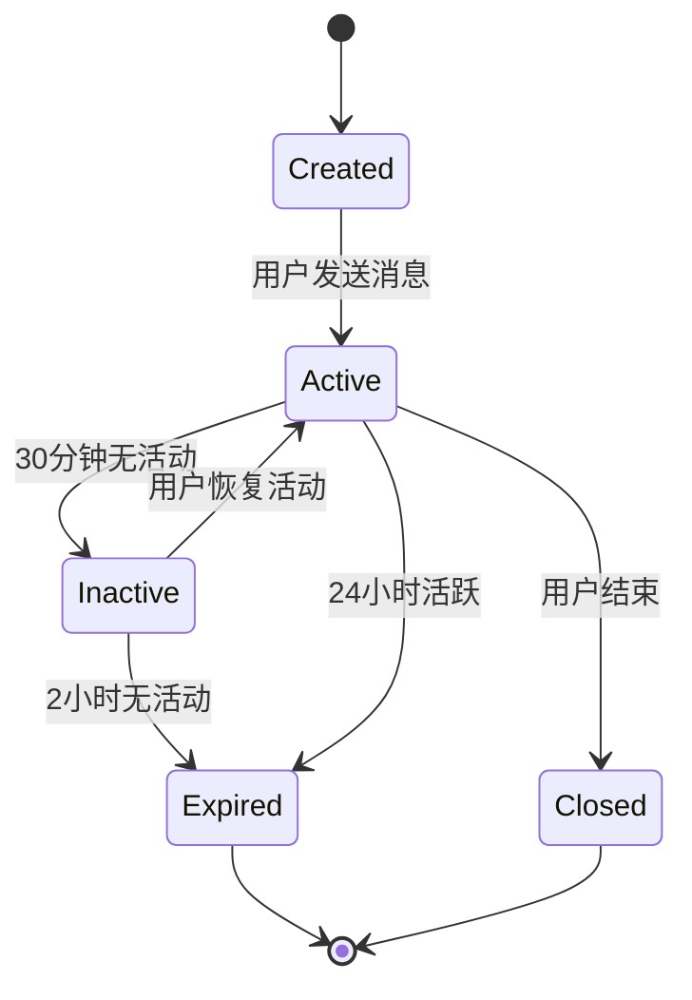
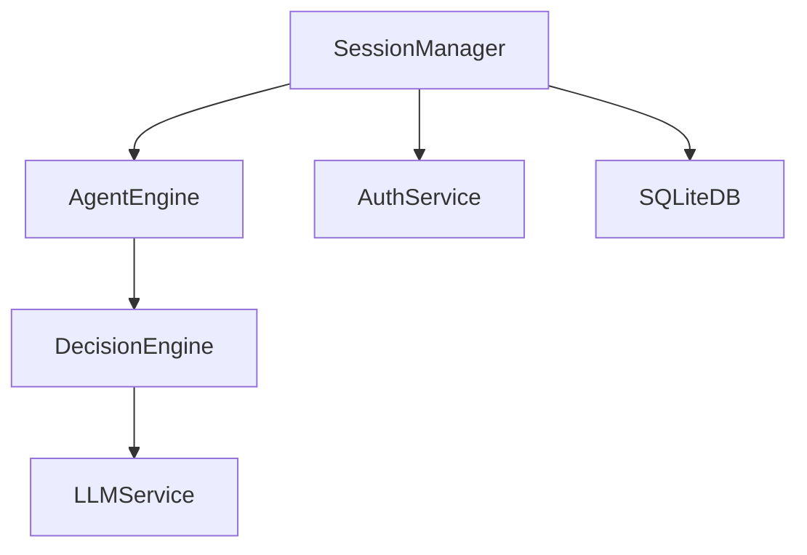

# SessionManager 模块特性设计文档

## 1. 模块概述

### 1.1 模块定位
SessionManager 是系统的会话管理核心模块，负责多用户会话隔离、会话状态管理和生命周期管理。

### 1.2 核心职责
- 会话创建与销毁
- 会话状态存储与恢复
- 多用户会话隔离
- 会话过期清理

### 1.3 涉及用例
| 用例ID | 用例名称 | 关联程度 |
|--------|----------|----------|
| UC1 | 发起对话 | 强 |
| UC2 | 调用工具 | 强 |
| UC3 | 查看历史 | 强 |
| UC8 | API集成 | 强 |

---

## 2. 用例图



### 用例说明

| 用例 | 说明 | 前置条件 | 后置条件 |
|------|------|----------|----------|
| 创建会话 | 为用户创建新会话 | 用户已认证 | 会话记录创建成功 |
| 获取会话 | 根据ID获取会话状态 | 会话存在 | 返回会话信息 |
| 更新会话 | 更新会话状态 | 会话存在 | 会话状态更新 |
| 删除会话 | 删除指定会话 | 会话存在 | 会话记录删除 |
| 会话列表 | 获取用户会话列表 | 用户已认证 | 返回会话列表 |

---

## 3. 时序图

### 3.1 创建会话流程



### 3.2 获取会话流程



---

## 4. 流程图

### 4.1 会话生命周期



### 4.2 会话状态流转



---

## 5. 模型设计

### 5.1 数据库表设计

**conversations 表**

| 字段名 | 类型 | 约束 | 说明 |
|--------|------|------|------|
| id | INTEGER | PRIMARY KEY AUTOINCREMENT | 会话ID |
| user_id | INTEGER | FOREIGN KEY REFERENCES users(id) | 用户ID |
| session_id | VARCHAR(64) | UNIQUE NOT NULL | 会话标识 |
| title | VARCHAR(255) | NULL | 会话标题 |
| status | VARCHAR(20) | DEFAULT 'active' | 会话状态 |
| metadata | TEXT | NULL | 元数据(JSON) |
| created_at | DATETIME | DEFAULT CURRENT_TIMESTAMP | 创建时间 |
| updated_at | DATETIME | DEFAULT CURRENT_TIMESTAMP | 更新时间 |

**messages 表**

| 字段名 | 类型 | 约束 | 说明 |
|--------|------|------|------|
| id | INTEGER | PRIMARY KEY AUTOINCREMENT | 消息ID |
| conversation_id | INTEGER | FOREIGN KEY REFERENCES conversations(id) | 会话ID |
| role | VARCHAR(20) | NOT NULL | 角色(user/assistant/tool/system) |
| content | TEXT | NOT NULL | 消息内容 |
| tool_call | TEXT | NULL | 工具调用(JSON) |
| timestamp | DATETIME | DEFAULT CURRENT_TIMESTAMP | 时间戳 |

### 5.2 数据模型

```python
from pydantic import BaseModel
from datetime import datetime
from typing import Optional, List, Dict

class Message(BaseModel):
    id: int
    role: str
    content: str
    tool_call: Optional[Dict] = None
    timestamp: datetime

class Session(BaseModel):
    id: int
    user_id: int
    session_id: str
    title: Optional[str] = None
    status: str = "active"
    metadata: Optional[Dict] = None
    messages: List[Message] = []
    created_at: datetime
    updated_at: datetime

class SessionCreate(BaseModel):
    user_id: int
    title: Optional[str] = None

class SessionUpdate(BaseModel):
    title: Optional[str] = None
    status: Optional[str] = None
    metadata: Optional[Dict] = None
```

---

## 6. 接口设计

### 6.1 接口列表

| API路径 | HTTP方法 | 功能描述 |
|---------|----------|----------|
| `/api/v1/sessions` | POST | 创建会话 |
| `/api/v1/sessions` | GET | 获取会话列表 |
| `/api/v1/sessions/{session_id}` | GET | 获取单个会话 |
| `/api/v1/sessions/{session_id}` | PUT | 更新会话 |
| `/api/v1/sessions/{session_id}` | DELETE | 删除会话 |
| `/api/v1/sessions/{session_id}/messages` | GET | 获取消息列表 |

### 6.2 接口详细设计

#### 6.2.1 创建会话

**请求**:
```json
POST /api/v1/sessions
Authorization: Bearer <access_token>
Content-Type: application/json

{
    "title": "string (可选，会话标题)"
}
```

**成功响应** (201 Created):
```json
{
    "code": 0,
    "message": "创建成功",
    "data": {
        "id": "integer",
        "user_id": "integer",
        "session_id": "string (UUID)",
        "title": "string",
        "status": "active",
        "messages": [],
        "created_at": "datetime",
        "updated_at": "datetime"
    }
}
```

#### 6.2.2 获取会话列表

**请求**:
```json
GET /api/v1/sessions?page=1&limit=10
Authorization: Bearer <access_token>
```

**成功响应** (200 OK):
```json
{
    "code": 0,
    "message": "success",
    "data": {
        "items": [
            {
                "id": "integer",
                "session_id": "string",
                "title": "string",
                "status": "string",
                "message_count": "integer",
                "updated_at": "datetime"
            }
        ],
        "total": "integer",
        "page": "integer",
        "limit": "integer"
    }
}
```

#### 6.2.3 获取单个会话

**请求**:
```json
GET /api/v1/sessions/{session_id}
Authorization: Bearer <access_token>
```

**成功响应** (200 OK):
```json
{
    "code": 0,
    "message": "success",
    "data": {
        "id": "integer",
        "user_id": "integer",
        "session_id": "string",
        "title": "string",
        "status": "string",
        "metadata": "object",
        "messages": [
            {
                "id": "integer",
                "role": "string",
                "content": "string",
                "tool_call": "object",
                "timestamp": "datetime"
            }
        ],
        "created_at": "datetime",
        "updated_at": "datetime"
    }
}
```

**失败响应** (404 Not Found):
```json
{
    "code": 404,
    "message": "会话不存在"
}
```

#### 6.2.4 更新会话

**请求**:
```json
PUT /api/v1/sessions/{session_id}
Authorization: Bearer <access_token>
Content-Type: application/json

{
    "title": "string (可选)",
    "status": "string (可选，active/inactive/closed)",
    "metadata": "object (可选)"
}
```

**成功响应** (200 OK):
```json
{
    "code": 0,
    "message": "更新成功",
    "data": {
        "id": "integer",
        "session_id": "string",
        "title": "string",
        "status": "string",
        "updated_at": "datetime"
    }
}
```

#### 6.2.5 删除会话

**请求**:
```json
DELETE /api/v1/sessions/{session_id}
Authorization: Bearer <access_token>
```

**成功响应** (200 OK):
```json
{
    "code": 0,
    "message": "删除成功"
}
```

#### 6.2.6 获取消息列表

**请求**:
```json
GET /api/v1/sessions/{session_id}/messages?page=1&limit=50
Authorization: Bearer <access_token>
```

**成功响应** (200 OK):
```json
{
    "code": 0,
    "message": "success",
    "data": {
        "items": [
            {
                "id": "integer",
                "role": "string",
                "content": "string",
                "tool_call": "object",
                "timestamp": "datetime"
            }
        ],
        "total": "integer",
        "page": "integer",
        "limit": "integer"
    }
}
```

---

## 7. 代码模型设计

### 7.1 目录结构

```
backend/src/gateway/
├── __init__.py
├── session_manager.py   # 会话管理核心
├── schemas.py          # Pydantic模型
└── router.py           # API路由
```

### 7.2 关键类与方法

#### SessionManager 类

| 方法名 | 功能 | 参数 | 返回值 |
|--------|------|------|--------|
| `create_session` | 创建会话 | `user_id: int`, `title: str` | `Session` |
| `get_session` | 获取会话 | `session_id: str` | `Session` |
| `get_sessions` | 获取会话列表 | `user_id: int`, `page: int`, `limit: int` | `List[Session]` |
| `update_session` | 更新会话 | `session_id: str`, `**kwargs` | `Session` |
| `delete_session` | 删除会话 | `session_id: str` | `None` |
| `add_message` | 添加消息 | `session_id: str`, `message: dict` | `Message` |
| `get_messages` | 获取消息列表 | `session_id: str`, `page: int`, `limit: int` | `List[Message]` |
| `cleanup_expired` | 清理过期会话 | `expire_hours: int` | `int (删除数量)` |

---

## 8. 与其他模块的关系



| 模块 | 关系 | 说明 |
|------|------|------|
| AgentEngine | 依赖 | 获取会话状态执行对话 |
| AuthService | 依赖 | 验证用户身份 |
| SQLiteDB | 依赖 | 持久化会话数据 |

---

## 9. 版本历史

| 版本 | 日期 | 变更说明 |
|------|------|----------|
| v1.0 | 2026-06 | 初始版本 |
