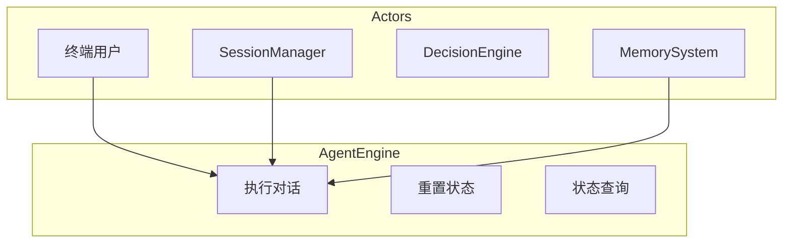
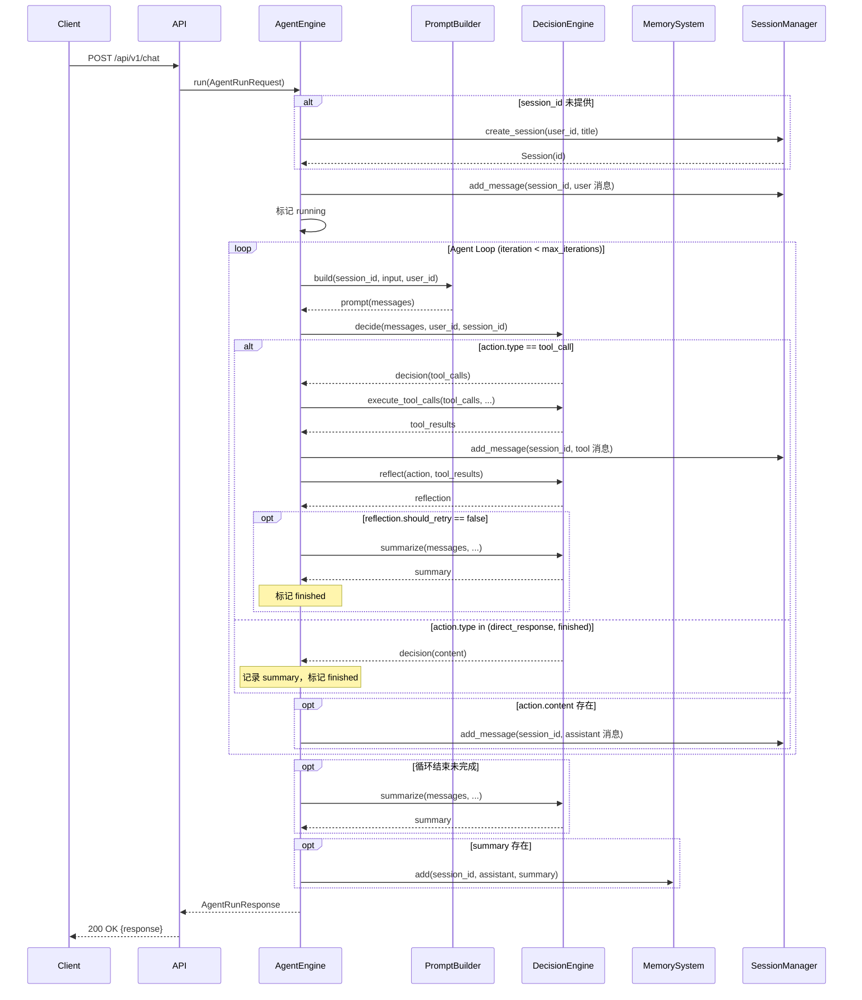
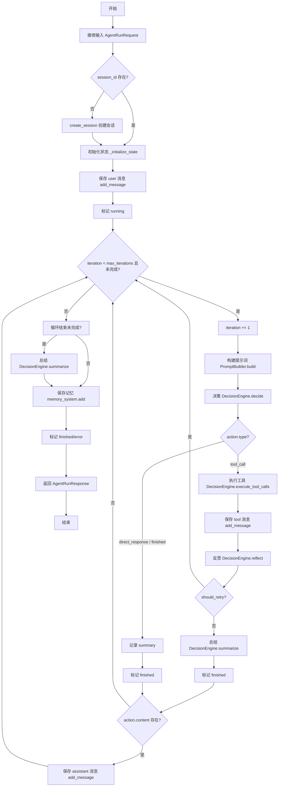
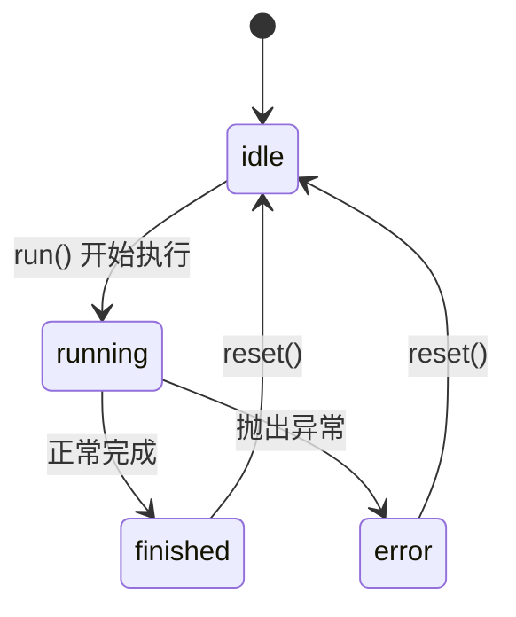
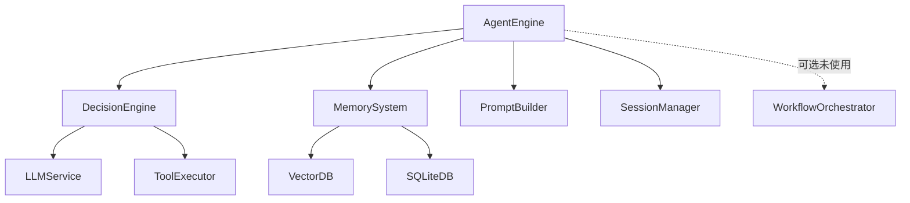

# AgentEngine 模块特性设计文档

## 1. 模块概述

### 1.1 模块定位
AgentEngine 是系统的核心模块，负责执行 Agent 的主循环，管理对话状态，协调各子系统完成用户请求。

### 1.2 核心职责
- 执行 Agent 主循环（构建提示词 -> 决策 -> 工具调用/直接响应 -> 反思 -> 总结）
- 管理对话状态（内存跟踪，无持久化）
- 协调决策引擎、记忆系统、提示词构建器、会话管理器
- 处理用户输入和生成响应

### 1.3 涉及用例
| 用例ID | 用例名称 | 关联程度 |
|--------|----------|----------|
| UC1 | 发起对话 | 强 |
| UC2 | 调用工具 | 强 |
| UC7 | 训练技能 | 中 |
| UC8 | API集成 | 强 |

---

## 2. 用例图



### 用例说明

| 用例 | 说明 | 前置条件 | 后置条件 | 状态 |
|------|------|----------|----------|------|
| 执行对话 | 完整的对话执行流程 | 用户已认证，会话存在（未提供时自动创建） | 返回响应结果 | 已实现 |
| 重置状态 | 重置 Agent 状态 | 会话存在 | 状态已重置 | 已实现 |
| 状态查询 | 获取当前 Agent 状态 | 会话存在 | 返回状态信息 | 已实现 |
| 单步执行 | 执行单个思考/动作步骤 | 会话存在 | 返回单步状态 | 未实现 |
| 中断执行 | 中断正在执行的任务 | 任务正在执行 | 任务已中断 | 未实现 |
| 流式对话 | 流式输出对话响应 | 会话存在 | 流式返回响应 | 未实现 |

---

## 3. 时序图

### 3.1 完整对话执行流程



> 说明：工具执行通过 `DecisionEngine.execute_tool_calls` 间接完成，AgentEngine 不直接依赖 ToolExecutor。记忆检索（retrieve）不在主循环内执行，仅在循环结束后调用 `memory_system.add` 保存总结。

---

## 4. 流程图

### 4.1 Agent 核心循环



> 说明：实际循环不再包含"上下文超限/压缩上下文""验证工具调用/拒绝工具调用"节点；工具调用后增加"反思（reflect）"步骤，根据 `should_retry` 决定是否继续循环。

### 4.2 状态流转



> 说明：状态跟踪仅维护 `idle/running/finished/error` 四个状态，存储于 AgentEngine 内存字典 `_states`，无持久化。

---

## 5. 模型设计

### 5.1 Agent 状态模型

```python
from typing import Any, Dict, List, Optional, TypedDict

from pydantic import BaseModel


class AgentState(TypedDict):
    """Agent 运行状态，贯穿整个对话循环（TypedDict，非 Pydantic）。"""
    input: str
    messages: List[Dict[str, Any]]
    tool_calls: List[Dict[str, Any]]
    tool_results: List[Dict[str, Any]]
    memory_items: List[Dict[str, Any]]
    finished: bool
    summary: str
    error: Optional[str]
    user_id: Optional[int]
    session_id: Optional[int]
    iteration: int
    max_iterations: int  # 默认值来自 settings.MAX_ITERATIONS（=10）
```

> 说明：`AgentState` 为 `TypedDict`，无 `created_at`/`updated_at` 时间戳字段；`user_id`、`session_id` 为 `Optional[int]`；`max_iterations` 默认值由 `settings.MAX_ITERATIONS` 提供（当前为 10，非 50）。

### 5.2 请求与响应模型

```python
class AgentRunRequest(BaseModel):
    """Agent 运行请求模型。"""
    message: str
    session_id: Optional[int] = None  # 未提供时自动创建会话
    user_id: Optional[int] = None


class AgentRunResponse(BaseModel):
    """Agent 运行响应模型（替代原 AgentResponse）。"""
    response: str
    session_id: int
    iterations: int
    tool_calls: List[Dict[str, Any]] = []
    error: Optional[str] = None


class AgentStatus(BaseModel):
    """Agent 状态信息模型（对应 get_status 返回值）。"""
    state: str  # idle/running/finished/error
    iteration: int
    max_iterations: int
    session_id: Optional[int] = None
    error: Optional[str] = None
```

### 5.3 工具调用结构

实际实现中不再定义独立的 `ToolCall` / `ToolResult` Pydantic 模型。工具调用与工具结果均以 **字典（`Dict[str, Any]`）** 形式存储于 `AgentState.tool_calls` 与 `AgentState.tool_results` 列表中，由 `DecisionEngine.execute_tool_calls` 返回。

---

## 6. 接口设计

### 6.1 接口列表

| API路径 | HTTP方法 | 功能描述 | 状态 |
|---------|----------|----------|------|
| `/api/v1/chat` | POST | 执行对话 | 已实现 |
| `/api/v1/chat/reset` | POST | 重置状态（对应 `AgentEngine.reset`） | 已实现 |
| `/api/v1/chat/state` | GET | 获取状态（对应 `AgentEngine.get_status`） | 已实现 |
| `/api/v1/chat/stream` | POST | 流式对话 | 未实现 |
| `/api/v1/chat/step` | POST | 单步执行 | 未实现 |
| `/api/v1/chat/interrupt` | POST | 中断执行 | 未实现 |

### 6.2 接口详细设计

#### 6.2.1 执行对话

**请求**:
```json
POST /api/v1/chat
Authorization: Bearer <access_token>
Content-Type: application/json

{
    "message": "string (用户输入)",
    "session_id": "integer (可选，会话ID，未提供时自动创建)",
    "user_id": "integer (可选，用户ID)"
}
```

> 说明：`max_iterations` 不再由请求参数指定，统一由 `settings.MAX_ITERATIONS`（=10）提供。

**成功响应** (200 OK):
```json
{
    "code": 0,
    "message": "success",
    "data": {
        "response": "string (最终回复)",
        "session_id": "integer",
        "iterations": "integer (实际迭代次数)",
        "tool_calls": [
            {"tool_name": "string", "result": "object"}
        ],
        "error": null
    }
}
```

**失败响应** (500 Internal Server Error):
```json
{
    "code": 500,
    "message": "Agent执行失败",
    "data": {
        "response": "string (运行出错: <error>)",
        "session_id": "integer",
        "iterations": "integer",
        "tool_calls": [],
        "error": "string (错误信息)"
    }
}
```

#### 6.2.2 流式对话（未实现）

> 说明：流式响应未实现，`AgentEngine.run` 为一次性返回 `AgentRunResponse`，不支持 SSE 流式输出。以下为原设计保留。

**请求**:
```json
POST /api/v1/chat/stream
Authorization: Bearer <access_token>
Content-Type: application/json

{
    "session_id": "integer",
    "message": "string"
}
```

**响应** (text/event-stream):
```
event: message
data: {"type": "thinking", "content": "正在思考..."}

event: message
data: {"type": "tool_call", "tool_name": "search", "arguments": {...}}

event: message
data: {"type": "tool_result", "tool_name": "search", "result": {...}}

event: message
data: {"type": "summary", "content": "最终回复"}

event: end
data: {"finished": true}
```

#### 6.2.3 单步执行（未实现）

> 说明：`AgentEngine.step` 方法未实现，对应接口暂不可用。以下为原设计保留。

**请求**:
```json
POST /api/v1/chat/step
Authorization: Bearer <access_token>
Content-Type: application/json

{
    "session_id": "integer",
    "state": "object (当前状态)"
}
```

**成功响应** (200 OK):
```json
{
    "code": 0,
    "message": "success",
    "data": {
        "state": "object (更新后的状态)",
        "finished": false,
        "iteration": 1
    }
}
```

#### 6.2.4 重置状态

对应 `AgentEngine.reset(session_id: int)`，清除内存中的状态跟踪信息。

**请求**:
```json
POST /api/v1/chat/reset
Authorization: Bearer <access_token>
Content-Type: application/json

{
    "session_id": "integer"
}
```

**成功响应** (200 OK):
```json
{
    "code": 0,
    "message": "状态已重置"
}
```

#### 6.2.5 获取状态

对应 `AgentEngine.get_status(session_id: int)`，返回 `AgentStatus` 模型。

**请求**:
```json
GET /api/v1/chat/state?session_id={session_id}
Authorization: Bearer <access_token>
```

**成功响应** (200 OK):
```json
{
    "code": 0,
    "message": "success",
    "data": {
        "state": "idle",
        "iteration": 0,
        "max_iterations": 10,
        "session_id": "integer",
        "error": null
    }
}
```

---

## 7. 代码模型设计

### 7.1 目录结构

```
backend/src/agent/
├── __init__.py
├── engine.py              # AgentEngine 核心循环实现
└── schemas.py             # 数据模型（TypedDict + Pydantic）
```

> 说明：实际实现中不存在 `agent_loop.py`、`state_manager.py`、`exceptions.py`。核心循环、状态管理均内联于 `engine.py` 的 `AgentEngine` 类中；异常处理直接使用内置 `Exception`。

### 7.2 关键类与方法

#### AgentEngine 类

| 方法名 | 功能 | 参数 | 返回值 |
|--------|------|------|--------|
| `__init__` | 初始化引擎 | `db`, `decision_engine`, `memory_system`, `prompt_builder`, `session_manager`, `workflow_orchestrator=None` | - |
| `run` | 完整对话执行 | `request: AgentRunRequest` | `AgentRunResponse` |
| `reset` | 重置状态（清除内存跟踪） | `session_id: int` | `None` |
| `get_status` | 获取状态 | `session_id: int` | `AgentStatus` |
| `_initialize_state` | 初始化状态（含条件性创建会话） | `request: AgentRunRequest` | `AgentState` |
| `_save_message` | 保存消息到会话 | `state: AgentState`, `role: str`, `content: str` | `None` |
| `_messages_to_dicts` | 消息对象转字典（静态方法） | `messages: List[Any]` | `List[Dict[str, Any]]` |
| `_update_status` | 更新内存状态跟踪 | `state: AgentState`, `status: str` | `None` |

> 说明：`step`、`interrupt`、`_is_context_over_limit`、`_should_finish` 方法均未实现。状态管理内联于 `AgentEngine`，通过内存字典 `_states: Dict[int, AgentStatus]` 跟踪，无持久化。

#### StateManager 类

实际实现中不存在独立的 `StateManager` 类。状态管理职责由 `AgentEngine` 内联承担：
- 状态创建：`_initialize_state` 返回 `AgentState`（TypedDict）
- 状态更新：循环内直接修改 `AgentState` 字典字段
- 状态跟踪：`_update_status` 写入内存字典 `_states`
- 状态查询：`get_status` 读取内存字典 `_states`
- 状态重置：`reset` 删除内存字典中的条目

> 无 `save_state` / `load_state` 持久化方法，状态仅存在于运行时内存。

---

## 8. 与其他模块的关系



| 模块 | 关系 | 说明 |
|------|------|------|
| DecisionEngine | 依赖 | 调用 `decide`/`execute_tool_calls`/`reflect`/`summarize` 完成决策、工具执行、反思与总结 |
| MemorySystem | 依赖 | 循环结束后调用 `add` 保存总结记忆（循环内不调用 `retrieve`） |
| PromptBuilder | 依赖 | 构建每轮迭代的提示词（`build`） |
| SessionManager | 依赖 | 条件性 `create_session` 创建会话，`add_message` 持久化消息 |
| ToolExecutor | 间接依赖 | 通过 `DecisionEngine.execute_tool_calls` 间接调用，AgentEngine 不直接依赖 |
| WorkflowOrchestrator | 可选（未使用） | 构造函数接受该参数，但 `run` 流程中未实际调用 |

---

## 9. 性能考虑

| 关注点 | 策略 | 状态 |
|--------|------|------|
| 响应时间 | 异步执行（`run` 为 `async`） | 已实现 |
| 响应时间 | 流式响应 | 未实现 |
| 内存使用 | 状态清理（`reset` 清除内存跟踪） | 已实现 |
| 内存使用 | 上下文压缩 | 未实现（原"上下文超限/压缩"节点已移除） |
| 并发处理 | 会话隔离（按 `session_id` 隔离 `_states`） | 已实现 |
| 并发处理 | 线程安全 | 待实现（`_states` 字典无锁保护） |
| 错误恢复 | 异常捕获并记录（`try/except` + `logger`） | 已实现 |
| 错误恢复 | 重试机制 | 未实现（`reflect.should_retry` 字段存在但 AgentEngine 未据此重试） |
| 错误恢复 | 状态持久化 | 未实现（状态仅存于内存，无 `save_state`/`load_state`） |

---

## 10. 版本历史

| 版本 | 日期 | 变更说明 |
|------|------|----------|
| v1.0 | 2026-06 | 初始版本 |
| v1.1 | 2026-06 | 根据实现反馈更新文档以匹配实际代码 |
