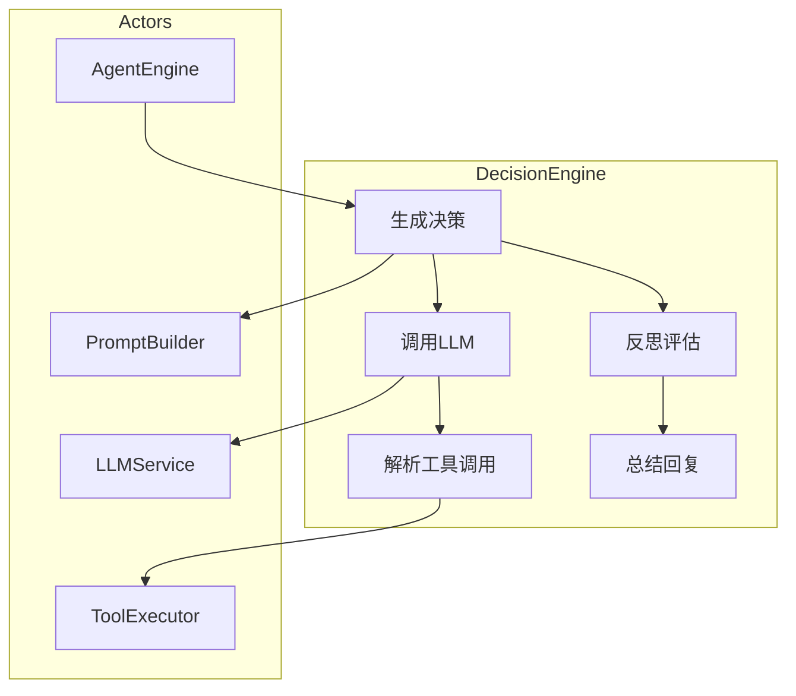
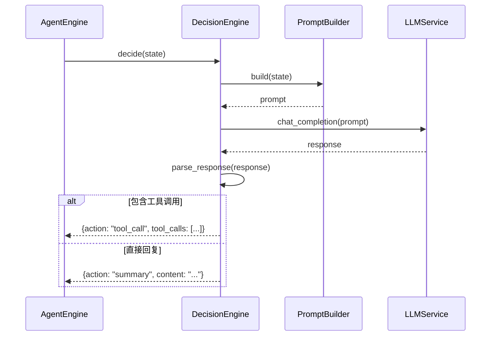
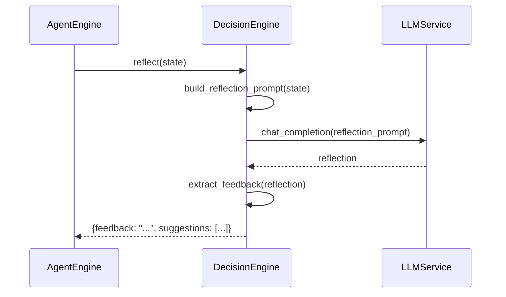
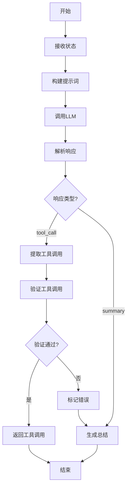
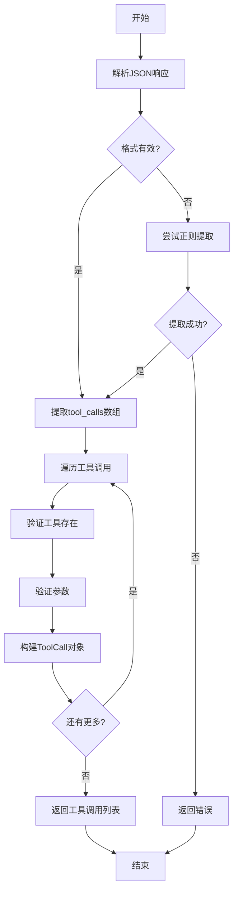
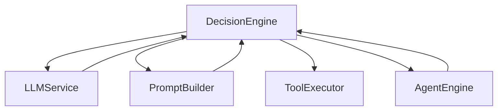

# DecisionEngine 模块特性设计文档

## 1. 模块概述

### 1.1 模块定位
DecisionEngine 是 Agent 的决策核心，负责根据当前状态生成下一步动作，包括调用 LLM、解析工具调用、反思评估和总结回复。

### 1.2 核心职责
- LLM 调用与响应解析
- 工具调用识别与解析
- 反思机制实现
- 最终回复生成

### 1.3 涉及用例
| 用例ID | 用例名称 | 关联程度 |
|--------|----------|----------|
| UC1 | 发起对话 | 强 |
| UC2 | 调用工具 | 强 |
| UC7 | 训练技能 | 强 |

---

## 2. 用例图



### 用例说明

| 用例 | 说明 | 前置条件 | 后置条件 |
|------|------|----------|----------|
| 生成决策 | 根据状态生成下一步动作 | 状态已初始化 | 返回决策结果 |
| 调用LLM | 调用OpenAI兼容API | 提示词已构建 | 返回LLM响应 |
| 解析工具调用 | 从响应中提取工具调用 | LLM响应已获取 | 返回工具调用列表 |
| 反思评估 | 对执行结果进行反思 | 工具执行完成 | 返回反思结果 |
| 总结回复 | 生成最终总结 | 决策完成 | 返回总结文本 |

---

## 3. 时序图

### 3.1 决策流程



### 3.2 反思流程



---

## 4. 流程图

### 4.1 决策生成流程



### 4.2 工具调用解析



---

## 5. 模型设计

### 5.1 决策结果模型

```python
from pydantic import BaseModel
from datetime import datetime
from typing import Optional, List, Dict, Any, Literal

class ToolCall(BaseModel):
    id: str
    tool_name: str
    arguments: Dict[str, Any]
    type: str = "function"

class DecisionResult(BaseModel):
    action: Literal["tool_call", "summary", "continue", "error"]
    content: Optional[str] = None
    tool_calls: List[ToolCall] = []
    error: Optional[str] = None
    reflection: Optional[str] = None
    suggestions: List[str] = []
    timestamp: datetime = datetime.now()

class ReflectionResult(BaseModel):
    success: bool
    feedback: str
    suggestions: List[str]
    improvements: List[str]
```

### 5.2 LLM响应模型

```python
class LLMResponse(BaseModel):
    id: str
    object: str
    created: int
    model: str
    choices: List[Dict[str, Any]]
    usage: Dict[str, int]

class ChatMessage(BaseModel):
    role: str
    content: str
    tool_calls: Optional[List[Dict[str, Any]]] = None
    tool_call_id: Optional[str] = None
```

---

## 6. 接口设计

### 6.1 内部接口

| 方法名 | 功能 | 参数 | 返回值 |
|--------|------|------|--------|
| `decide` | 生成决策 | `state: AgentState` | `DecisionResult` |
| `reflect` | 反思评估 | `state: AgentState` | `ReflectionResult` |
| `call_llm` | 调用LLM | `messages: List[dict]`, `tools: List[dict]`, `stream: bool` | `LLMResponse` |
| `parse_tool_calls` | 解析工具调用 | `response: LLMResponse` | `List[ToolCall]` |
| `generate_summary` | 生成总结 | `state: AgentState` | `str` |

### 6.2 配置接口

| API路径 | HTTP方法 | 功能描述 |
|---------|----------|----------|
| `/api/v1/config/llm` | GET | 获取LLM配置 |
| `/api/v1/config/llm` | PUT | 更新LLM配置 |

#### 6.2.1 获取LLM配置

**请求**:
```json
GET /api/v1/config/llm
Authorization: Bearer <access_token>
```

**成功响应** (200 OK):
```json
{
    "code": 0,
    "message": "success",
    "data": {
        "api_key": "string (脱敏显示)",
        "base_url": "string",
        "model": "string",
        "max_tokens": 4096,
        "temperature": 0.7,
        "top_p": 1.0,
        "stream": true
    }
}
```

#### 6.2.2 更新LLM配置

**请求**:
```json
PUT /api/v1/config/llm
Authorization: Bearer <access_token>
Content-Type: application/json

{
    "api_key": "string (可选)",
    "base_url": "string (可选)",
    "model": "string (可选)",
    "max_tokens": "integer (可选)",
    "temperature": "float (可选)",
    "top_p": "float (可选)",
    "stream": "boolean (可选)"
}
```

**成功响应** (200 OK):
```json
{
    "code": 0,
    "message": "配置更新成功",
    "data": {
        "model": "string",
        "max_tokens": 4096,
        "temperature": 0.7
    }
}
```

---

## 7. 代码模型设计

### 7.1 目录结构

```
backend/src/agent/
├── __init__.py
├── decision_engine.py     # 决策引擎核心
├── prompt_builder.py     # 提示词构建
└── schemas.py            # 模型定义
```

### 7.2 关键类与方法

#### DecisionEngine 类

| 方法名 | 功能 | 参数 | 返回值 |
|--------|------|------|--------|
| `__init__` | 初始化 | `llm_client: LLMClient`, `prompt_builder: PromptBuilder` | - |
| `decide` | 生成决策 | `state: AgentState` | `DecisionResult` |
| `reflect` | 反思评估 | `state: AgentState` | `ReflectionResult` |
| `call_llm` | 调用LLM | `messages: list`, `tools: list`, `stream: bool` | `LLMResponse` |
| `parse_tool_calls` | 解析工具调用 | `response: dict` | `List[ToolCall]` |
| `generate_summary` | 生成总结 | `state: AgentState` | `str` |
| `_build_decision_prompt` | 构建决策提示词 | `state: AgentState` | `List[dict]` |
| `_build_reflection_prompt` | 构建反思提示词 | `state: AgentState` | `List[dict]` |

---

## 8. 与其他模块的关系



| 模块 | 关系 | 说明 |
|------|------|------|
| LLMService | 依赖 | 调用LLM API |
| PromptBuilder | 依赖 | 构建提示词 |
| ToolExecutor | 协作 | 验证工具调用 |
| AgentEngine | 依赖者 | 调用决策引擎 |

---

## 9. 版本历史

| 版本 | 日期 | 变更说明 |
|------|------|----------|
| v1.0 | 2026-06 | 初始版本 |
