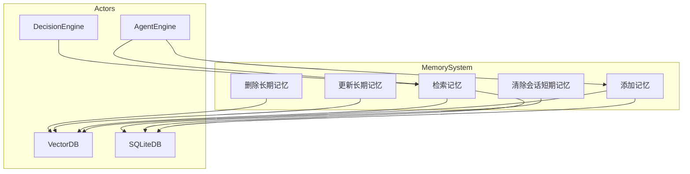
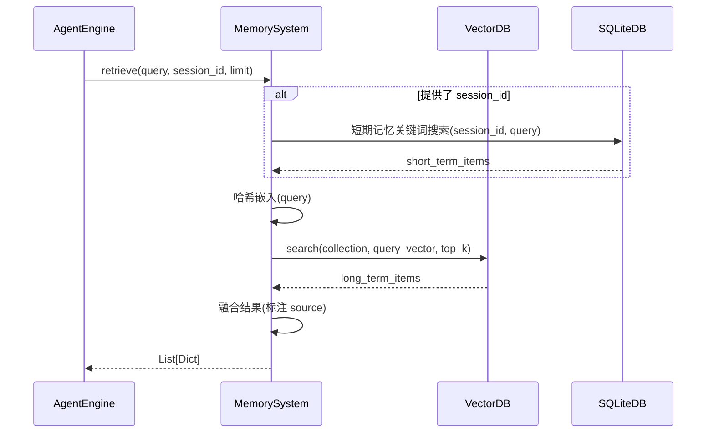
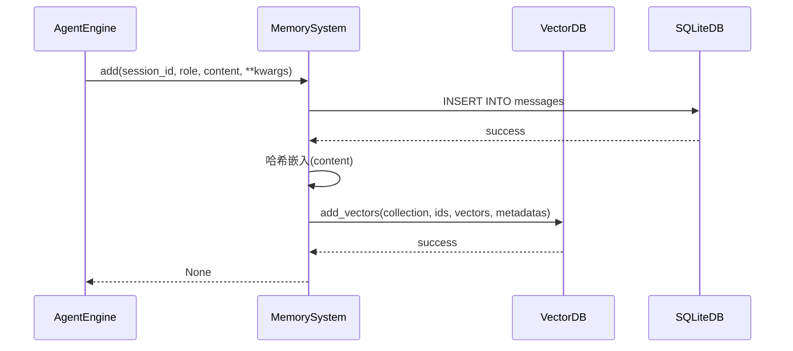
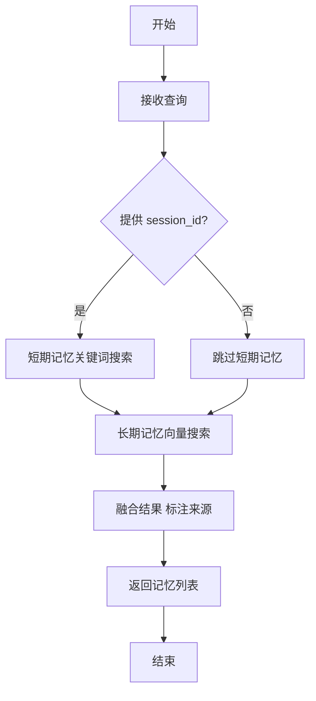
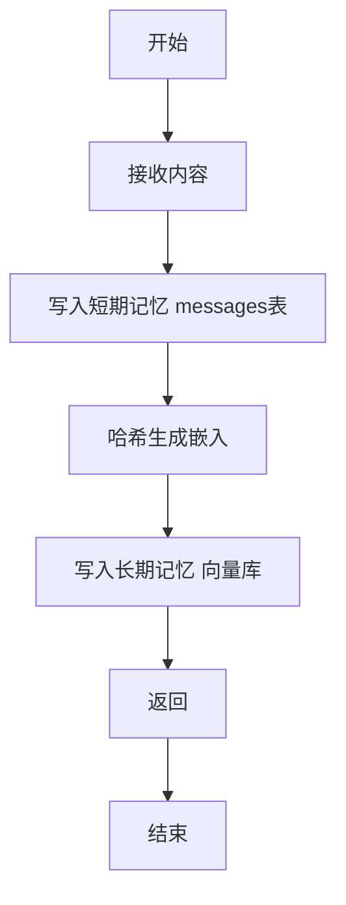
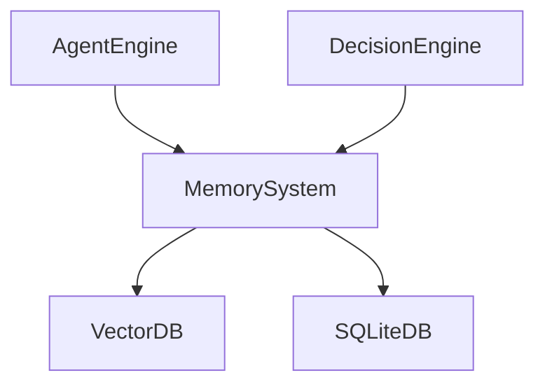

# MemorySystem 模块特性设计文档

## 1. 模块概述

### 1.1 模块定位
MemorySystem 是 Agent 的记忆管理系统，负责短期会话记忆和长期记忆的存储、检索和管理。短期记忆基于 SQLite `messages` 表，长期记忆基于向量数据库。

### 1.2 核心职责
- 短期记忆管理（会话内，基于 SQLite `messages` 表）
- 长期记忆管理（跨会话，基于向量数据库）
- 记忆检索与匹配（短期关键词检索 + 长期向量检索双路融合）
- 向量嵌入与存储（当前为 SHA-256 哈希占位实现，详见第 9.3 节）

### 1.3 涉及用例
| 用例ID | 用例名称 | 关联程度 |
|--------|----------|----------|
| UC1 | 发起对话 | 强 |
| UC2 | 调用工具 | 中 |
| UC7 | 训练技能 | 强 |

---

## 2. 用例图



### 用例说明

| 用例 | 说明 | 前置条件 | 后置条件 |
|------|------|----------|----------|
| 添加记忆 | 将内容同时写入短期记忆(messages 表)和长期记忆(向量库) | 内容已生成 | 记忆已保存 |
| 检索记忆 | 短期关键词检索 + 长期向量检索双路融合 | 查询已准备 | 返回记忆列表(标注来源) |
| 更新长期记忆 | 先删除后添加，保持相同 ID | 记忆存在 | 长期记忆已更新 |
| 删除长期记忆 | 根据 ID 列表删除长期记忆 | 记忆存在 | 长期记忆已删除 |
| 清除会话短期记忆 | 清除指定会话的短期记忆(messages 表) | 会话存在 | 短期记忆已清除 |

---

## 3. 时序图

### 3.1 记忆检索流程



### 3.2 记忆存储流程



---

## 4. 流程图

### 4.1 记忆检索流程



### 4.2 记忆存储流程



---

## 5. 模型设计

### 5.1 数据存储说明

MemorySystem 不再使用独立的 `memories` 表：

- **短期记忆**：直接复用 SQLite 中的 `messages` 表（由 `src/db/models.py` 中的 `Message` 模型定义），存储会话内的消息记录（role、content、tool_call 等）。
- **长期记忆**：不落 SQLite，直接写入向量数据库（FAISS/Chroma）的 `conversation_memory` 集合，原始内容存放在向量记录的 `metadata.content` 字段中。

### 5.2 数据模型

```python
from typing import Any, Dict, List, Optional

from pydantic import BaseModel, Field


class MemoryItem(BaseModel):
    """单条记忆项。"""

    id: Optional[str] = None
    content: str
    metadata: Dict[str, Any] = Field(default_factory=dict)
    score: Optional[float] = None


class MemorySearchResult(BaseModel):
    """记忆搜索结果集。"""

    items: List[MemoryItem]
    total: int
```

---

## 6. 接口设计

当前 MemorySystem 以 **Python SDK** 形式提供，未暴露 REST API。调用方（如 AgentEngine、DecisionEngine）通过直接实例化 `MemorySystem` 并调用其方法使用，详见第 7 节代码模型设计。

---

## 7. 代码模型设计

### 7.1 目录结构

```
backend/src/memory/
├── __init__.py
├── manager.py             # 记忆系统管理器 MemorySystem
├── short_term.py          # 短期记忆 ShortTermMemory
├── long_term.py           # 长期记忆 LongTermMemory
└── schemas.py             # 数据模型定义
```

### 7.2 关键类与方法

#### MemorySystem 类

| 方法名 | 功能 | 参数 | 返回值 |
|--------|------|------|--------|
| `add` | 添加记忆（同时写入短期与长期记忆） | `session_id: int`, `role: str`, `content: str`, `**kwargs` | `None` |
| `retrieve` | 检索记忆（短期关键词 + 长期向量双路融合） | `query: str`, `session_id: Optional[int]`, `limit: int` | `List[Dict[str, Any]]` |
| `get_recent` | 获取短期记忆最近消息 | `session_id: int`, `limit: int` | `List[Dict[str, Any]]` |
| `search_long_term` | 搜索长期记忆 | `query: str`, `limit: int` | `List[MemoryItem]` |
| `clear_session` | 清除指定会话的短期记忆 | `session_id: int` | `None` |

#### ShortTermMemory 类

| 方法名 | 功能 | 参数 | 返回值 |
|--------|------|------|--------|
| `add` | 添加消息到短期记忆 | `session_id: int`, `role: str`, `content: str`, `tool_call: Optional[str]` | `None` |
| `get_recent` | 获取会话最近 N 条消息（时间正序） | `session_id: int`, `limit: int` | `List[Dict[str, Any]]` |
| `get_all` | 获取会话所有消息（时间正序） | `session_id: int` | `List[Dict[str, Any]]` |
| `search` | 关键词搜索会话消息 | `session_id: int`, `keyword: str`, `limit: int` | `List[Dict[str, Any]]` |
| `clear` | 清除指定会话的所有消息 | `session_id: int` | `None` |

#### LongTermMemory 类

| 方法名 | 功能 | 参数 | 返回值 |
|--------|------|------|--------|
| `add` | 添加长期记忆到向量库 | `content: str`, `metadata: Dict[str, Any]` | `str`（记忆 ID） |
| `search` | 向量相似性搜索 | `query: str`, `limit: int` | `List[MemoryItem]` |
| `delete` | 根据 ID 列表删除长期记忆 | `ids: List[str]` | `None` |
| `update` | 更新长期记忆（先删除后添加，保持相同 ID） | `id: str`, `content: str`, `metadata: Dict[str, Any]` | `None` |

---

## 8. 与其他模块的关系



| 模块 | 关系 | 说明 |
|------|------|------|
| VectorDB | 依赖 | 长期记忆的向量存储与检索 |
| SQLiteDB | 依赖 | 短期记忆存储（messages 表） |
| AgentEngine | 依赖者 | 调用记忆系统 |
| DecisionEngine | 依赖者 | 检索相关记忆 |

---

## 9. 向量数据库设计

### 9.1 Collection 设计

**conversation_memory collection**

| 字段 | 类型 | 说明 |
|------|------|------|
| id | str | 记忆 ID（UUID） |
| embedding | List[float] | 向量嵌入 |
| metadata | Dict | 元数据（含 content、session_id、role 等） |

其中 `metadata` 实际存储的字段包括：

| metadata 字段 | 类型 | 说明 |
|---------------|------|------|
| content | str | 原始记忆内容（检索时恢复） |
| session_id | int | 会话 ID |
| role | str | 消息角色 (system/user/assistant/tool) |
| ... | Any | 其他附加参数 |

### 9.2 索引设计

| 索引类型 | 字段 | 说明 |
|----------|------|------|
| IndexFlatL2 | embedding | L2 距离精确搜索（FAISS 默认） |

> 注：当前使用 FAISS `IndexFlatL2` 进行精确搜索，未使用 HNSW 近似索引；Chroma 后端由其内部默认索引管理。

### 9.3 嵌入机制与已知限制

**嵌入实现**：当前长期记忆的向量嵌入由 `long_term.py` 中的 `_text_to_vector()` 函数生成，采用 **SHA-256 哈希占位实现**，而非真实语义嵌入模型。其原理为：对 `"{text}:{dimension_index}"` 进行 SHA-256 哈希，取前 8 字节映射到 `[-1, 1]` 区间，再进行 L2 归一化，生成固定维度（默认 1536）的向量。

**已知限制**：
- 该占位实现仅保证相同文本生成相同向量、不同文本生成不同向量，**不具备语义相似性**能力。
- 未配置真实嵌入模型（如 OpenAI `text-embedding-ada-002` / `text-embedding-3-small`），向量检索结果不代表语义相关性。
- 待接入真实嵌入模型后，需替换 `_text_to_vector()` 实现，已有向量数据需重新生成。

---

## 10. 版本历史

| 版本 | 日期 | 变更说明 |
|------|------|----------|
| v1.0 | 2026-06 | 初始版本 |
| v1.1 | 2026-06 | 根据实现反馈更新文档以匹配实际代码 |
