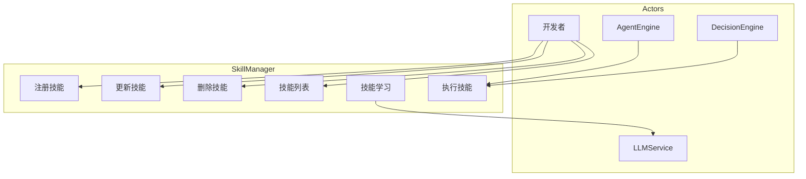
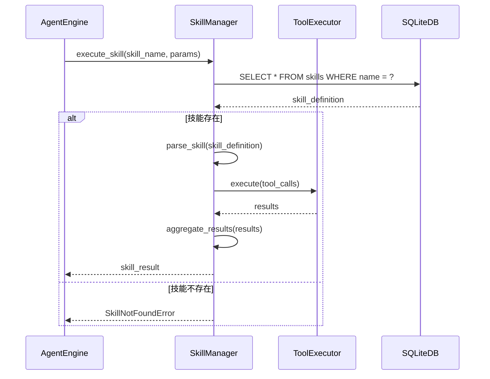
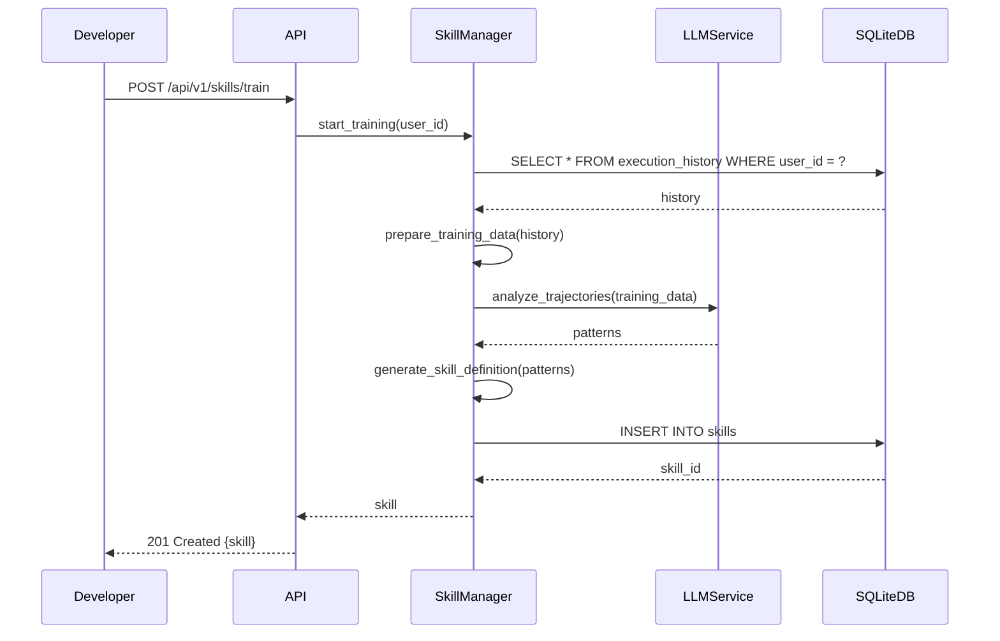
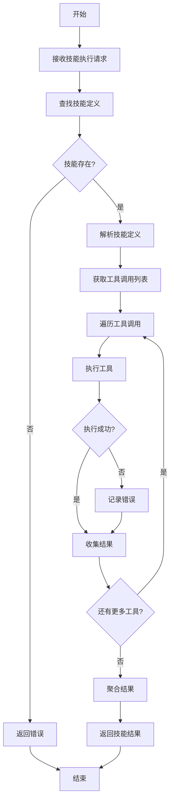
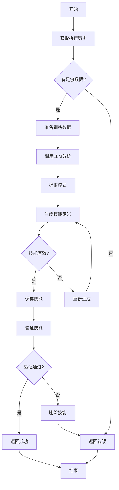
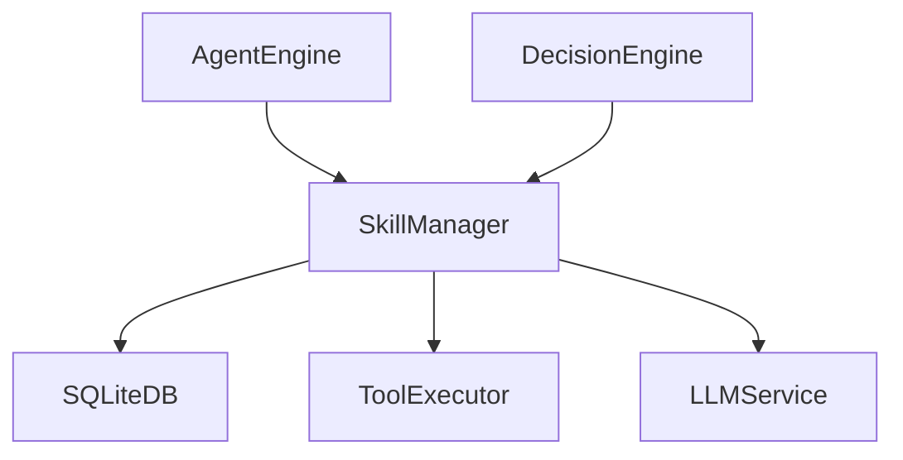

# SkillManager 模块特性设计文档

## 1. 模块概述

### 1.1 模块定位
SkillManager 是 Agent 的技能管理系统，负责技能的注册、执行、学习和管理，支持自学习闭环。

### 1.2 核心职责
- 技能注册与发现
- 技能执行与调度
- 自学习闭环（从执行历史学习新技能）
- 技能版本管理

### 1.3 涉及用例
| 用例ID | 用例名称 | 关联程度 |
|--------|----------|----------|
| UC1 | 发起对话 | 中 |
| UC4 | 管理技能 | 强 |
| UC7 | 训练技能 | 强 |

---

## 2. 用例图



### 用例说明

| 用例 | 说明 | 前置条件 | 后置条件 |
|------|------|----------|----------|
| 注册技能 | 将技能添加到技能库 | 技能定义已准备 | 技能已注册 |
| 执行技能 | 执行指定技能 | 技能已注册 | 技能执行完成 |
| 更新技能 | 修改技能定义 | 技能存在 | 技能已更新 |
| 删除技能 | 从技能库移除技能 | 技能存在 | 技能已删除 |
| 技能学习 | 从执行历史学习新技能 | 有执行历史数据 | 新技能已生成 |
| 技能列表 | 获取所有技能 | 用户已认证 | 返回技能列表 |

---

## 3. 时序图

### 3.1 技能执行流程



### 3.2 技能学习流程



---

## 4. 流程图

### 4.1 技能执行流程



### 4.2 技能学习流程



---

## 5. 模型设计

### 5.1 数据库表设计

**skills 表**

| 字段名 | 类型 | 约束 | 说明 |
|--------|------|------|------|
| id | INTEGER | PRIMARY KEY AUTOINCREMENT | 技能ID |
| user_id | INTEGER | FOREIGN KEY REFERENCES users(id) | 用户ID |
| name | VARCHAR(100) | UNIQUE NOT NULL | 技能名称 |
| description | TEXT | NULL | 技能描述 |
| prompt | TEXT | NOT NULL | 技能提示词 |
| tool_config | TEXT | NULL | 工具配置(JSON) |
| is_enabled | BOOLEAN | DEFAULT TRUE | 是否启用 |
| version | VARCHAR(20) | DEFAULT '1.0.0' | 版本号 |
| created_at | DATETIME | DEFAULT CURRENT_TIMESTAMP | 创建时间 |
| updated_at | DATETIME | DEFAULT CURRENT_TIMESTAMP | 更新时间 |

**skill_executions 表**

| 字段名 | 类型 | 约束 | 说明 |
|--------|------|------|------|
| id | INTEGER | PRIMARY KEY AUTOINCREMENT | 执行记录ID |
| skill_id | INTEGER | FOREIGN KEY REFERENCES skills(id) | 技能ID |
| user_id | INTEGER | FOREIGN KEY REFERENCES users(id) | 用户ID |
| input | TEXT | NULL | 输入参数 |
| output | TEXT | NULL | 输出结果 |
| success | BOOLEAN | NOT NULL | 是否成功 |
| error | TEXT | NULL | 错误信息 |
| execution_time | FLOAT | NULL | 执行时间(秒) |
| created_at | DATETIME | DEFAULT CURRENT_TIMESTAMP | 创建时间 |

### 5.2 数据模型

```python
from pydantic import BaseModel
from datetime import datetime
from typing import Optional, List, Dict, Any

class ToolConfig(BaseModel):
    tool_name: str
    arguments: Dict[str, Any]

class Skill(BaseModel):
    id: int
    user_id: int
    name: str
    description: Optional[str] = None
    prompt: str
    tool_config: Optional[List[ToolConfig]] = None
    is_enabled: bool = True
    version: str = "1.0.0"
    created_at: datetime = datetime.now()
    updated_at: datetime = datetime.now()

class SkillCreate(BaseModel):
    name: str
    description: Optional[str] = None
    prompt: str
    tool_config: Optional[List[ToolConfig]] = None

class SkillUpdate(BaseModel):
    name: Optional[str] = None
    description: Optional[str] = None
    prompt: Optional[str] = None
    tool_config: Optional[List[ToolConfig]] = None
    is_enabled: Optional[bool] = None

class SkillExecution(BaseModel):
    id: int
    skill_id: int
    user_id: int
    input: Optional[str] = None
    output: Optional[str] = None
    success: bool
    error: Optional[str] = None
    execution_time: Optional[float] = None
    created_at: datetime = datetime.now()
```

---

## 6. 接口设计

### 6.1 接口列表

| API路径 | HTTP方法 | 功能描述 |
|---------|----------|----------|
| `/api/v1/skills` | POST | 创建技能 |
| `/api/v1/skills` | GET | 获取技能列表 |
| `/api/v1/skills/{skill_id}` | GET | 获取单个技能 |
| `/api/v1/skills/{skill_id}` | PUT | 更新技能 |
| `/api/v1/skills/{skill_id}` | DELETE | 删除技能 |
| `/api/v1/skills/{skill_id}/execute` | POST | 执行技能 |
| `/api/v1/skills/train` | POST | 训练技能 |

### 6.2 接口详细设计

#### 6.2.1 创建技能

**请求**:
```json
POST /api/v1/skills
Authorization: Bearer <access_token>
Content-Type: application/json

{
    "name": "string (技能名称)",
    "description": "string (可选，技能描述)",
    "prompt": "string (技能提示词)",
    "tool_config": [
        {
            "tool_name": "string",
            "arguments": {"key": "value"}
        }
    ]
}
```

**成功响应** (201 Created):
```json
{
    "code": 0,
    "message": "创建成功",
    "data": {
        "id": "integer",
        "name": "string",
        "description": "string",
        "prompt": "string",
        "is_enabled": true,
        "version": "1.0.0",
        "created_at": "datetime"
    }
}
```

#### 6.2.2 获取技能列表

**请求**:
```json
GET /api/v1/skills?page=1&limit=10&enabled=true
Authorization: Bearer <access_token>
```

**成功响应** (200 OK):
```json
{
    "code": 0,
    "message": "success",
    "data": {
        "items": [
            {
                "id": "integer",
                "name": "string",
                "description": "string",
                "is_enabled": true,
                "version": "string",
                "created_at": "datetime"
            }
        ],
        "total": "integer",
        "page": "integer",
        "limit": "integer"
    }
}
```

#### 6.2.3 获取单个技能

**请求**:
```json
GET /api/v1/skills/{skill_id}
Authorization: Bearer <access_token>
```

**成功响应** (200 OK):
```json
{
    "code": 0,
    "message": "success",
    "data": {
        "id": "integer",
        "user_id": "integer",
        "name": "string",
        "description": "string",
        "prompt": "string",
        "tool_config": [],
        "is_enabled": true,
        "version": "string",
        "created_at": "datetime",
        "updated_at": "datetime"
    }
}
```

#### 6.2.4 更新技能

**请求**:
```json
PUT /api/v1/skills/{skill_id}
Authorization: Bearer <access_token>
Content-Type: application/json

{
    "name": "string (可选)",
    "description": "string (可选)",
    "prompt": "string (可选)",
    "tool_config": "object (可选)",
    "is_enabled": "boolean (可选)"
}
```

**成功响应** (200 OK):
```json
{
    "code": 0,
    "message": "更新成功",
    "data": {
        "id": "integer",
        "name": "string",
        "updated_at": "datetime"
    }
}
```

#### 6.2.5 删除技能

**请求**:
```json
DELETE /api/v1/skills/{skill_id}
Authorization: Bearer <access_token>
```

**成功响应** (200 OK):
```json
{
    "code": 0,
    "message": "删除成功"
}
```

#### 6.2.6 执行技能

**请求**:
```json
POST /api/v1/skills/{skill_id}/execute
Authorization: Bearer <access_token>
Content-Type: application/json

{
    "input": "object (输入参数)"
}
```

**成功响应** (200 OK):
```json
{
    "code": 0,
    "message": "执行成功",
    "data": {
        "skill_id": "integer",
        "output": "object",
        "success": true,
        "execution_time": "float"
    }
}
```

**失败响应** (500 Internal Server Error):
```json
{
    "code": 500,
    "message": "执行失败",
    "data": {
        "skill_id": "integer",
        "success": false,
        "error": "string"
    }
}
```

#### 6.2.7 训练技能

**请求**:
```json
POST /api/v1/skills/train
Authorization: Bearer <access_token>
Content-Type: application/json

{
    "criteria": "string (可选，训练条件)"
}
```

**成功响应** (201 Created):
```json
{
    "code": 0,
    "message": "训练成功",
    "data": {
        "skills_created": "integer",
        "skills_updated": "integer",
        "skills": [
            {
                "id": "integer",
                "name": "string",
                "description": "string"
            }
        ]
    }
}
```

---

## 7. 代码模型设计

### 7.1 目录结构

```
backend/src/skills/
├── __init__.py
├── skill_manager.py      # 技能管理核心
├── skill_executor.py     # 技能执行器
├── skill_learning.py     # 技能学习
└── schemas.py            # 模型定义
```

### 7.2 关键类与方法

#### SkillManager 类

| 方法名 | 功能 | 参数 | 返回值 |
|--------|------|------|--------|
| `register_skill` | 注册技能 | `skill: SkillCreate`, `user_id: int` | `Skill` |
| `get_skill` | 获取技能 | `skill_id: int` | `Skill` |
| `get_skills` | 获取技能列表 | `user_id: int`, `page: int`, `limit: int` | `List[Skill]` |
| `update_skill` | 更新技能 | `skill_id: int`, `**kwargs` | `Skill` |
| `delete_skill` | 删除技能 | `skill_id: int` | `None` |
| `execute_skill` | 执行技能 | `skill_id: int`, `input_data: dict` | `SkillExecution` |

#### SkillExecutor 类

| 方法名 | 功能 | 参数 | 返回值 |
|--------|------|------|--------|
| `execute` | 执行技能 | `skill: Skill`, `input_data: dict` | `dict` |
| `_execute_tool` | 执行单个工具 | `tool_name: str`, `arguments: dict` | `dict` |
| `_aggregate_results` | 聚合结果 | `results: list` | `dict` |

#### SkillLearning 类

| 方法名 | 功能 | 参数 | 返回值 |
|--------|------|------|--------|
| `start_training` | 开始训练 | `user_id: int`, `criteria: str` | `List[Skill]` |
| `_analyze_trajectories` | 分析执行轨迹 | `history: list` | `list` |
| `_generate_skill` | 生成技能定义 | `patterns: list` | `Skill` |

---

## 8. 与其他模块的关系



| 模块 | 关系 | 说明 |
|------|------|------|
| SQLiteDB | 依赖 | 存储技能定义和执行记录 |
| ToolExecutor | 依赖 | 执行技能中的工具调用 |
| LLMService | 依赖 | 技能学习时调用LLM |
| AgentEngine | 依赖者 | 调用技能执行 |
| DecisionEngine | 依赖者 | 获取可用技能列表 |

---

## 9. 版本历史

| 版本 | 日期 | 变更说明 |
|------|------|----------|
| v1.0 | 2026-06 | 初始版本 |
