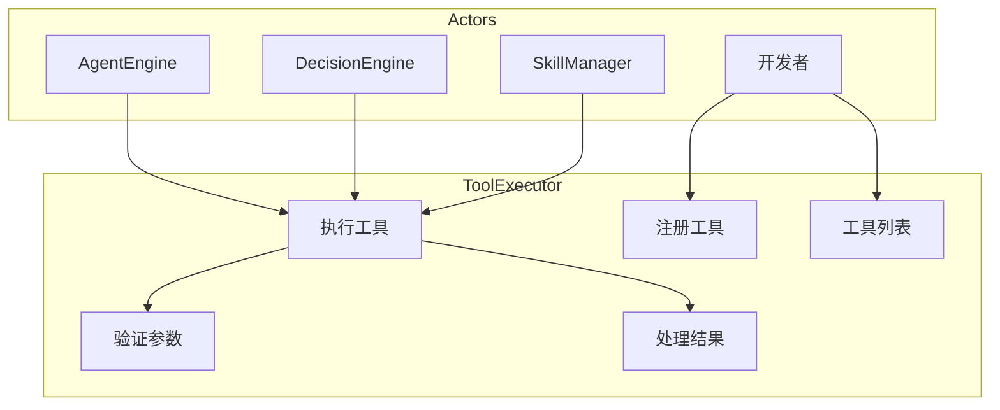
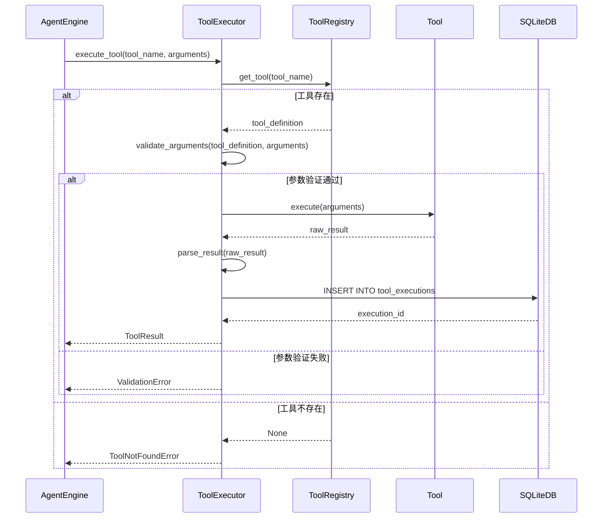
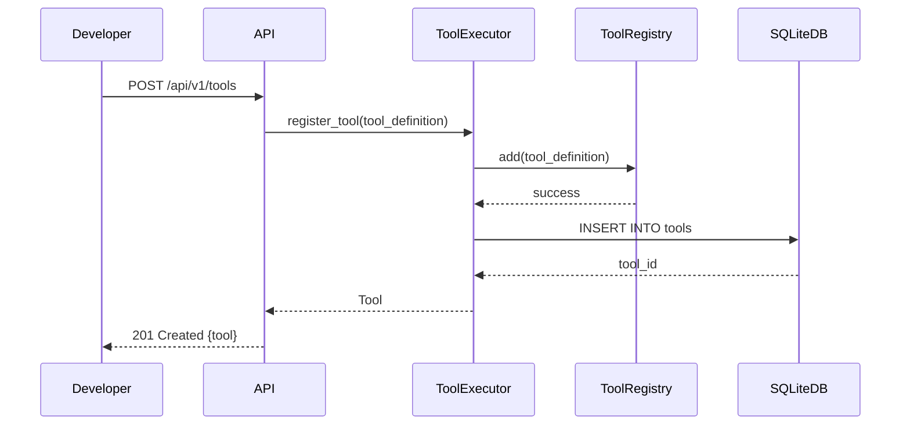
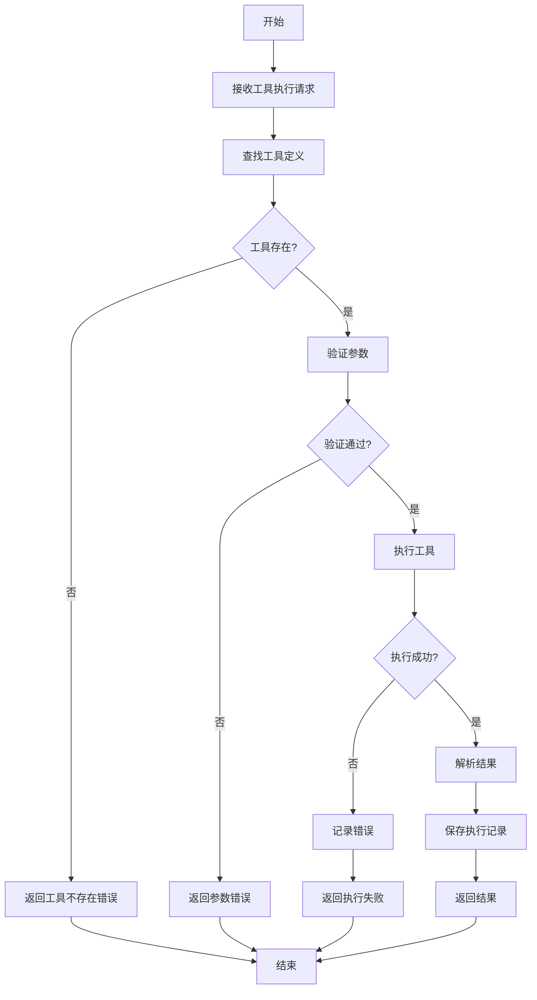
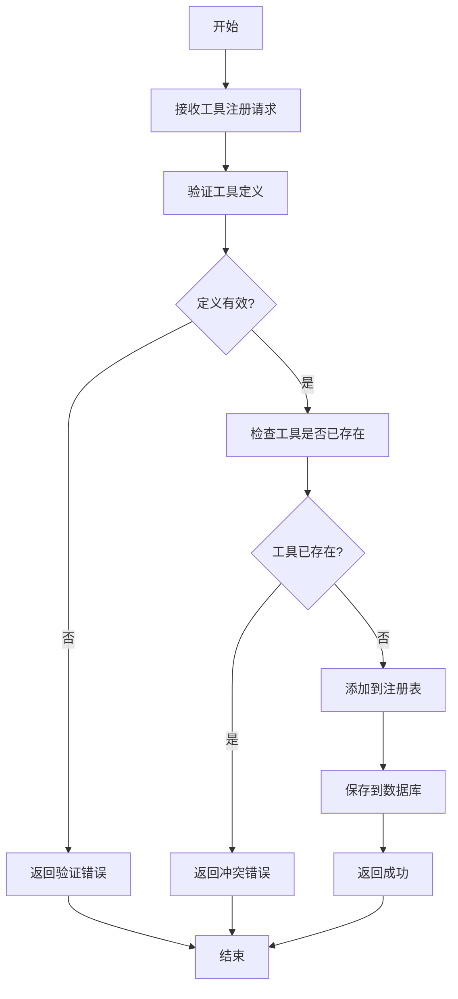
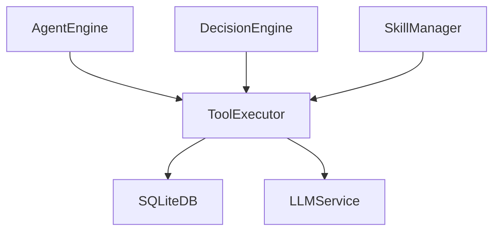

# ToolExecutor 模块特性设计文档

## 1. 模块概述

### 1.1 模块定位
ToolExecutor 是 Agent 的工具执行引擎，负责工具调用、参数验证、结果处理，是连接 Agent 与外部工具的核心桥梁。

### 1.2 核心职责
- 工具注册与发现
- 工具调用执行
- 参数验证与安全检查
- 结果解析与格式化

### 1.3 涉及用例
| 用例ID | 用例名称 | 关联程度 |
|--------|----------|----------|
| UC2 | 调用工具 | 强 |
| UC8 | API集成 | 中 |

---

## 2. 用例图



### 用例说明

| 用例 | 说明 | 前置条件 | 后置条件 |
|------|------|----------|----------|
| 注册工具 | 将工具添加到工具注册表 | 工具实现已准备 | 工具已注册 |
| 执行工具 | 调用指定工具 | 工具已注册 | 工具执行完成 |
| 验证参数 | 检查工具调用参数 | 工具存在 | 参数验证完成 |
| 工具列表 | 获取所有可用工具 | 用户已认证 | 返回工具列表 |
| 处理结果 | 解析工具返回结果 | 工具执行完成 | 结果已格式化 |

---

## 3. 时序图

### 3.1 工具执行流程



### 3.2 工具注册流程



---

## 4. 流程图

### 4.1 工具执行流程



### 4.2 工具注册流程



---

## 5. 模型设计

### 5.1 数据库表设计

**tools 表**

| 字段名 | 类型 | 约束 | 说明 |
|--------|------|------|------|
| id | INTEGER | PRIMARY KEY AUTOINCREMENT | 工具ID |
| name | VARCHAR(100) | UNIQUE NOT NULL | 工具名称 |
| description | TEXT | NULL | 工具描述 |
| function_name | VARCHAR(100) | NOT NULL | 函数名 |
| module_path | VARCHAR(255) | NOT NULL | 模块路径 |
| parameters | TEXT | NOT NULL | 参数定义(JSON) |
| return_type | VARCHAR(50) | NULL | 返回类型 |
| is_enabled | BOOLEAN | DEFAULT TRUE | 是否启用 |
| created_at | DATETIME | DEFAULT CURRENT_TIMESTAMP | 创建时间 |
| updated_at | DATETIME | DEFAULT CURRENT_TIMESTAMP | 更新时间 |

**tool_executions 表**

| 字段名 | 类型 | 约束 | 说明 |
|--------|------|------|------|
| id | INTEGER | PRIMARY KEY AUTOINCREMENT | 执行记录ID |
| tool_id | INTEGER | FOREIGN KEY REFERENCES tools(id) | 工具ID |
| user_id | INTEGER | FOREIGN KEY REFERENCES users(id) | 用户ID |
| session_id | INTEGER | FOREIGN KEY REFERENCES sessions(id) | 会话ID |
| arguments | TEXT | NULL | 调用参数(JSON) |
| result | TEXT | NULL | 执行结果 |
| success | BOOLEAN | NOT NULL | 是否成功 |
| error | TEXT | NULL | 错误信息 |
| execution_time | FLOAT | NULL | 执行时间(秒) |
| created_at | DATETIME | DEFAULT CURRENT_TIMESTAMP | 创建时间 |

### 5.2 数据模型

```python
from pydantic import BaseModel
from datetime import datetime
from typing import Optional, Dict, Any, List

class Parameter(BaseModel):
    name: str
    type: str
    required: bool = True
    description: Optional[str] = None

class Tool(BaseModel):
    id: int
    name: str
    description: Optional[str] = None
    function_name: str
    module_path: str
    parameters: List[Parameter]
    return_type: Optional[str] = None
    is_enabled: bool = True
    created_at: datetime = datetime.now()
    updated_at: datetime = datetime.now()

class ToolCreate(BaseModel):
    name: str
    description: Optional[str] = None
    function_name: str
    module_path: str
    parameters: List[Parameter]
    return_type: Optional[str] = None

class ToolUpdate(BaseModel):
    name: Optional[str] = None
    description: Optional[str] = None
    parameters: Optional[List[Parameter]] = None
    is_enabled: Optional[bool] = None

class ToolExecution(BaseModel):
    id: int
    tool_id: int
    user_id: int
    session_id: Optional[int] = None
    arguments: Optional[Dict[str, Any]] = None
    result: Optional[Dict[str, Any]] = None
    success: bool
    error: Optional[str] = None
    execution_time: Optional[float] = None
    created_at: datetime = datetime.now()
```

---

## 6. 接口设计

### 6.1 接口列表

| API路径 | HTTP方法 | 功能描述 |
|---------|----------|----------|
| `/api/v1/tools` | POST | 注册工具 |
| `/api/v1/tools` | GET | 获取工具列表 |
| `/api/v1/tools/{tool_id}` | GET | 获取单个工具 |
| `/api/v1/tools/{tool_id}` | PUT | 更新工具 |
| `/api/v1/tools/{tool_id}` | DELETE | 删除工具 |
| `/api/v1/tools/{tool_id}/execute` | POST | 执行工具 |

### 6.2 接口详细设计

#### 6.2.1 注册工具

**请求**:
```json
POST /api/v1/tools
Authorization: Bearer <access_token>
Content-Type: application/json

{
    "name": "string (工具名称)",
    "description": "string (可选，工具描述)",
    "function_name": "string (函数名)",
    "module_path": "string (模块路径)",
    "parameters": [
        {
            "name": "string",
            "type": "string",
            "required": true,
            "description": "string (可选)"
        }
    ],
    "return_type": "string (可选)"
}
```

**成功响应** (201 Created):
```json
{
    "code": 0,
    "message": "注册成功",
    "data": {
        "id": "integer",
        "name": "string",
        "description": "string",
        "is_enabled": true,
        "created_at": "datetime"
    }
}
```

#### 6.2.2 获取工具列表

**请求**:
```json
GET /api/v1/tools?page=1&limit=10&enabled=true
Authorization: Bearer <access_token>
```

**成功响应** (200 OK):
```json
{
    "code": 0,
    "message": "success",
    "data": {
        "items": [
            {
                "id": "integer",
                "name": "string",
                "description": "string",
                "parameters": [],
                "is_enabled": true,
                "created_at": "datetime"
            }
        ],
        "total": "integer",
        "page": "integer",
        "limit": "integer"
    }
}
```

#### 6.2.3 获取单个工具

**请求**:
```json
GET /api/v1/tools/{tool_id}
Authorization: Bearer <access_token>
```

**成功响应** (200 OK):
```json
{
    "code": 0,
    "message": "success",
    "data": {
        "id": "integer",
        "name": "string",
        "description": "string",
        "function_name": "string",
        "module_path": "string",
        "parameters": [],
        "return_type": "string",
        "is_enabled": true,
        "created_at": "datetime",
        "updated_at": "datetime"
    }
}
```

#### 6.2.4 更新工具

**请求**:
```json
PUT /api/v1/tools/{tool_id}
Authorization: Bearer <access_token>
Content-Type: application/json

{
    "name": "string (可选)",
    "description": "string (可选)",
    "parameters": "array (可选)",
    "is_enabled": "boolean (可选)"
}
```

**成功响应** (200 OK):
```json
{
    "code": 0,
    "message": "更新成功",
    "data": {
        "id": "integer",
        "name": "string",
        "updated_at": "datetime"
    }
}
```

#### 6.2.5 删除工具

**请求**:
```json
DELETE /api/v1/tools/{tool_id}
Authorization: Bearer <access_token>
```

**成功响应** (200 OK):
```json
{
    "code": 0,
    "message": "删除成功"
}
```

#### 6.2.6 执行工具

**请求**:
```json
POST /api/v1/tools/{tool_id}/execute
Authorization: Bearer <access_token>
Content-Type: application/json

{
    "arguments": {"key": "value"},
    "session_id": "integer (可选)"
}
```

**成功响应** (200 OK):
```json
{
    "code": 0,
    "message": "执行成功",
    "data": {
        "tool_id": "integer",
        "result": "object",
        "success": true,
        "execution_time": "float"
    }
}
```

**失败响应** (400 Bad Request):
```json
{
    "code": 400,
    "message": "参数验证失败",
    "data": {
        "errors": ["参数错误信息"]
    }
}
```

---

## 7. 代码模型设计

### 7.1 目录结构

```
backend/src/tools/
├── __init__.py
├── tool_executor.py      # 工具执行器
├── tool_registry.py      # 工具注册表
├── tool_validator.py     # 参数验证器
├── schemas.py            # 模型定义
└── builtin/              # 内置工具
    ├── __init__.py
    ├── search_tool.py
    └── calculator_tool.py
```

### 7.2 关键类与方法

#### ToolExecutor 类

| 方法名 | 功能 | 参数 | 返回值 |
|--------|------|------|--------|
| `execute` | 执行工具 | `tool_name: str`, `arguments: dict`, `session_id: Optional[int]` | `ToolExecution` |
| `register_tool` | 注册工具 | `tool_def: ToolCreate` | `Tool` |
| `get_tool` | 获取工具 | `tool_id: int` | `Tool` |
| `get_tools` | 获取工具列表 | `user_id: int`, `page: int`, `limit: int` | `List[Tool]` |
| `update_tool` | 更新工具 | `tool_id: int`, `**kwargs` | `Tool` |
| `delete_tool` | 删除工具 | `tool_id: int` | `None` |

#### ToolRegistry 类

| 方法名 | 功能 | 参数 | 返回值 |
|--------|------|------|--------|
| `add` | 添加工具到注册表 | `tool: Tool` | `None` |
| `get` | 获取工具 | `tool_name: str` | `Optional[Tool]` |
| `list` | 获取所有工具 | `enabled_only: bool = True` | `List[Tool]` |
| `remove` | 移除工具 | `tool_name: str` | `None` |
| `contains` | 检查工具是否存在 | `tool_name: str` | `bool` |

#### ToolValidator 类

| 方法名 | 功能 | 参数 | 返回值 |
|--------|------|------|--------|
| `validate` | 验证参数 | `tool: Tool`, `arguments: dict` | `bool` |
| `validate_type` | 验证类型 | `value: Any`, `expected_type: str` | `bool` |
| `get_errors` | 获取验证错误 | - | `List[str]` |

---

## 8. 与其他模块的关系



| 模块 | 关系 | 说明 |
|------|------|------|
| SQLiteDB | 依赖 | 存储工具定义和执行记录 |
| LLMService | 依赖 | 处理工具执行结果的总结 |
| AgentEngine | 依赖者 | 调用工具执行 |
| DecisionEngine | 依赖者 | 获取可用工具列表 |
| SkillManager | 依赖者 | 在技能中调用工具 |

---

## 9. 版本历史

| 版本 | 日期 | 变更说明 |
|------|------|----------|
| v1.0 | 2026-06 | 初始版本 |