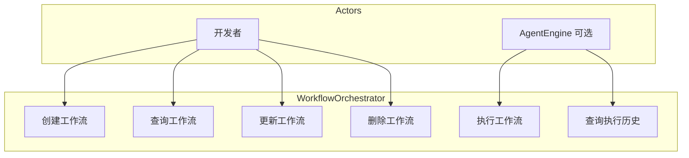
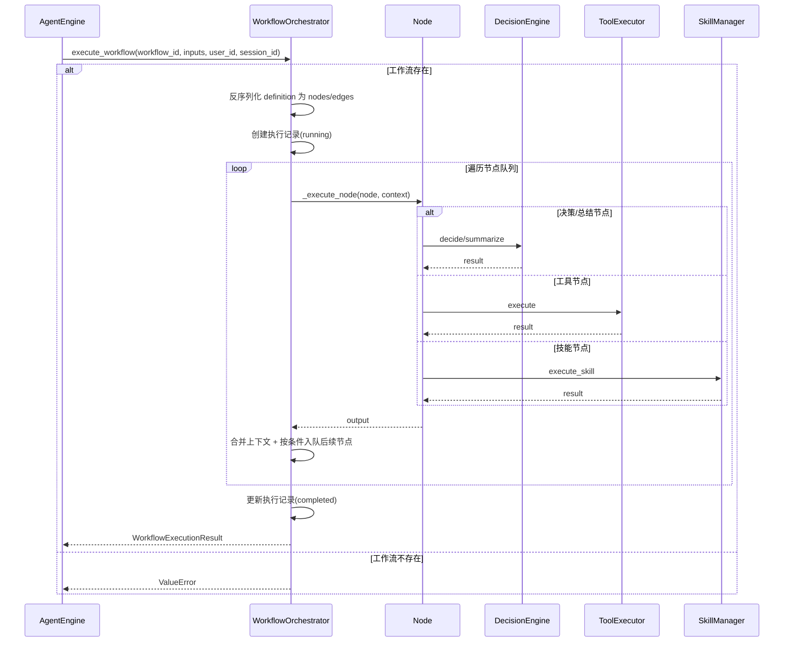
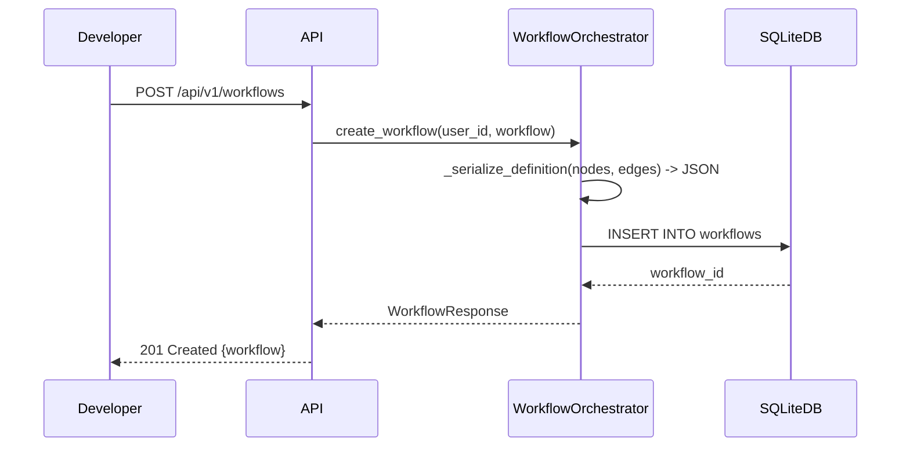
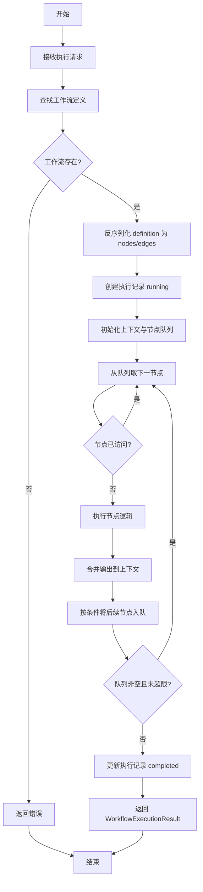
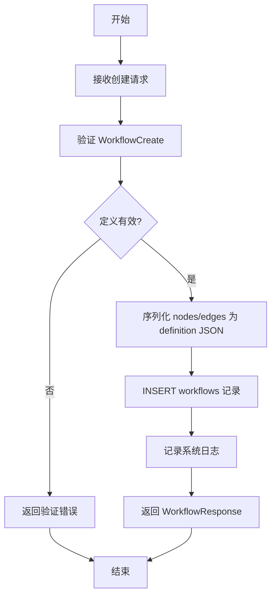
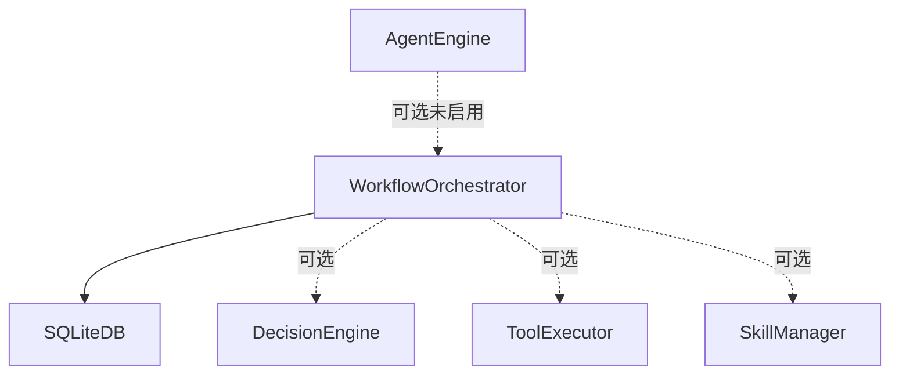

# WorkflowOrchestrator 模块特性设计文档

## 1. 模块概述

### 1.1 模块定位
WorkflowOrchestrator 是基于节点遍历的图执行引擎，负责管理工作流定义并按节点顺序遍历执行，支持条件分支，不支持循环与并行执行。

### 1.2 核心职责
- 工作流定义的序列化与反序列化（JSON）
- 节点定义与边路由配置
- 工作流执行与状态管理
- 执行监控

### 1.3 涉及用例
| 用例ID | 用例名称 | 关联程度 |
|--------|----------|----------|
| UC1 | 发起对话 | 强 |
| UC2 | 调用工具 | 强 |
| UC8 | API集成 | 中 |

---

## 2. 用例图



### 用例说明

| 用例 | 说明 | 前置条件 | 后置条件 |
|------|------|----------|----------|
| 创建工作流 | 提交包含节点与边的工作流定义并持久化 | 用户已认证 | 工作流已创建 |
| 查询工作流 | 获取单个工作流或分页列表 | 工作流存在 | 返回 WorkflowResponse |
| 更新工作流 | 修改名称、描述、节点、边或启用状态 | 工作流存在 | 工作流已更新 |
| 删除工作流 | 删除工作流定义 | 工作流存在 | 工作流已删除 |
| 执行工作流 | 反序列化定义并按节点遍历执行 | 工作流存在且已启用 | 返回 WorkflowExecutionResult |
| 查询执行历史 | 分页获取工作流执行记录 | 工作流存在 | 返回分页执行结果 |

---

## 3. 时序图

### 3.1 工作流执行流程



### 3.2 工作流构建流程



---

## 4. 流程图

### 4.1 工作流执行流程



### 4.2 工作流构建流程



---

## 5. 模型设计

### 5.1 数据库表设计

**workflows 表**

| 字段名 | 类型 | 约束 | 说明 |
|--------|------|------|------|
| id | INTEGER | PRIMARY KEY AUTOINCREMENT | 工作流ID |
| user_id | INTEGER | FOREIGN KEY REFERENCES users(id), INDEX, NOT NULL | 用户ID |
| name | VARCHAR(100) | NOT NULL, INDEX | 工作流名称 |
| description | TEXT | NULL | 工作流描述 |
| definition | TEXT | NOT NULL | 工作流定义(JSON) |
| is_enabled | BOOLEAN | DEFAULT TRUE | 是否启用 |
| created_at | DATETIME | DEFAULT CURRENT_TIMESTAMP | 创建时间 |
| updated_at | DATETIME | NULL, ON UPDATE CURRENT_TIMESTAMP | 更新时间（仅在更新时自动设置，无默认值） |

**workflow_executions 表**

| 字段名 | 类型 | 约束 | 说明 |
|--------|------|------|------|
| id | INTEGER | PRIMARY KEY AUTOINCREMENT | 执行记录ID |
| workflow_id | INTEGER | FOREIGN KEY REFERENCES workflows(id), INDEX, NOT NULL | 工作流ID |
| user_id | INTEGER | FOREIGN KEY REFERENCES users(id), NOT NULL | 用户ID |
| session_id | INTEGER | FOREIGN KEY REFERENCES sessions(id), NULL | 会话ID |
| inputs | TEXT | NULL | 输入参数(JSON) |
| outputs | TEXT | NULL | 输出结果(JSON) |
| status | VARCHAR(20) | NOT NULL | 执行状态(running/completed/failed) |
| error | TEXT | NULL | 错误信息 |
| started_at | DATETIME | DEFAULT CURRENT_TIMESTAMP | 开始时间 |
| completed_at | DATETIME | NULL | 完成时间 |

### 5.2 数据模型

数据模型分为两层：数据库 ORM 模型（定义在 `backend/src/db/models.py`）与 API 请求/响应模型（定义在 `backend/src/workflow/schemas.py`）。

#### 5.2.1 数据库 ORM 模型（`db/models.py`）

`Workflow` 与 `WorkflowExecution` 为 SQLAlchemy ORM 模型，对应 5.1 中的两张表，字段与表结构一致，此处不再赘述。

#### 5.2.2 API 请求/响应模型（`workflow/schemas.py`）

```python
from pydantic import BaseModel
from datetime import datetime
from typing import Optional, Dict, Any, List

class WorkflowNode(BaseModel):
    name: str
    type: str  # decision/tool/skill/summary
    config: Optional[Dict[str, Any]] = None

class WorkflowEdge(BaseModel):
    source: str
    target: str
    condition: Optional[str] = None

class WorkflowCreate(BaseModel):
    name: str
    description: Optional[str] = None
    nodes: List[WorkflowNode]
    edges: List[WorkflowEdge]

class WorkflowUpdate(BaseModel):
    name: Optional[str] = None
    description: Optional[str] = None
    nodes: Optional[List[WorkflowNode]] = None
    edges: Optional[List[WorkflowEdge]] = None
    is_enabled: Optional[bool] = None

class WorkflowResponse(BaseModel):
    id: int
    user_id: int
    name: str
    description: Optional[str]
    nodes: List[WorkflowNode]
    edges: List[WorkflowEdge]
    is_enabled: bool
    created_at: datetime

    class Config:
        from_attributes = True

class WorkflowExecutionResult(BaseModel):
    execution_id: int
    workflow_id: int
    status: str
    outputs: Optional[Dict[str, Any]] = None
    error: Optional[str] = None
    started_at: datetime
    completed_at: Optional[datetime] = None
```

> 注：`WorkflowResponse` 不包含 `updated_at` 字段；`WorkflowExecutionResult` 仅返回执行结果摘要，不直接暴露 ORM 的 `inputs`/`user_id`/`session_id` 等字段。

---

## 6. 接口设计

### 6.1 接口列表

| API路径 | HTTP方法 | 功能描述 |
|---------|----------|----------|
| `/api/v1/workflows` | POST | 创建工作流 |
| `/api/v1/workflows` | GET | 获取工作流列表 |
| `/api/v1/workflows/{workflow_id}` | GET | 获取单个工作流 |
| `/api/v1/workflows/{workflow_id}` | PUT | 更新工作流 |
| `/api/v1/workflows/{workflow_id}` | DELETE | 删除工作流 |
| `/api/v1/workflows/{workflow_id}/execute` | POST | 执行工作流 |
| `/api/v1/workflows/{workflow_id}/executions` | GET | 获取执行历史 |
| `/api/v1/workflows/executions/{execution_id}` | GET | 获取执行详情 |

### 6.2 接口详细设计

#### 6.2.1 创建工作流

**请求**:
```json
POST /api/v1/workflows
Authorization: Bearer <access_token>
Content-Type: application/json

{
    "name": "string (工作流名称)",
    "description": "string (可选，工作流描述)",
    "nodes": [
        {
            "name": "string",
            "type": "decision|tool|skill|summary",
            "config": {"key": "value"}
        }
    ],
    "edges": [
        {
            "source": "string",
            "target": "string",
            "condition": "string (可选)"
        }
    ]
}
```

**成功响应** (201 Created):
```json
{
    "code": 0,
    "message": "创建成功",
    "data": {
        "id": "integer",
        "name": "string",
        "description": "string",
        "is_enabled": true,
        "created_at": "datetime"
    }
}
```

#### 6.2.2 获取工作流列表

**请求**:
```json
GET /api/v1/workflows?page=1&limit=10&enabled=true
Authorization: Bearer <access_token>
```

**成功响应** (200 OK):
```json
{
    "code": 0,
    "message": "success",
    "data": {
        "items": [
            {
                "id": "integer",
                "name": "string",
                "description": "string",
                "node_count": "integer",
                "edge_count": "integer",
                "is_enabled": true,
                "created_at": "datetime"
            }
        ],
        "total": "integer",
        "page": "integer",
        "limit": "integer"
    }
}
```

#### 6.2.3 获取单个工作流

**请求**:
```json
GET /api/v1/workflows/{workflow_id}
Authorization: Bearer <access_token>
```

**成功响应** (200 OK):
```json
{
    "code": 0,
    "message": "success",
    "data": {
        "id": "integer",
        "user_id": "integer",
        "name": "string",
        "description": "string",
        "nodes": [],
        "edges": [],
        "is_enabled": true,
        "created_at": "datetime"
    }
}
```

#### 6.2.4 更新工作流

**请求**:
```json
PUT /api/v1/workflows/{workflow_id}
Authorization: Bearer <access_token>
Content-Type: application/json

{
    "name": "string (可选)",
    "description": "string (可选)",
    "nodes": "array (可选)",
    "edges": "array (可选)",
    "is_enabled": "boolean (可选)"
}
```

**成功响应** (200 OK):
```json
{
    "code": 0,
    "message": "更新成功",
    "data": {
        "id": "integer",
        "user_id": "integer",
        "name": "string",
        "description": "string",
        "nodes": [],
        "edges": [],
        "is_enabled": true,
        "created_at": "datetime"
    }
}
```

#### 6.2.5 删除工作流

**请求**:
```json
DELETE /api/v1/workflows/{workflow_id}
Authorization: Bearer <access_token>
```

**成功响应** (200 OK):
```json
{
    "code": 0,
    "message": "删除成功"
}
```

#### 6.2.6 执行工作流

**请求**:
```json
POST /api/v1/workflows/{workflow_id}/execute
Authorization: Bearer <access_token>
Content-Type: application/json

{
    "inputs": {"key": "value"},
    "session_id": "integer (可选)"
}
```

**成功响应** (200 OK):
```json
{
    "code": 0,
    "message": "执行成功",
    "data": {
        "execution_id": "integer",
        "workflow_id": "integer",
        "outputs": "object",
        "status": "completed",
        "completed_at": "datetime"
    }
}
```

#### 6.2.7 获取执行历史

**请求**:
```json
GET /api/v1/workflows/{workflow_id}/executions?page=1&limit=10
Authorization: Bearer <access_token>
```

**成功响应** (200 OK):
```json
{
    "code": 0,
    "message": "success",
    "data": {
        "items": [
            {
                "id": "integer",
                "status": "string",
                "started_at": "datetime",
                "completed_at": "datetime"
            }
        ],
        "total": "integer",
        "page": "integer",
        "limit": "integer"
    }
}
```

---

## 7. 代码模型设计

### 7.1 目录结构

```
backend/src/workflow/
├── __init__.py
├── orchestrator.py    # 工作流编排器（CRUD + 节点遍历执行）
└── schemas.py         # Pydantic 请求/响应模型
```

### 7.2 关键类与方法

#### WorkflowOrchestrator 类

| 方法名 | 功能 | 参数 | 返回值 |
|--------|------|------|--------|
| `__init__` | 初始化编排器 | `db: Session`, `decision_engine: Optional[DecisionEngine]`, `tool_executor: Optional[ToolExecutor]`, `skill_manager: Optional[SkillManager]` | `None` |
| `create_workflow` | 创建工作流 | `user_id: int`, `workflow: WorkflowCreate` | `WorkflowResponse` |
| `get_workflow` | 获取单个工作流 | `workflow_id: int` | `Optional[WorkflowResponse]` |
| `get_workflows` | 获取工作流列表（分页） | `user_id: int`, `page: int = 1`, `limit: int = 20` | `Dict[str, Any]` |
| `update_workflow` | 更新工作流 | `workflow_id: int`, `update: WorkflowUpdate` | `WorkflowResponse` |
| `delete_workflow` | 删除工作流 | `workflow_id: int` | `bool` |
| `execute_workflow` | 执行工作流 | `workflow_id: int`, `inputs: Dict[str, Any]`, `user_id: int`, `session_id: Optional[int] = None` | `WorkflowExecutionResult` |
| `get_executions` | 获取执行历史（分页） | `workflow_id: int`, `page: int = 1`, `limit: int = 20` | `Dict[str, Any]` |
| `_serialize_definition` | 序列化节点/边为 JSON 字符串 | `nodes: List[WorkflowNode]`, `edges: List[WorkflowEdge]` | `str`（静态方法） |
| `_deserialize_definition` | 反序列化 JSON 为节点/边 | `definition: str` | `tuple[List[WorkflowNode], List[WorkflowEdge]]`（静态方法） |
| `_to_response` | ORM 模型转 WorkflowResponse | `entry: Workflow` | `WorkflowResponse`（静态方法） |
| `_execution_to_result` | ORM 执行记录转结果模型 | `execution: WorkflowExecution` | `WorkflowExecutionResult`（静态方法） |
| `_run_nodes` | 按节点顺序遍历执行 | `nodes: List[WorkflowNode]`, `edges: List[WorkflowEdge]`, `inputs: Dict[str, Any]`, `user_id: int`, `session_id: Optional[int]` | `Dict[str, Any]` |
| `_execute_node` | 根据类型执行单个节点 | `node: WorkflowNode`, `context: Dict[str, Any]`, `user_id: int`, `session_id: Optional[int]` | `Dict[str, Any]` |
| `_execute_decision_node` | 执行决策节点（调用 DecisionEngine.decide） | `node: WorkflowNode`, `context: Dict[str, Any]`, `user_id: int`, `session_id: Optional[int]` | `Dict[str, Any]` |
| `_execute_tool_node` | 执行工具节点（调用 ToolExecutor.execute） | `node: WorkflowNode`, `context: Dict[str, Any]`, `user_id: int`, `session_id: Optional[int]` | `Dict[str, Any]` |
| `_execute_skill_node` | 执行技能节点（调用 SkillManager.execute_skill） | `node: WorkflowNode`, `context: Dict[str, Any]`, `user_id: int`, `session_id: Optional[int]` | `Dict[str, Any]` |
| `_execute_summary_node` | 执行总结节点（调用 DecisionEngine.summarize） | `node: WorkflowNode`, `context: Dict[str, Any]`, `user_id: int`, `session_id: Optional[int]` | `Dict[str, Any]` |
| `_should_traverse` | 判断是否遍历到目标节点 | `condition: Optional[str]`, `output: Dict[str, Any]` | `bool`（静态方法） |

> 注：实现中不存在 `WorkflowCompiler` 与 `NodeExecutor` 类，节点编译与执行逻辑均内聚于 `WorkflowOrchestrator` 中。

---

## 8. 与其他模块的关系



| 模块 | 关系 | 说明 |
|------|------|------|
| SQLiteDB | 依赖 | 存储工作流定义和执行记录 |
| DecisionEngine | 可选依赖 | 决策/总结节点调用其 decide/summarize；构造时未注入则相关节点抛错 |
| ToolExecutor | 可选依赖 | 工具节点调用其 execute；构造时未注入则相关节点抛错 |
| SkillManager | 可选依赖 | 技能节点调用其 execute_skill；构造时未注入则相关节点抛错 |
| AgentEngine | 可选依赖者 | 当前未在主循环中调用 WorkflowOrchestrator，依赖关系为可选且未启用 |

---

## 9. 版本历史

| 版本 | 日期 | 变更说明 |
|------|------|----------|
| v1.0 | 2026-06 | 初始版本 |
| v1.1 | 2026-06 | 根据实现反馈更新文档以匹配实际代码 |
