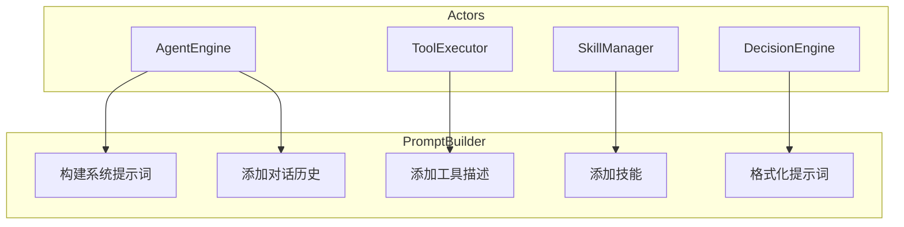
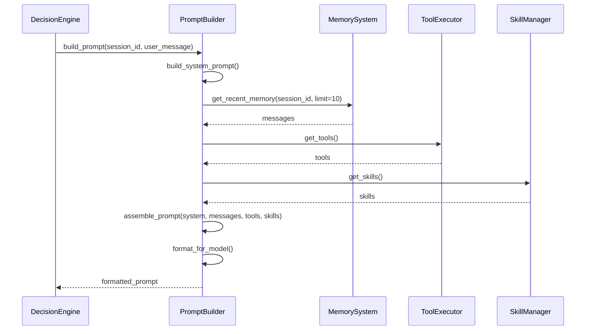
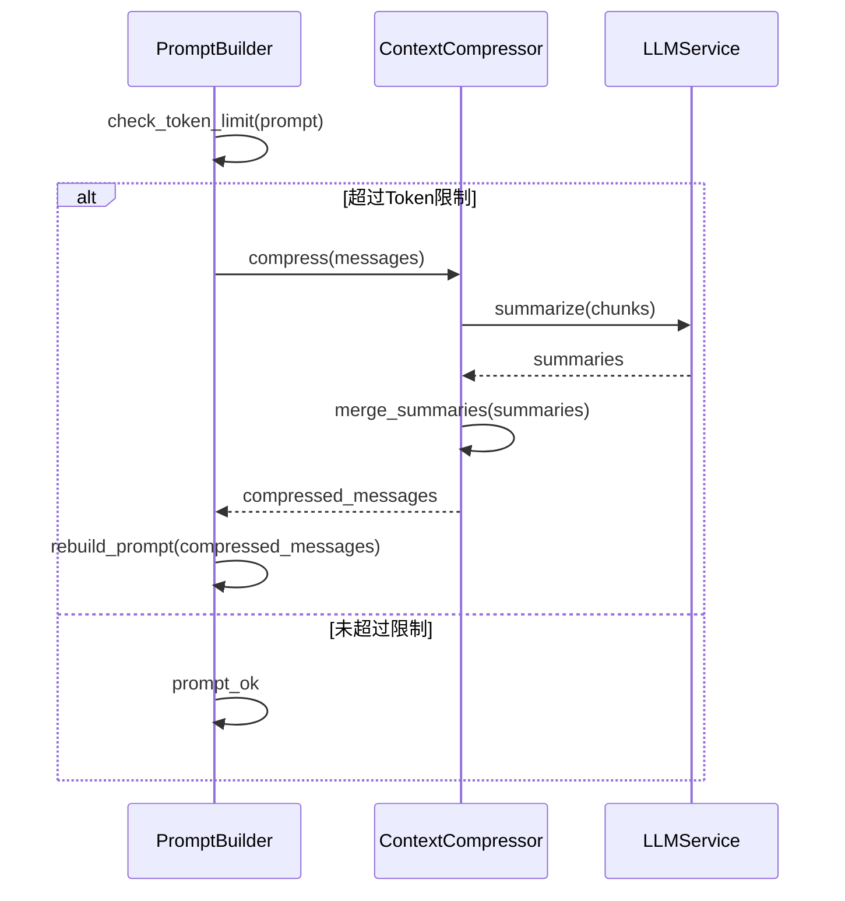
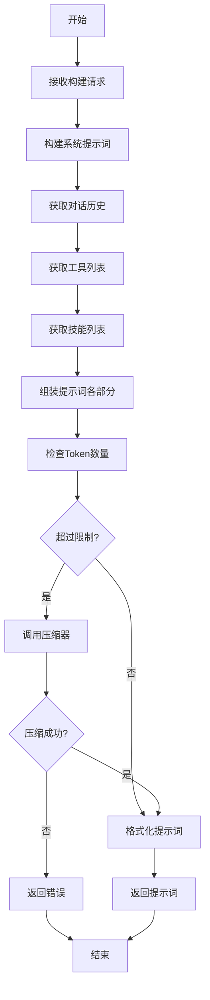
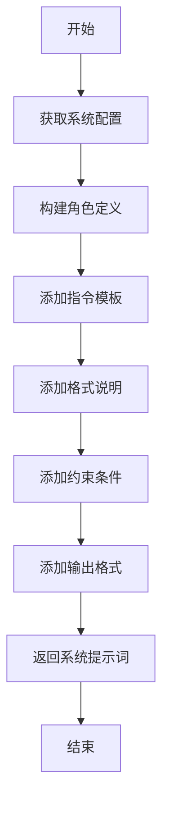
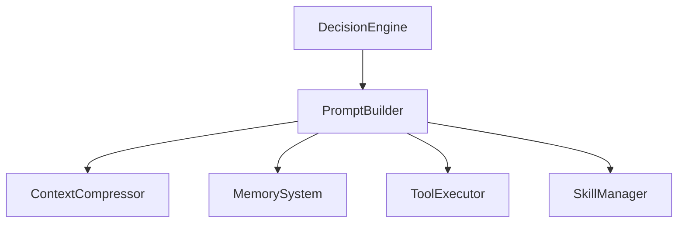

# PromptBuilder 模块特性设计文档

## 1. 模块概述

### 1.1 模块定位
PromptBuilder 是动态提示词构建引擎，负责根据对话上下文、工具列表、技能定义等动态组装符合 LLM 格式要求的提示词。

### 1.2 核心职责
- 系统提示词构建
- 对话历史整合
- 工具描述生成
- 技能信息注入
- 提示词格式化

### 1.3 涉及用例
| 用例ID | 用例名称 | 关联程度 |
|--------|----------|----------|
| UC1 | 发起对话 | 强 |
| UC2 | 调用工具 | 强 |
| UC7 | 训练技能 | 中 |

---

## 2. 用例图



### 用例说明

| 用例 | 说明 | 前置条件 | 后置条件 |
|------|------|----------|----------|
| 构建系统提示词 | 生成系统角色定义 | 系统配置已准备 | 系统提示词已生成 |
| 添加对话历史 | 将历史消息加入提示词 | 对话历史存在 | 历史已整合 |
| 添加工具描述 | 将工具定义加入提示词 | 工具列表已获取 | 工具描述已添加 |
| 添加技能 | 将技能信息加入提示词 | 技能列表已获取 | 技能已注入 |
| 格式化提示词 | 按模型要求格式化 | 各部分内容已准备 | 提示词已格式化 |

---

## 3. 时序图

### 3.1 提示词构建流程



### 3.2 上下文压缩流程



---

## 4. 流程图

### 4.1 提示词构建流程



### 4.2 系统提示词构建流程



---

## 5. 模型设计

### 5.1 数据模型

```python
from pydantic import BaseModel
from typing import Optional, Dict, Any, List

class Message(BaseModel):
    role: str  # system/user/assistant/tool
    content: str
    tool_call: Optional[Dict[str, Any]] = None

class ToolDescription(BaseModel):
    name: str
    description: str
    parameters: List[Dict[str, Any]]

class SkillDescription(BaseModel):
    name: str
    description: str
    prompt: str

class PromptConfig(BaseModel):
    system_prompt: str
    max_tokens: int = 8192
    model_name: str = "gpt-4o"
    include_tools: bool = True
    include_skills: bool = True
    history_limit: int = 10

class BuiltPrompt(BaseModel):
    messages: List[Message]
    token_count: int
    is_compressed: bool = False
    original_token_count: Optional[int] = None
```

---

## 6. 代码模型设计

### 6.1 目录结构

```
backend/src/prompt/
├── __init__.py
├── prompt_builder.py      # 提示词构建器
├── system_prompt.py       # 系统提示词模板
├── formatters.py          # 格式转换器
└── schemas.py             # 模型定义
```

### 6.2 关键类与方法

#### PromptBuilder 类

| 方法名 | 功能 | 参数 | 返回值 |
|--------|------|------|--------|
| `build` | 构建完整提示词 | `session_id: int`, `user_message: str`, `config: Optional[PromptConfig]` | `BuiltPrompt` |
| `build_system_prompt` | 构建系统提示词 | `config: PromptConfig` | `str` |
| `add_messages` | 添加对话历史 | `messages: List[Message]` | `None` |
| `add_tools` | 添加工具描述 | `tools: List[ToolDescription]` | `None` |
| `add_skills` | 添加技能描述 | `skills: List[SkillDescription]` | `None` |
| `format` | 格式化提示词 | `model_name: str` | `BuiltPrompt` |
| `_count_tokens` | 计算Token数量 | `text: str` | `int` |

#### SystemPrompt 类

| 方法名 | 功能 | 参数 | 返回值 |
|--------|------|------|--------|
| `generate` | 生成系统提示词 | `role: str`, `instructions: List[str]`, `constraints: List[str]` | `str` |
| `get_default` | 获取默认系统提示词 | - | `str` |
| `load_template` | 从模板加载 | `template_name: str` | `str` |

#### Formatters 类

| 方法名 | 功能 | 参数 | 返回值 |
|--------|------|------|--------|
| `format_for_openai` | 格式化为OpenAI格式 | `prompt: BuiltPrompt` | `List[Dict[str, str]]` |
| `format_for_anthropic` | 格式化为Anthropic格式 | `prompt: BuiltPrompt` | `str` |
| `format_for_ollama` | 格式化为Ollama格式 | `prompt: BuiltPrompt` | `str` |

---

## 7. 与其他模块的关系



| 模块 | 关系 | 说明 |
|------|------|------|
| ContextCompressor | 依赖 | 超过Token限制时进行压缩 |
| MemorySystem | 依赖 | 获取对话历史 |
| ToolExecutor | 依赖 | 获取可用工具列表 |
| SkillManager | 依赖 | 获取可用技能列表 |
| DecisionEngine | 依赖者 | 获取构建好的提示词 |

---

## 8. 版本历史

| 版本 | 日期 | 变更说明 |
|------|------|----------|
| v1.0 | 2026-06 | 初始版本 |