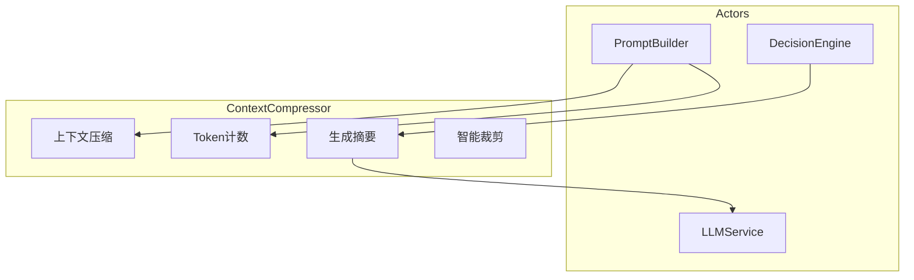
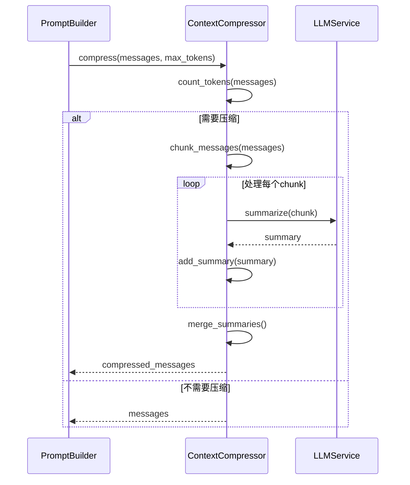
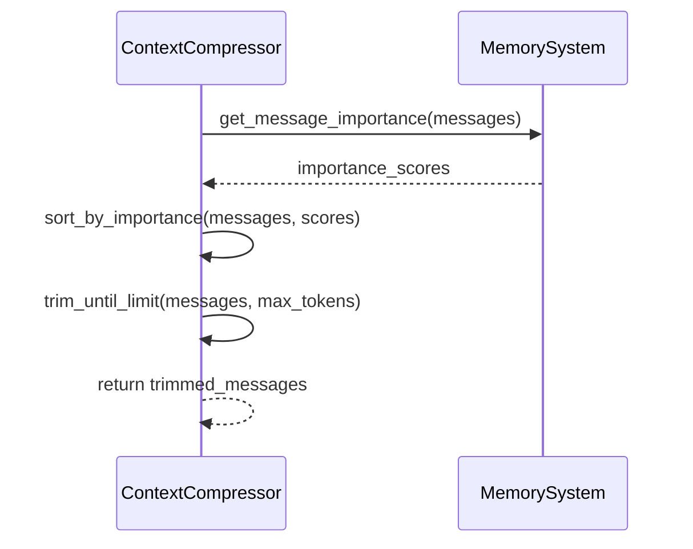
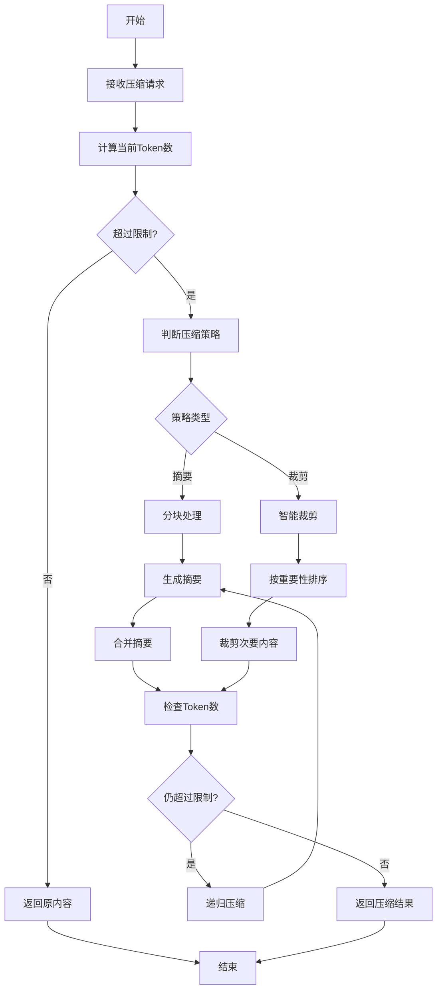
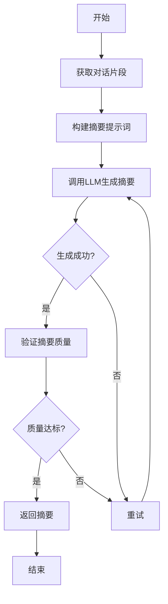
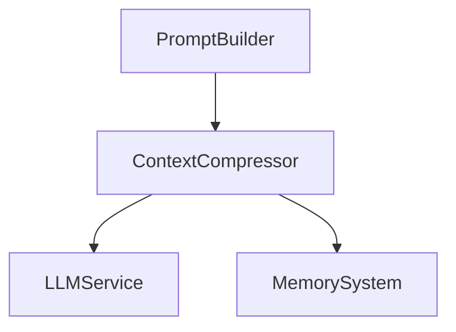

# ContextCompressor 模块特性设计文档

## 1. 模块概述

### 1.1 模块定位
ContextCompressor 是上下文压缩引擎，负责管理对话上下文的 Token 数量，通过智能摘要和裁剪确保提示词在模型限制范围内。

### 1.2 核心职责
- 上下文压缩
- 摘要生成
- Token计数
- 智能裁剪

### 1.3 涉及用例
| 用例ID | 用例名称 | 关联程度 |
|--------|----------|----------|
| UC1 | 发起对话 | 中 |
| UC2 | 调用工具 | 中 |

---

## 2. 用例图



### 用例说明

| 用例 | 说明 | 前置条件 | 后置条件 |
|------|------|----------|----------|
| 上下文压缩 | 压缩对话历史到Token限制内 | 对话历史存在 | 上下文已压缩 |
| 生成摘要 | 对对话片段生成摘要 | 需要压缩的内容存在 | 摘要已生成 |
| Token计数 | 计算提示词Token数量 | 提示词内容已准备 | Token数已计算 |
| 智能裁剪 | 保留重要信息，裁剪次要内容 | 超过Token限制 | 内容已裁剪 |

---

## 3. 时序图

### 3.1 上下文压缩流程



### 3.2 智能裁剪流程



---

## 4. 流程图

### 4.1 上下文压缩流程



### 4.2 摘要生成流程



---

## 5. 模型设计

### 5.1 数据模型

```python
from pydantic import BaseModel
from typing import Optional, Dict, Any, List

class CompressionResult(BaseModel):
    messages: List[Dict[str, Any]]
    original_token_count: int
    compressed_token_count: int
    compression_ratio: float
    method: str  # summary/trim/hybrid

class CompressionConfig(BaseModel):
    max_tokens: int = 8192
    compression_strategy: str = "hybrid"  # summary/trim/hybrid
    summary_ratio: float = 0.3
    min_messages: int = 3
```

---

## 6. 代码模型设计

### 6.1 目录结构

```
backend/src/context/
├── __init__.py
├── context_compressor.py    # 上下文压缩器
├── token_counter.py         # Token计数器
├── summarizer.py            # 摘要生成器
└── schemas.py               # 模型定义
```

### 6.2 关键类与方法

#### ContextCompressor 类

| 方法名 | 功能 | 参数 | 返回值 |
|--------|------|------|--------|
| `compress` | 压缩上下文 | `messages: List[Dict]`, `max_tokens: int`, `config: CompressionConfig` | `CompressionResult` |
| `summarize` | 生成摘要 | `text: str` | `str` |
| `trim` | 智能裁剪 | `messages: List[Dict]`, `max_tokens: int` | `List[Dict]` |
| `hybrid_compress` | 混合压缩 | `messages: List[Dict]`, `max_tokens: int` | `CompressionResult` |

#### TokenCounter 类

| 方法名 | 功能 | 参数 | 返回值 |
|--------|------|------|--------|
| `count` | 计算Token数量 | `text: str`, `model_name: str` | `int` |
| `count_messages` | 计算消息列表Token数 | `messages: List[Dict]` | `int` |
| `estimate` | 估算Token数量 | `text: str` | `int` |

#### Summarizer 类

| 方法名 | 功能 | 参数 | 返回值 |
|--------|------|------|--------|
| `summarize_chunk` | 对单个chunk生成摘要 | `chunk: str`, `max_length: int` | `str` |
| `merge_summaries` | 合并多个摘要 | `summaries: List[str]` | `str` |
| `generate_summary` | 生成完整摘要 | `messages: List[Dict]` | `str` |

---

## 7. 与其他模块的关系



| 模块 | 关系 | 说明 |
|------|------|------|
| LLMService | 依赖 | 生成摘要时调用LLM |
| MemorySystem | 依赖 | 获取消息重要性评分 |
| PromptBuilder | 依赖者 | 调用压缩功能 |

---

## 8. 版本历史

| 版本 | 日期 | 变更说明 |
|------|------|----------|
| v1.0 | 2026-06 | 初始版本 |