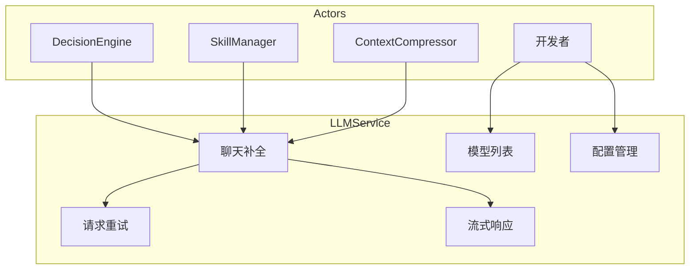
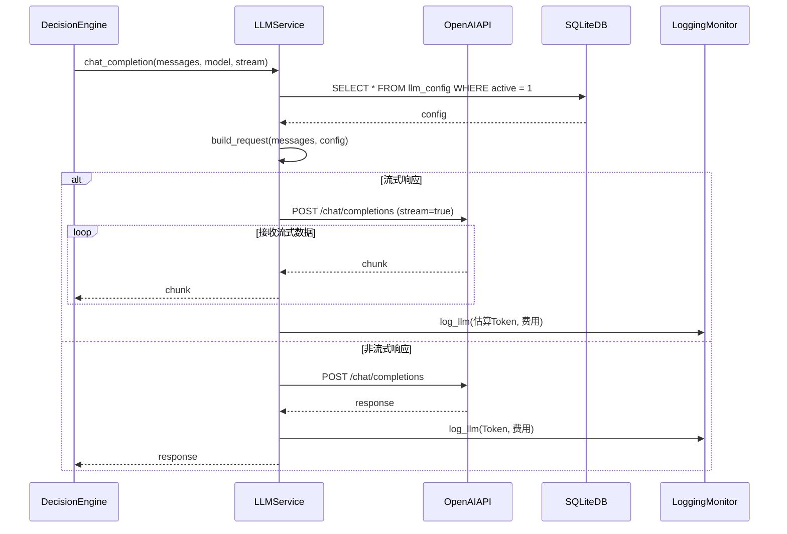
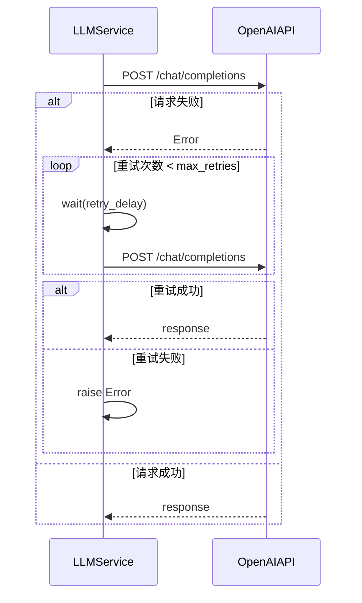
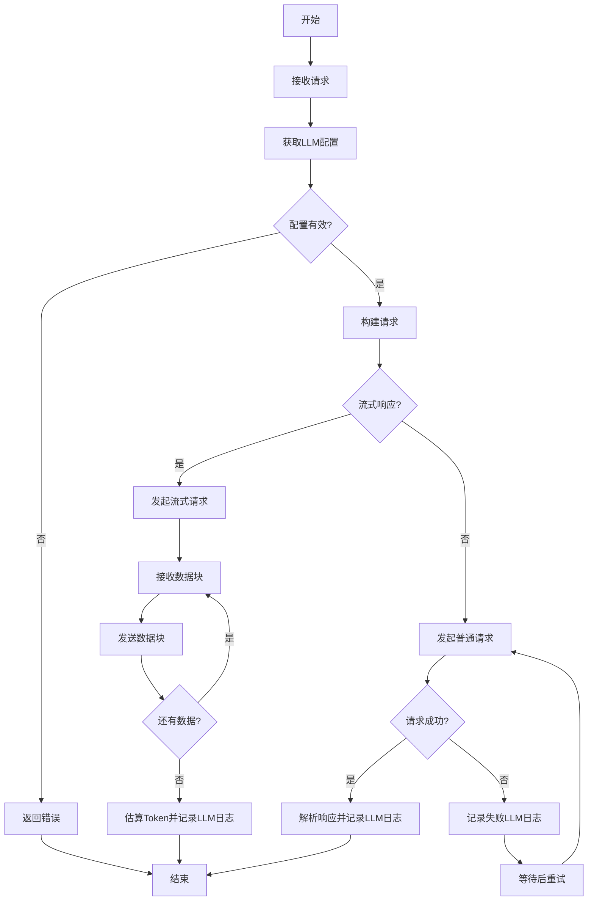
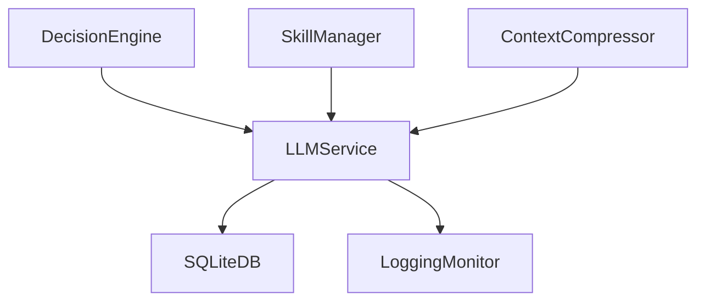

# LLM Service 模块特性设计文档

## 1. 模块概述

### 1.1 模块定位
LLM Service 是大语言模型服务封装层，提供 OpenAI 协议兼容的接口调用，支持多种模型和流式响应。

### 1.2 核心职责
- OpenAI协议兼容调用
- 模型列表管理
- 配置管理
- 请求重试
- 流式响应支持

### 1.3 涉及用例
| 用例ID | 用例名称 | 关联程度 |
|--------|----------|----------|
| UC1 | 发起对话 | 强 |
| UC2 | 调用工具 | 强 |
| UC7 | 训练技能 | 强 |

---

## 2. 用例图



### 用例说明

| 用例 | 说明 | 前置条件 | 后置条件 |
|------|------|----------|----------|
| 聊天补全 | 调用chat_completion接口 | API配置已完成 | 返回模型响应 |
| 模型列表 | 获取可用模型列表 | 服务已启动 | 返回模型列表 |
| 配置管理 | 管理API密钥和端点 | 用户已认证 | 配置已保存 |
| 请求重试 | 处理API调用失败重试 | 调用失败 | 重试成功或返回错误 |
| 流式响应 | 支持流式输出 | 客户端支持流式 | 返回流式响应 |

---

## 3. 时序图

### 3.1 聊天补全流程



### 3.2 请求重试流程



---

## 4. 流程图

### 4.1 聊天补全流程



> 说明：实际实现中重试机制对**所有异常**均进行重试（无 `_should_retry` 过滤），重试常量为 `MAX_RETRIES=3`、`INITIAL_BACKOFF=1.0`，退避倍数为 2（指数退避）。重试耗尽后抛出最后一次异常。流式模式下由于无法从 OpenAI 流式响应中精确获取 Token 数，采用 `字符数 / 4` 的粗略估算策略记录日志。

---

## 5. 模型设计

### 5.1 数据库表设计

**llm_configs 表**

| 字段名 | 类型 | 约束 | 说明 |
|--------|------|------|------|
| id | INTEGER | PRIMARY KEY AUTOINCREMENT | 配置ID |
| user_id | INTEGER | FOREIGN KEY REFERENCES users(id), NOT NULL, INDEX | 用户ID |
| name | VARCHAR(100) | NOT NULL, INDEX | 配置名称 |
| api_key | VARCHAR(255) | NOT NULL | API密钥 |
| api_base | VARCHAR(255) | NOT NULL | API端点 |
| model_name | VARCHAR(100) | NOT NULL | 默认模型 |
| max_tokens | INTEGER | DEFAULT 4096 | 最大Token数 |
| temperature | FLOAT | DEFAULT 0.7 | 温度参数 |
| is_active | BOOLEAN | DEFAULT FALSE | 是否激活 |
| created_at | DATETIME | DEFAULT CURRENT_TIMESTAMP | 创建时间 |
| updated_at | DATETIME | ON UPDATE CURRENT_TIMESTAMP | 更新时间 |

> 说明：`name` 字段实际仅有 `NOT NULL` 和索引约束，**无 UNIQUE 约束**。`LLMConfig` 为 SQLAlchemy ORM 模型，定义于 `backend/src/db/models.py`。

### 5.2 数据模型

> 说明：`LLMConfig` 为 SQLAlchemy ORM 模型（位于 `backend/src/db/models.py`），不在 `schemas.py` 中定义。`schemas.py` 仅包含 `LLMConfigCreate`、`LLMConfigUpdate`、`ChatMessage`、`ChatCompletionRequest`、`ChatCompletionResponse` 等 Pydantic 模型。

```python
from pydantic import BaseModel
from typing import Optional, Dict, Any, List

# LLMConfig 为 SQLAlchemy 模型，定义于 backend/src/db/models.py
# class LLMConfig(Base):
#     __tablename__ = "llm_configs"
#     id, user_id, name, api_key, api_base, model_name,
#     max_tokens, temperature, is_active, created_at, updated_at

class LLMConfigCreate(BaseModel):
    name: str
    api_key: str
    api_base: str
    model_name: str
    max_tokens: Optional[int] = 4096
    temperature: Optional[float] = 0.7

class LLMConfigUpdate(BaseModel):
    name: Optional[str] = None
    api_key: Optional[str] = None
    api_base: Optional[str] = None
    model_name: Optional[str] = None
    max_tokens: Optional[int] = None
    temperature: Optional[float] = None

class ChatMessage(BaseModel):
    role: str  # system/user/assistant/tool
    content: str

class ChatCompletionRequest(BaseModel):
    messages: List[ChatMessage]
    model: Optional[str] = None
    max_tokens: Optional[int] = 4096
    temperature: Optional[float] = 0.7
    stream: Optional[bool] = False
    tools: Optional[List[Dict[str, Any]]] = None

class ChatCompletionResponse(BaseModel):
    id: str
    model: str
    content: str
    tool_calls: Optional[List[Dict[str, Any]]] = None
    prompt_tokens: int
    completion_tokens: int
    total_tokens: int
```

> 说明：`ChatCompletionRequest.messages` 类型为 `List[ChatMessage]`（非 `List[Dict]`），`model` 字段为可选（缺省时使用激活配置或 settings 默认模型），新增 `tools` 字段用于函数调用。`ChatCompletionResponse` 采用**扁平化结构**，直接包含 `content`、`tool_calls`、`prompt_tokens`、`completion_tokens`、`total_tokens`，而非嵌套 `choices`/`usage` 结构。

---

## 6. 接口设计

### 6.1 接口列表

| API路径 | HTTP方法 | 功能描述 |
|---------|----------|----------|
| `/api/v1/llm/configs` | POST | 创建LLM配置 |
| `/api/v1/llm/configs` | GET | 获取配置列表 |
| `/api/v1/llm/configs/{config_id}` | GET | 获取单个配置 |
| `/api/v1/llm/configs/{config_id}` | PUT | 更新配置 |
| `/api/v1/llm/configs/{config_id}` | DELETE | 删除配置 |
| `/api/v1/llm/configs/{config_id}/activate` | POST | 激活配置 |
| `/api/v1/llm/models` | GET | 获取模型列表 |

### 6.2 接口详细设计

#### 6.2.1 创建LLM配置

**请求**:
```json
POST /api/v1/llm/configs
Authorization: Bearer <access_token>
Content-Type: application/json

{
    "name": "string (配置名称)",
    "api_key": "string (API密钥)",
    "api_base": "string (API端点)",
    "model_name": "string (默认模型)",
    "max_tokens": "integer (可选，默认4096)",
    "temperature": "float (可选，默认0.7)"
}
```

**成功响应** (201 Created):
```json
{
    "code": 0,
    "message": "创建成功",
    "data": {
        "id": "integer",
        "name": "string",
        "api_base": "string",
        "model_name": "string",
        "max_tokens": "integer",
        "temperature": "float",
        "created_at": "datetime"
    }
}
```

> 说明：新建配置默认 `is_active=False`，需通过 `activate_config` 显式激活。

#### 6.2.2 获取配置列表

**请求**:
```json
GET /api/v1/llm/configs
Authorization: Bearer <access_token>
```

**成功响应** (200 OK):
```json
{
    "code": 0,
    "message": "success",
    "data": {
        "items": [
            {
                "id": "integer",
                "name": "string",
                "api_base": "string",
                "model_name": "string",
                "is_active": true,
                "created_at": "datetime"
            }
        ],
        "total": "integer"
    }
}
```

#### 6.2.3 获取模型列表

**请求**:
```json
GET /api/v1/llm/models
Authorization: Bearer <access_token>
```

**成功响应** (200 OK):
```json
{
    "code": 0,
    "message": "success",
    "data": {
        "models": [
            {
                "id": "string",
                "created": "integer",
                "owned_by": "string"
            }
        ]
    }
}
```

> 说明：`get_models` 仅返回 `id`、`created`、`owned_by` 三个字段。调用失败时记录错误日志并返回默认模型作为兜底（`[{"id": default_model, "created": null, "owned_by": null}]`）。

---

## 7. 代码模型设计

### 7.1 目录结构

```
backend/src/llm/
├── __init__.py
├── service.py             # LLM 服务主类（含配置管理、重试逻辑）
└── schemas.py             # Pydantic 数据模型定义
```

> 说明：实际实现仅包含 3 个文件，**不存在** `llm_service.py`、`openai_adapter.py`、`config_manager.py`、`retry_handler.py`。所有逻辑（OpenAI 调用、配置管理、重试机制）均集中在 `service.py` 的 `LLMService` 类中。本模块依赖 **OpenAI SDK v1.x**，通过 `OpenAI(api_key=..., base_url=...)` 构建客户端。

### 7.2 关键类与方法

#### LLMService 类

| 方法名 | 功能 | 参数 | 返回值 |
|--------|------|------|--------|
| `__init__` | 初始化服务，加载激活配置 | `db: Session` | - |
| `chat_completion` | 聊天补全 | `request: ChatCompletionRequest`, `user_id: Optional[int] = None`, `session_id: Optional[int] = None` | `ChatCompletionResponse` |
| `stream_chat_completion` | 流式聊天补全 | `request: ChatCompletionRequest`, `user_id: Optional[int] = None`, `session_id: Optional[int] = None` | `Iterator[str]` |
| `get_models` | 获取模型列表 | - | `List[Dict[str, Any]]` |
| `create_config` | 创建配置 | `config: LLMConfigCreate`, `user_id: int` | `LLMConfig` |
| `get_configs` | 获取用户配置列表 | `user_id: int` | `List[LLMConfig]` |
| `get_config` | 获取单个配置 | `config_id: int` | `Optional[LLMConfig]` |
| `update_config` | 更新配置 | `config_id: int`, `config: LLMConfigUpdate` | `Optional[LLMConfig]` |
| `delete_config` | 删除配置 | `config_id: int` | `bool` |
| `activate_config` | 激活配置 | `config_id: int`, `user_id: int` | `Optional[LLMConfig]` |

**私有方法**

| 方法名 | 功能 | 参数 | 返回值 |
|--------|------|------|--------|
| `_load_active_config` | 加载激活配置 | - | `Optional[LLMConfig]` |
| `_build_client` | 构建 OpenAI 客户端 | `config: LLMConfig` | `OpenAI` |
| `_get_default_client` | 使用 settings 默认配置构建客户端 | - | `OpenAI` |
| `_get_active_client_and_model` | 获取可用客户端、模型名及配置 | - | `tuple[OpenAI, str, Optional[LLMConfig]]` |
| `_messages_to_dicts` | 将 ChatMessage 列表转为字典列表 | `messages: List[Any]` | `List[Dict[str, Any]]` |
| `_call_with_retry` | 带重试的 OpenAI 调用 | `client: OpenAI`, `**kwargs` | `Any` |

> 说明：实际实现**不存在** `OpenAIAdapter` 和 `RetryHandler` 类，相关逻辑由 `LLMService` 的私有方法承担：
> - **重试机制**：`_call_with_retry` 实现指数退避重试，常量 `MAX_RETRIES=3`、`INITIAL_BACKOFF=1.0`、退避倍数=2，**对所有异常均重试**（无 `_should_retry` 过滤），重试耗尽后抛出最后一次异常。
> - **客户端构建**：`_build_client` 根据激活配置构建 `OpenAI` 客户端；`_get_default_client` 使用 `settings.OPENAI_API_KEY`/`settings.OPENAI_API_BASE` 构建默认客户端；`_get_active_client_and_model` 优先使用激活配置，**无激活配置时回退到 settings 默认配置**（模型名取 `settings.DEFAULT_MODEL`）。
> - **配置创建**：`create_config` 新建配置时默认 `is_active=False`。
> - **get_models 返回字段**：仅返回 `id`、`created`、`owned_by` 三个字段；调用失败时记录错误日志并返回默认模型作为兜底（`[{"id": default_model, "created": None, "owned_by": None}]`）。
> - **LLM 日志集成**：依赖 `LoggingMonitor` 模块（`Logger`），在 `chat_completion` 和 `stream_chat_completion` 中调用 `self.logger.log_llm(...)` 记录调用日志（含 Token 消耗和费用）。

---

## 8. 与其他模块的关系



| 模块 | 关系 | 说明 |
|------|------|------|
| SQLiteDB | 依赖 | 存储LLM配置 |
| LoggingMonitor | 依赖 | 记录LLM调用日志（含Token消耗和费用） |
| DecisionEngine | 依赖者 | 调用聊天补全 |
| SkillManager | 依赖者 | 技能学习时调用 |
| ContextCompressor | 依赖者 | 生成摘要时调用 |

---

## 9. 版本历史

| 版本 | 日期 | 变更说明 |
|------|------|----------|
| v1.0 | 2026-06 | 初始版本 |
| v1.1 | 2026-06 | 根据实现反馈更新文档以匹配实际代码 |
