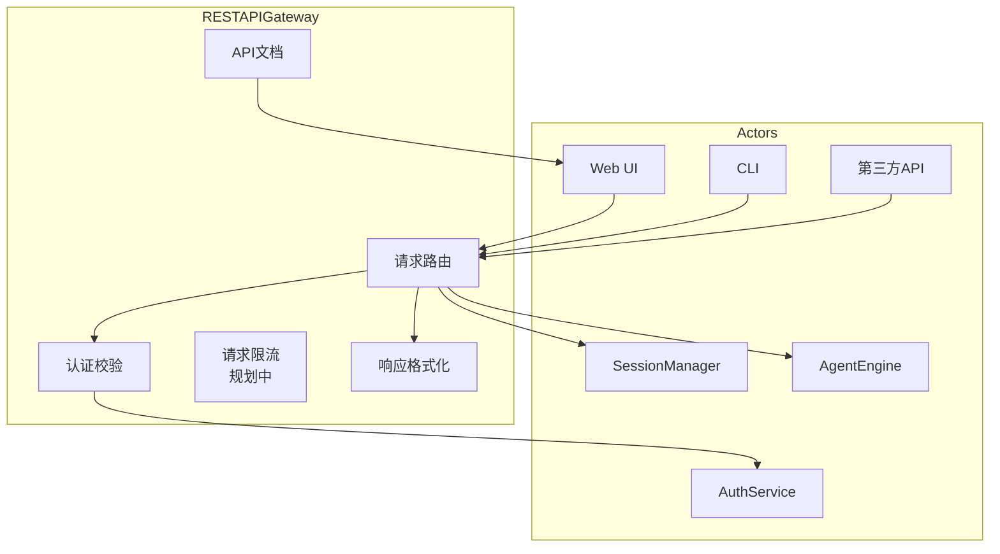
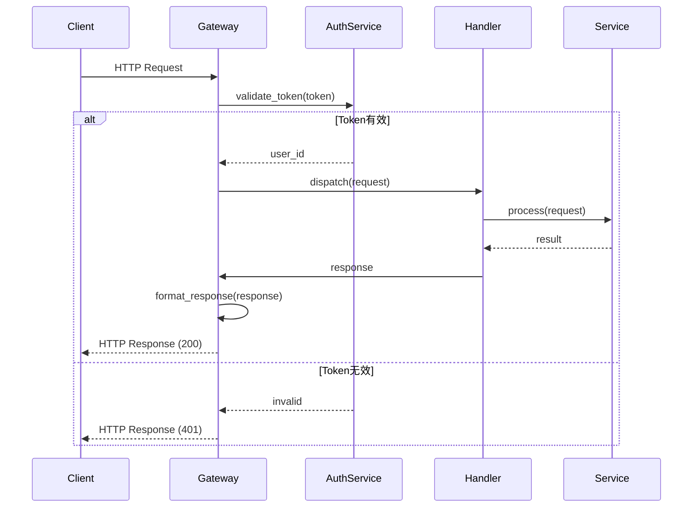
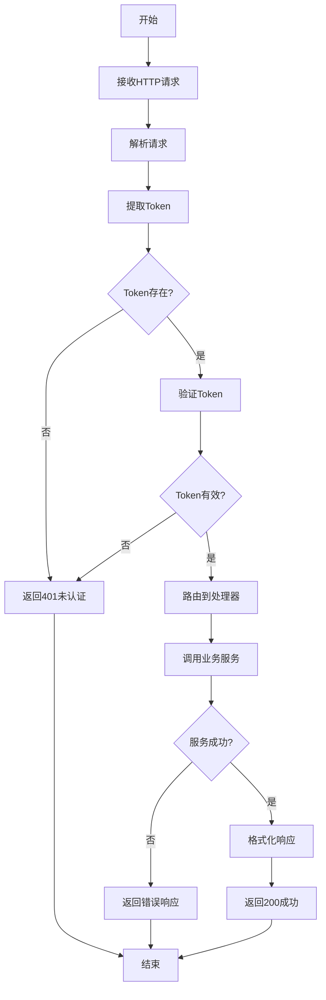
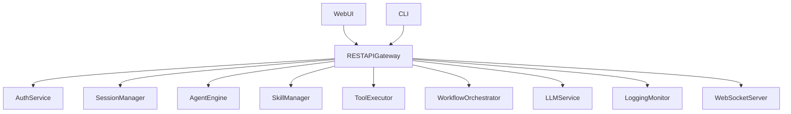

# REST API Gateway 模块特性设计文档

## 1. 模块概述

### 1.1 模块定位
REST API Gateway 是系统的入口网关，负责请求路由、认证校验和响应格式化，是客户端与后端服务的统一接口层。

### 1.2 核心职责
- 请求路由
- 认证校验
- 响应格式化
- API文档自动生成
- 数据库初始化（启动时）
- WebSocket 路由注册

> 注：请求限流为规划中能力，当前版本未实现。

### 1.3 涉及用例
| 用例ID | 用例名称 | 关联程度 |
|--------|----------|----------|
| UC1 | 发起对话 | 强 |
| UC2 | 调用工具 | 强 |
| UC3 | 查看历史 | 强 |
| UC4 | 管理技能 | 强 |
| UC8 | API集成 | 强 |

---

## 2. 用例图



### 用例说明

| 用例 | 说明 | 前置条件 | 后置条件 |
|------|------|----------|----------|
| 请求路由 | 根据URL路径路由到对应API处理函数 | 请求已到达 | 请求已路由 |
| 认证校验 | JWT Token验证、权限检查 | 请求携带Token | 认证通过或拒绝 |
| 请求限流 | 基于用户/IP的请求频率限制（规划中，未实现） | 请求已到达 | 请求通过或限流 |
| 响应格式化 | 统一响应格式、错误处理 | 请求已处理 | 响应已格式化 |
| API文档 | 自动生成Swagger/OpenAPI文档 | 服务已启动 | 文档可访问 |

---

## 3. 时序图

### 3.1 请求处理流程



---

## 4. 流程图

### 4.1 请求处理流程



---

## 5. 接口设计

### 5.1 全局错误码

| 错误码 | HTTP状态码 | 描述 |
|--------|-----------|------|
| 0 | 200 | 成功 |
| 400 | 400 | 请求参数错误 |
| 401 | 401 | 未认证 |
| 403 | 403 | 无权限 |
| 404 | 404 | 资源不存在 |
| 500 | 500 | 服务器内部错误 |

> 注：429（请求过于频繁）对应限流能力，当前为规划中，未实现。

> 注：实际路由出错时（如参数校验失败、业务异常），FastAPI 默认返回 `{"detail": "..."}` 格式，而非统一响应格式。统一响应格式仅在路由内部主动调用 `success_response` / `error_response` 时使用。

### 5.2 统一响应格式

**成功响应**:
```json
{
    "code": 0,
    "message": "success",
    "data": {}
}
```

**错误响应**:
```json
{
    "code": 400,
    "message": "错误描述",
    "data": null
}
```

### 5.3 API路由汇总

| 模块 | 基础路径 | 主要端点 |
|------|----------|----------|
| AuthService | `/api/v1/auth` | `/login`, `/register`, `/refresh`, `/me` |
| SessionManager | `/api/v1/sessions` | `/`, `/{session_id}`, `/{session_id}/messages` |
| AgentEngine | `/api/v1/agent` | `/chat`, `/status/{session_id}` |
| SkillManager | `/api/v1/skills` | `/`, `/{skill_id}`, `/{skill_id}/execute`, `/train` |
| ToolExecutor | `/api/v1/tools` | `/`, `/{tool_id}`, `/{tool_id}/execute` |
| WorkflowOrchestrator | `/api/v1/workflows` | `/`, `/{workflow_id}`, `/{workflow_id}/execute`, `/{workflow_id}/executions` |
| LLMService | `/api/v1/llm` | `/configs`, `/configs/{config_id}/activate`, `/models` |
| LoggingMonitor | `/api/v1/logs` | `/system`, `/llm`, `/llm/statistics` |

> 注：AgentEngine 的 `/interrupt` 端点为规划中，当前未实现。

---

## 6. 代码模型设计

### 6.1 目录结构

```
backend/src/api/
├── __init__.py
├── main.py                # FastAPI应用入口
├── dependencies.py        # 依赖注入（认证、响应格式化）
└── routes/                # 路由定义
    ├── __init__.py
    ├── auth.py
    ├── sessions.py
    ├── agent.py
    ├── skills.py
    ├── tools.py
    ├── workflows.py
    ├── llm.py
    └── logs.py
```

> 注：认证与响应格式化通过 `dependencies.py` 中的依赖注入函数实现，未单独设立 `middleware/` 目录。

### 6.2 关键组件

#### 依赖注入组件

| 函数 | 功能 | 说明 |
|------|------|------|
| `get_current_user` | 认证校验 | 通过 `OAuth2PasswordBearer` 提取 Token，调用 `AuthService.get_current_user` 验证用户身份，失败抛出 401 异常 |
| `success_response` | 构造成功响应 | 返回 `{"code": 0, "message": "success", "data": ...}` 统一格式字典 |
| `error_response` | 构造错误响应 | 返回 `{"code": <code>, "message": "...", "data": None}` 统一格式字典 |

#### 路由处理

| 文件 | 功能 | 主要端点 |
|------|------|----------|
| `auth.py` | 用户认证 | POST /login, POST /register, POST /refresh, GET /me |
| `sessions.py` | 会话管理 | GET/POST /, GET/PUT/DELETE /{id}, GET/POST /{id}/messages |
| `agent.py` | Agent交互 | POST /chat, GET /status/{session_id} |
| `skills.py` | 技能管理 | CRUD /skills, POST /{id}/execute, POST /train |
| `tools.py` | 工具管理 | CRUD /tools, POST /{id}/execute |
| `workflows.py` | 工作流管理 | CRUD /workflows, POST /{id}/execute, GET /{id}/executions |
| `llm.py` | LLM配置 | CRUD /configs, POST /configs/{id}/activate, GET /models |
| `logs.py` | 日志查询 | GET /system, GET /llm, GET /llm/statistics |

---

## 7. 与其他模块的关系



| 模块 | 关系 | 说明 |
|------|------|------|
| AuthService | 依赖 | Token验证和权限检查 |
| SessionManager | 依赖 | 会话创建和状态管理 |
| AgentEngine | 依赖 | 对话执行和状态查询 |
| SkillManager | 依赖 | 技能CRUD和执行 |
| ToolExecutor | 依赖 | 工具CRUD和执行 |
| WorkflowOrchestrator | 依赖 | 工作流CRUD和执行 |
| LLMService | 依赖 | LLM配置CRUD和模型查询 |
| LoggingMonitor | 依赖 | 系统日志与LLM日志查询 |
| WebSocketServer | 注册 | WebSocket router 通过 `app.include_router(ws_router)` 注册到主应用 |
| WebUI | 依赖者 | 前端界面调用API |
| CLI | 依赖者 | 命令行工具调用API |

---

## 8. 实现细节

### 8.1 健康检查端点

主应用在根路径注册了健康检查端点：

- `GET /`：返回服务名称与版本信息，响应格式为 `{"code": 0, "message": "success", "data": {"service": "HarnessClaw API", "version": "1.0.0"}}`。

### 8.2 数据库初始化

主应用通过 FastAPI 的 `startup` 事件触发数据库初始化：

- 应用启动时调用 `init_db()`，完成数据库表结构的创建与初始化。

### 8.3 WebSocket 路由注册

WebSocket router 已注册到主应用：

- 通过 `app.include_router(ws_router, tags=["websocket"])` 将 WebSocket 端点（`/ws`）注册到 FastAPI 主应用，与 REST 路由共用同一服务实例。

### 8.4 get_agent_engine 工厂函数

`agent.py` 路由中定义了 `get_agent_engine(db: Session) -> AgentEngine` 工厂函数，负责创建 `AgentEngine` 及其全部依赖。依赖组装顺序如下：

1. `LLMService(db)` — LLM 服务
2. `ToolExecutor(db)` — 工具执行器
3. `SessionManager(db)` — 会话管理器
4. `SkillManager(db, llm_service=llm_service)` — 技能管理器
5. `MemorySystem(db)` — 记忆系统（**降级策略**：向量库依赖缺失时捕获异常并降级为 `None`）
6. `PromptBuilder(memory_system=..., tool_executor=..., skill_manager=...)` — 提示词构建器
7. `DecisionEngine(llm_service=..., prompt_builder=..., tool_executor=...)` — 决策引擎
8. `WorkflowOrchestrator(db=..., decision_engine=..., tool_executor=..., skill_manager=...)` — 工作流编排器
9. `AgentEngine(db=..., decision_engine=..., memory_system=..., prompt_builder=..., session_manager=..., workflow_orchestrator=...)` — Agent 引擎

> 注：`MemorySystem` 初始化失败时不阻断服务，以 `None` 传入后续组件，实现优雅降级。

### 8.5 API 密钥掩码

`llm.py` 路由中定义了 `_mask_api_key(key: str) -> str` 函数，用于 LLM 配置响应中 API Key 的脱敏处理：

- 当 key 为空或长度不超过 8 时，返回 `"***"`。
- 否则保留首尾各 4 位字符，中间替换为 `"***"`（如 `sk-ab***wxyz`）。
- 通过 `_config_to_dict` 在所有 LLM 配置响应中统一应用脱敏，避免明文泄露 API Key。

---

## 9. 版本历史

| 版本 | 日期 | 变更说明 |
|------|------|----------|
| v1.0 | 2026-06 | 初始版本 |
| v1.1 | 2026-06 | 根据实现反馈更新文档以匹配实际代码 |