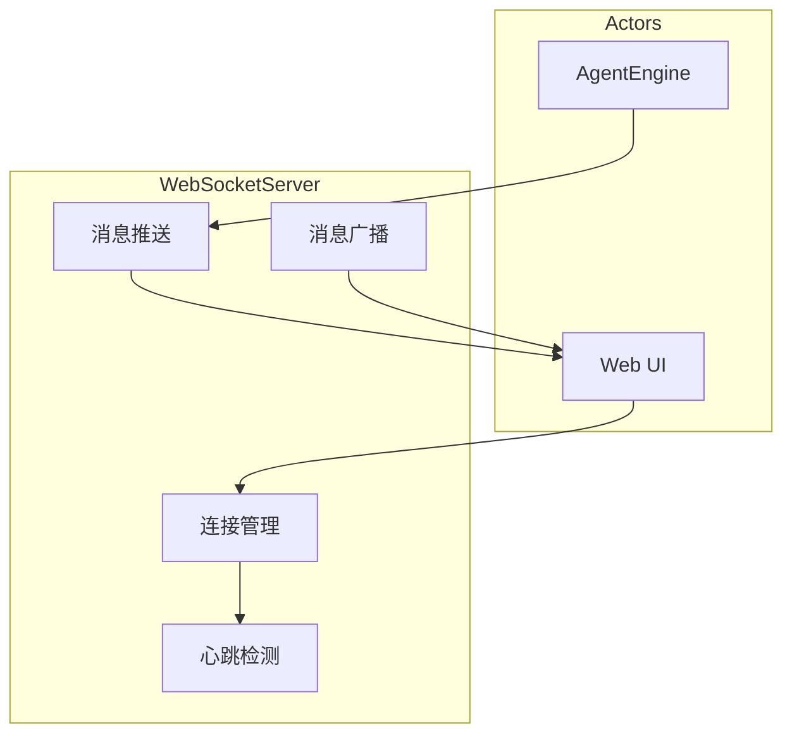
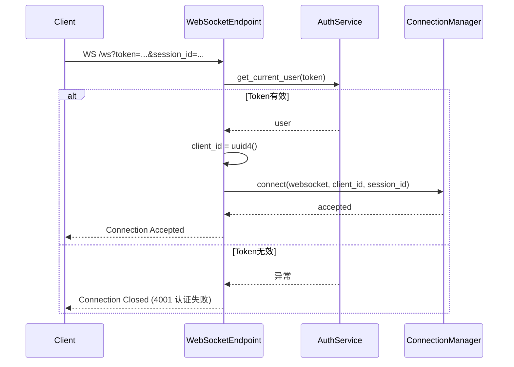
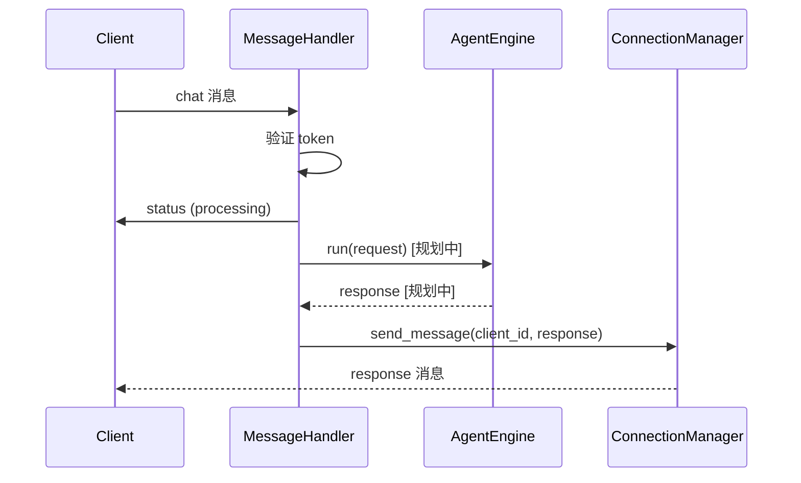
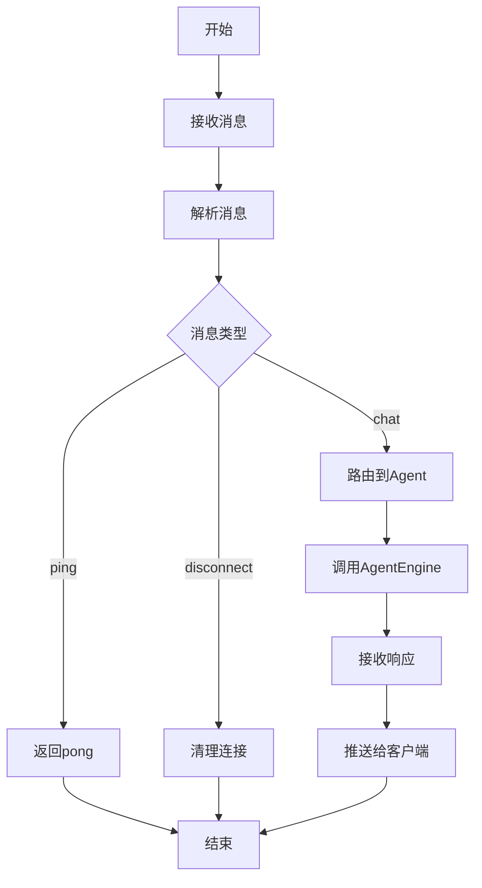
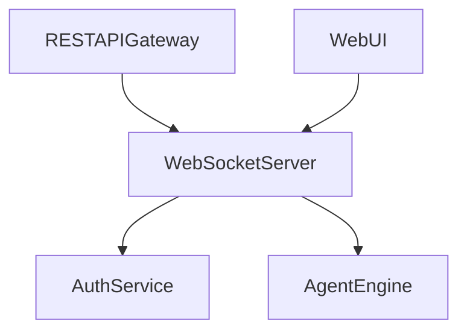

# WebSocket Server 模块特性设计文档

## 1. 模块概述

### 1.1 模块定位
WebSocket Server 提供实时双向通信能力，支持消息推送、心跳检测和消息广播，为客户端提供实时对话体验。

### 1.2 核心职责
- WebSocket连接管理
- 实时消息推送
- 心跳检测
- 消息广播

### 1.3 涉及用例
| 用例ID | 用例名称 | 关联程度 |
|--------|----------|----------|
| UC1 | 发起对话 | 强 |
| UC2 | 调用工具 | 中 |

---

## 2. 用例图



### 用例说明

| 用例 | 说明 | 前置条件 | 后置条件 |
|------|------|----------|----------|
| 连接管理 | WebSocket连接建立/断开 | 客户端发起连接 | 连接已建立或断开 |
| 消息推送 | 实时推送Agent响应 | 有新消息 | 消息已推送 |
| 心跳检测 | 连接状态维持 | 连接已建立 | 连接状态正常 |
| 消息广播 | 多客户端消息同步 | 有广播消息 | 消息已广播 |

---

## 3. 时序图

### 3.1 连接建立流程



### 3.2 消息推送流程

> 注：以下为设计目标流程。当前 AgentEngine 集成为**规划中/未实现**，实际 `_handle_chat` 以 Echo 模拟实现，直接向客户端返回 `{"type": "response", "content": "Echo: <message>"}`。



---

## 4. 流程图

### 4.1 消息处理流程



---

## 5. 代码模型设计

### 5.1 目录结构

```
backend/src/ws/
├── __init__.py
├── server.py              # WebSocket 端点
├── connection_manager.py   # 连接管理器
└── message_handler.py     # 消息处理器
```

### 5.2 关键类与方法

#### WebSocket 端点函数

WebSocket 端点路径为 `/ws`，通过 query 参数进行认证与会话关联：

| 函数 | 功能 | 参数 | 返回值 |
|------|------|------|--------|
| `websocket_endpoint` | WebSocket 端点入口，处理连接生命周期与消息循环 | `websocket: WebSocket`, `token: str = Query(...)`, `session_id: Optional[int] = Query(None)`, `db: Session = Depends(get_db)` | `None` |

**端点行为说明**：

1. **认证**：通过 query 参数 `token` 调用 `AuthService.get_current_user(token)` 验证用户身份；认证失败时以关闭码 `4001`（认证失败）关闭连接。
2. **client_id 生成**：使用 `uuid.uuid4()` 生成 UUID 字符串作为客户端唯一标识。
3. **连接注册**：调用 `manager.connect(websocket, client_id, session_id)` 接受连接并注册。
4. **消息循环**：创建 `MessageHandler(db, manager)` 后循环调用 `websocket.receive_json()` 接收消息，并交由 `handler.handle(data, client_id)` 处理。
5. **断开清理**：捕获 `WebSocketDisconnect` 异常后调用 `manager.disconnect(client_id)` 清理连接。

#### ConnectionManager 类

**内部数据结构**：

- `active_connections: Dict[str, WebSocket]` — client_id 到 WebSocket 的映射
- `session_connections: Dict[int, List[str]]` — session_id 到 client_id 列表的映射

| 方法名 | 功能 | 参数 | 返回值 |
|--------|------|------|--------|
| `connect` (async) | 接受 WebSocket 连接并注册，建立 client_id 与 session_id 的关联 | `websocket: WebSocket`, `client_id: str`, `session_id: int` | `None` |
| `disconnect` | 断开连接并清理，从 active_connections 和 session_connections 中移除 | `client_id: str` | `None` |
| `send_message` (async) | 发送 JSON 消息给指定客户端 | `client_id: str`, `message: dict` | `None` |
| `broadcast` (async) | 按会话广播或全量广播；指定 session_id 时仅广播给该会话客户端，为 None 时广播给所有客户端 | `message: dict`, `session_id: Optional[int] = None` | `None` |
| `get_connection_count` | 获取当前活跃连接数 | - | `int` |

#### MessageHandler 类

| 方法名 | 功能 | 参数 | 返回值 |
|--------|------|------|--------|
| `handle` (async) | 处理接收到的消息，根据 `type` 字段分发到对应处理方法 | `message: dict`, `client_id: str` | `None` |
| `_handle_ping` (async) | 处理心跳，直接向客户端发送 `{"type": "pong"}` 消息 | `client_id: str` | `None` |
| `_handle_chat` (async) | 处理对话消息，验证用户身份后发送处理状态并调用 Agent 引擎 | `message: dict`, `client_id: str` | `None` |
| `_handle_disconnect` (async) | 处理断开连接，调用 `connection_manager.disconnect` | `client_id: str` | `None` |

> **未知消息类型处理**：当消息 `type` 字段不属于 `ping`/`chat`/`disconnect` 时，向客户端发送 `{"type": "error", "message": "Unknown message type: <type>"}` 错误消息。

> **Chat 消息重复认证**：`chat` 消息体中携带 `token` 字段，`_handle_chat` 会再次调用 `AuthService.get_current_user(token)` 进行认证；认证失败时发送 `{"type": "error", "message": "Authentication failed"}` 并终止处理。该设计确保每条对话消息均经过身份验证。

> **AgentEngine 集成状态**：当前 `_handle_chat` 中 AgentEngine 集成为**规划中/未实现**，实际以 Echo 模拟实现（返回 `{"type": "response", "content": "Echo: <user_message>", "session_id": ...}`）。完整初始化代码已以 TODO 注释标注。

---

## 6. 与其他模块的关系



| 模块 | 关系 | 说明 |
|------|------|------|
| AuthService | 依赖 | 连接建立时验证 token；chat 消息重复认证 |
| AgentEngine | 依赖（规划中） | 处理对话消息，当前以 Echo 模拟实现 |
| RESTAPIGateway | 注册者 | WebSocket router 通过 `app.include_router(ws_router)` 注册到 FastAPI 主应用 |
| WebUI | 依赖者 | 建立WebSocket连接 |

> 注：当前实现未直接调用 SessionManager；会话 ID 通过 query 参数 `session_id` 传入，由 `ConnectionManager` 维护 client_id 与 session_id 的映射关系。

---

## 7. 消息协议

WebSocket 通信使用 JSON 格式消息，通过 `type` 字段区分消息类型。

### 7.1 客户端 → 服务端

**ping（心跳请求）**：
```json
{"type": "ping"}
```

**chat（对话请求）**：
```json
{
    "type": "chat",
    "content": "用户消息内容",
    "token": "访问令牌",
    "session_id": 123,
    "user_id": 1
}
```

**disconnect（断开请求）**：
```json
{"type": "disconnect"}
```

### 7.2 服务端 → 客户端

**pong（心跳响应）**：
```json
{"type": "pong"}
```

**status（处理状态）**：
```json
{"type": "status", "status": "processing"}
```

**response（对话响应）**：
```json
{"type": "response", "content": "响应内容", "session_id": 123}
```

**error（错误消息）**：
```json
{"type": "error", "message": "错误描述"}
```

---

## 8. 版本历史

| 版本 | 日期 | 变更说明 |
|------|------|----------|
| v1.0 | 2026-06 | 初始版本 |
| v1.1 | 2026-06 | 根据实现反馈更新文档以匹配实际代码 |