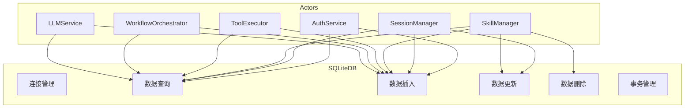
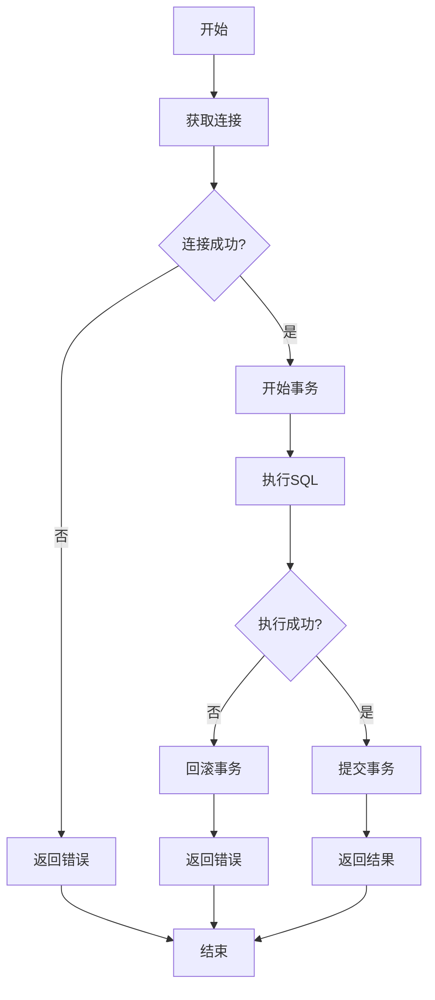
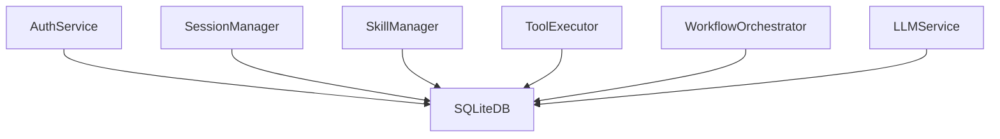

# SQLite DB 模块特性设计文档

## 1. 模块概述

### 1.1 模块定位
SQLite DB 是系统的结构化数据存储层，负责用户数据、会话数据、技能定义、工具定义等结构化数据的持久化存储。

### 1.2 核心职责
- 数据库连接管理
- 数据查询与操作
- 事务管理
- 数据持久化

### 1.3 涉及用例
| 用例ID | 用例名称 | 关联程度 |
|--------|----------|----------|
| UC1 | 发起对话 | 强 |
| UC3 | 查看历史 | 强 |
| UC4 | 管理技能 | 强 |

---

## 2. 用例图



### 用例说明

| 用例 | 说明 | 前置条件 | 后置条件 |
|------|------|----------|----------|
| 连接管理 | 数据库连接池管理 | 服务已启动 | 连接已建立 |
| 数据查询 | 执行SELECT查询 | 查询条件已准备 | 返回查询结果 |
| 数据插入 | 插入新记录 | 数据已准备 | 记录已插入 |
| 数据更新 | 更新已有记录 | 记录存在 | 记录已更新 |
| 数据删除 | 删除记录 | 记录存在 | 记录已删除 |
| 事务管理 | 事务提交/回滚 | 事务已开始 | 事务已完成 |

---

## 3. 流程图

### 3.1 数据操作流程



---

## 4. 数据库表设计

### 4.1 表清单

| 表名 | 说明 |
|------|------|
| users | 用户信息 |
| sessions | 会话信息 |
| messages | 消息记录 |
| skills | 技能定义 |
| skill_executions | 技能执行记录 |
| tools | 工具定义 |
| tool_executions | 工具执行记录 |
| workflows | 工作流定义 |
| workflow_executions | 工作流执行记录 |
| llm_configs | LLM配置 |
| api_tokens | API令牌 |

### 4.2 表结构汇总

**users 表**

| 字段名 | 类型 | 约束 |
|--------|------|------|
| id | INTEGER | PRIMARY KEY AUTOINCREMENT |
| username | VARCHAR(50) | UNIQUE NOT NULL |
| email | VARCHAR(100) | UNIQUE NOT NULL |
| hashed_password | VARCHAR(255) | NOT NULL |
| is_active | BOOLEAN | DEFAULT TRUE |
| created_at | DATETIME | DEFAULT CURRENT_TIMESTAMP |
| updated_at | DATETIME | DEFAULT CURRENT_TIMESTAMP |

**sessions 表**

| 字段名 | 类型 | 约束 |
|--------|------|------|
| id | INTEGER | PRIMARY KEY AUTOINCREMENT |
| user_id | INTEGER | FOREIGN KEY REFERENCES users(id) |
| session_key | VARCHAR(64) | UNIQUE NOT NULL |
| title | VARCHAR(100) | NULL |
| status | VARCHAR(20) | DEFAULT 'active' |
| created_at | DATETIME | DEFAULT CURRENT_TIMESTAMP |
| updated_at | DATETIME | DEFAULT CURRENT_TIMESTAMP |

**messages 表**

| 字段名 | 类型 | 约束 |
|--------|------|------|
| id | INTEGER | PRIMARY KEY AUTOINCREMENT |
| session_id | INTEGER | FOREIGN KEY REFERENCES sessions(id) |
| role | VARCHAR(20) | NOT NULL |
| content | TEXT | NOT NULL |
| tool_call | TEXT | NULL |
| created_at | DATETIME | DEFAULT CURRENT_TIMESTAMP |

---

## 5. 代码模型设计

### 5.1 目录结构

```
backend/src/db/
├── __init__.py
├── sqlite_client.py        # SQLite客户端
├── connection_pool.py      # 连接池管理
├── models.py              # SQLAlchemy模型
└── schemas.py             # Pydantic模型
```

### 5.2 关键类与方法

#### SQLiteClient 类

| 方法名 | 功能 | 参数 | 返回值 |
|--------|------|------|--------|
| `connect` | 建立连接 | - | `Connection` |
| `close` | 关闭连接 | - | `None` |
| `execute` | 执行SQL | `sql: str`, `params: Optional[Tuple]` | `Cursor` |
| `query` | 查询数据 | `sql: str`, `params: Optional[Tuple]` | `List[Dict]` |
| `insert` | 插入数据 | `table: str`, `data: dict` | `int` |
| `update` | 更新数据 | `table: str`, `data: dict`, `where: str` | `int` |
| `delete` | 删除数据 | `table: str`, `where: str` | `int` |
| `begin_transaction` | 开始事务 | - | `None` |
| `commit` | 提交事务 | - | `None` |
| `rollback` | 回滚事务 | - | `None` |

#### ConnectionPool 类

| 方法名 | 功能 | 参数 | 返回值 |
|--------|------|------|--------|
| `get_connection` | 获取连接 | - | `Connection` |
| `release_connection` | 释放连接 | `conn: Connection` | `None` |
| `close_all` | 关闭所有连接 | - | `None` |

---

## 6. 与其他模块的关系



| 模块 | 关系 | 说明 |
|------|------|------|
| AuthService | 依赖者 | 用户数据存储 |
| SessionManager | 依赖者 | 会话数据存储 |
| SkillManager | 依赖者 | 技能数据存储 |
| ToolExecutor | 依赖者 | 工具数据存储 |
| WorkflowOrchestrator | 依赖者 | 工作流数据存储 |
| LLMService | 依赖者 | LLM配置存储 |

---

## 7. 版本历史

| 版本 | 日期 | 变更说明 |
|------|------|----------|
| v1.0 | 2026-06 | 初始版本 |