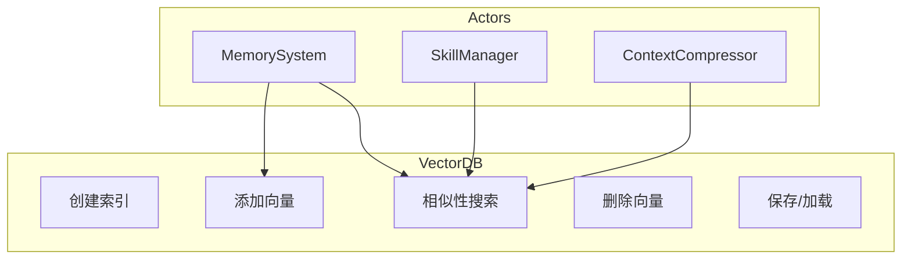
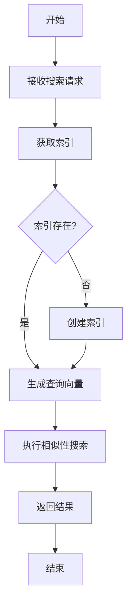
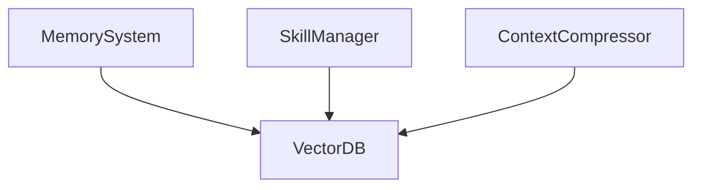

# Vector DB 模块特性设计文档

## 1. 模块概述

### 1.1 模块定位
Vector DB 是向量数据存储层，负责对话历史、技能知识等非结构化数据的向量存储和相似性检索，支持 FAISS 和 Chroma 两种向量数据库。

### 1.2 核心职责
- 向量索引创建与管理
- 向量数据插入与查询
- 相似性搜索
- 索引持久化与加载

### 1.3 涉及用例
| 用例ID | 用例名称 | 关联程度 |
|--------|----------|----------|
| UC1 | 发起对话 | 中 |
| UC7 | 训练技能 | 中 |

---

## 2. 用例图



### 用例说明

| 用例 | 说明 | 前置条件 | 后置条件 |
|------|------|----------|----------|
| 创建索引 | 创建向量索引 | 向量维度已确定 | 索引已创建 |
| 添加向量 | 插入向量数据 | 索引已创建 | 向量已添加 |
| 相似性搜索 | 查找相似向量 | 查询向量已准备 | 返回相似结果 |
| 删除向量 | 移除向量数据 | 向量存在 | 向量已删除 |
| 保存/加载 | 持久化和加载索引 | 索引已创建 | 索引已保存/加载 |

---

## 3. 流程图

### 3.1 相似性搜索流程



---

## 4. Collection 设计

### 4.1 Collection 清单

| Collection名称 | 用途 | 向量维度 | 元数据字段 |
|----------------|------|----------|------------|
| conversation_memory | 对话记忆 | 1536 | content, session_id, role, ... |
| skill_knowledge | 技能知识 | 1536 | user_id, skill_id, content_type |
| document_embeddings | 文档嵌入 | 1536 | user_id, document_id, chunk_index |

### 4.2 Collection 结构

**conversation_memory**

| 字段 | 类型 | 说明 |
|------|------|------|
| id | str | 唯一标识（UUID） |
| embedding | List[float] | 向量嵌入 |
| metadata | Dict | 元数据 |

`metadata` 实际存储的字段包括：

| metadata 字段 | 类型 | 说明 |
|---------------|------|------|
| content | str | 原始内容（检索时恢复） |
| session_id | int | 会话 ID |
| role | str | 消息角色 (system/user/assistant/tool) |
| ... | Any | 其他附加参数 |

---

## 5. 代码模型设计

### 5.1 目录结构

```
backend/src/vector/
├── __init__.py
└── db.py                 # 向量数据库抽象接口、FAISS/Chroma 适配器、工厂类
```

### 5.2 关键类与方法

#### VectorDB 接口

| 方法名 | 功能 | 参数 | 返回值 |
|--------|------|------|--------|
| `create_collection` | 创建集合 | `collection_name: str` | `None` |
| `add_vectors` | 添加向量 | `collection_name: str`, `ids: List[str]`, `vectors: List[List[float]]`, `metadatas: Optional[List[Dict]]` | `None` |
| `search` | 相似性搜索 | `collection_name: str`, `query_vector: List[float]`, `top_k: int` | `List[Dict]` |
| `delete_vectors` | 删除向量 | `collection_name: str`, `ids: List[str]` | `None` |
| `save` | 保存索引 | `collection_name: str` | `None` |
| `load` | 加载索引 | `collection_name: str` | `None` |

> 注：`create_collection` 无 `dimension` 参数（维度由构造函数 `__init__(store_path, dimension)` 决定）；`add_vectors` 含 `ids` 参数且使用 `metadatas`（复数）；`save`/`load` 无 `path` 参数（路径由构造函数决定）。

#### FAISSAdapter 类

FAISSAdapter 直接实现 VectorDB 公共接口，未拆分 `_create_index`/`_add`/`_search` 等私有方法。使用 `faiss.IndexFlatL2` 索引，基于 L2 距离（平方欧氏距离）进行精确搜索。由于 `IndexFlatL2` 不支持原生删除，在内存中保留原始向量副本以便删除时重建索引。

#### ChromaAdapter 类

ChromaAdapter 直接实现 VectorDB 公共接口，未拆分 `_get_collection`/`_add`/`_search` 等私有方法。使用 `chromadb.PersistentClient` 持久化客户端，不存储 `documents` 字段（仅存储 id、embeddings、metadatas）。

### 5.3 工厂模式

#### VectorDBFactory 类

| 方法名 | 功能 | 参数 | 返回值 |
|--------|------|------|--------|
| `create` | 创建向量数据库适配器 | `db_type: Optional[str]`, `store_path: Optional[str]`, `dimension: int` | `VectorDB` |
| `available_backends` | 返回当前可用的后端列表 | - | `List[str]` |

#### get_vector_db 函数

| 函数名 | 功能 | 参数 | 返回值 |
|--------|------|------|--------|
| `get_vector_db` | 便捷函数：创建适配器并确保指定集合存在 | `collection_name: str`, `dimension: int` | `VectorDB` |

**相关配置项**（`src/core/config.py`）：

| 配置项 | 默认值 | 说明 |
|--------|--------|------|
| `VECTOR_DB_TYPE` | `faiss` | 向量数据库类型（`faiss` / `chroma`） |
| `VECTOR_STORE_PATH` | `./data/vector_store` | 向量存储路径 |

---

## 6. 与其他模块的关系



| 模块 | 关系 | 说明 |
|------|------|------|
| MemorySystem | 依赖者 | 存储和检索对话记忆 |
| SkillManager | 依赖者 | 存储和检索技能知识 |
| ContextCompressor | 依赖者 | 获取相关上下文 |

---

## 7. 相似性度量

FAISS 后端使用 `IndexFlatL2` 索引，基于 **L2 距离**（平方欧氏距离）进行相似性度量。`search` 方法返回结果中的 `score` 字段语义为**距离值**（越小越相似），而非相似度（越大越相似）。

Chroma 后端使用其内部默认的距离度量，`score` 字段同样为距离语义。

---

## 8. 持久化机制

存储路径由构造函数的 `store_path` 参数决定（默认从 `settings.VECTOR_STORE_PATH` 读取），构造时会自动创建该目录。

**FAISS 后端**：
- 每个 collection 保存为两个文件：`{collection_name}.index`（FAISS 索引）和 `{collection_name}.meta.json`（元数据，含 dimension、ids、metadatas、vectors）。
- 调用 `save()` 写入磁盘，调用 `load()` 从磁盘读取。
- 加载时若文件不存在，则创建空集合。

**Chroma 后端**：
- 使用 `PersistentClient`，数据自动落盘到 `store_path`。
- `save()` 仅记录日志（无需显式保存），`load()` 获取集合引用。

---

## 9. 依赖与容错

向量数据库后端依赖为**可选依赖**，通过 `try/except ImportError` 容错导入：

| 依赖 | 用途 | 缺失时行为 |
|------|------|------------|
| `numpy` | FAISS 向量计算 | `_NUMPY_AVAILABLE = False`，FAISSAdapter 初始化时抛出 `ImportError` |
| `faiss` (faiss-cpu) | FAISS 后端 | `_FAISS_AVAILABLE = False`，FAISSAdapter 初始化时抛出 `ImportError` |
| `chromadb` | Chroma 后端 | `_CHROMA_AVAILABLE = False`，ChromaAdapter 初始化时抛出 `ImportError` |

**降级行为**：
- 模块导入不会因缺少可选依赖而失败，仅在实际创建对应适配器实例时才抛出 `ImportError`。
- `VectorDBFactory.available_backends()` 根据已安装的依赖动态返回可用后端列表。
- 默认配置 `VECTOR_DB_TYPE = "faiss"`，需安装 `faiss-cpu` 和 `numpy`。

---

## 10. 版本历史

| 版本 | 日期 | 变更说明 |
|------|------|----------|
| v1.0 | 2026-06 | 初始版本 |
| v1.1 | 2026-06 | 根据实现反馈更新文档以匹配实际代码 |
