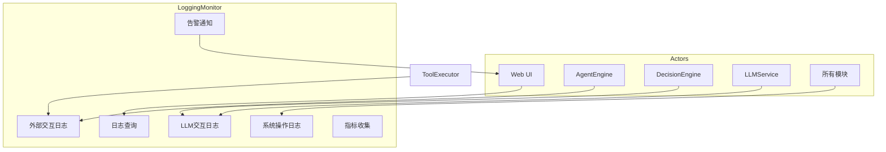
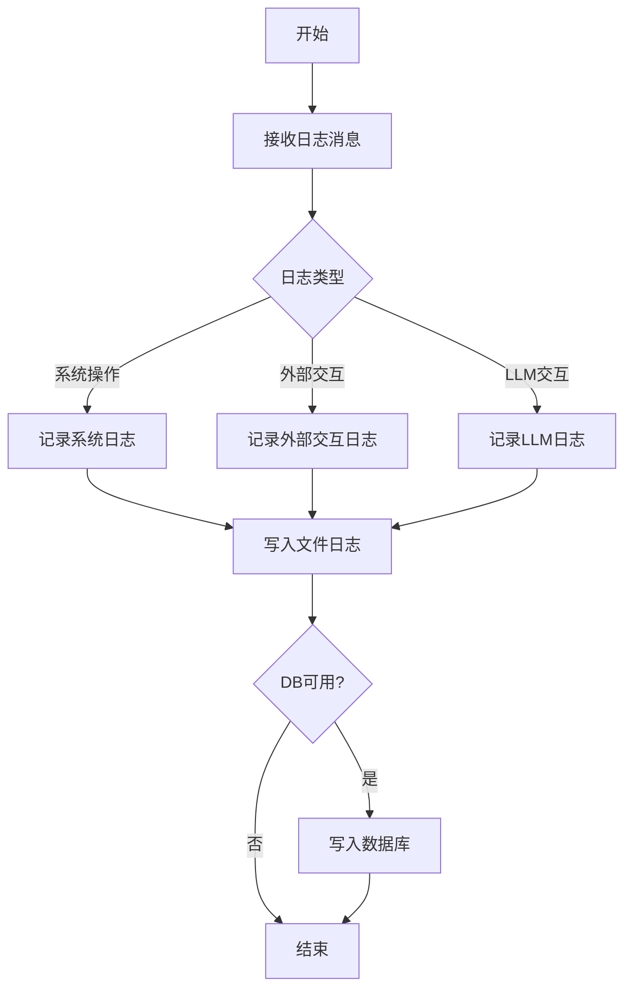
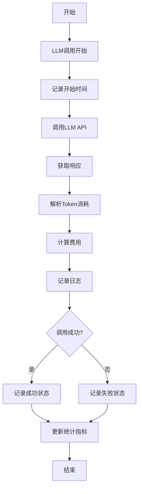
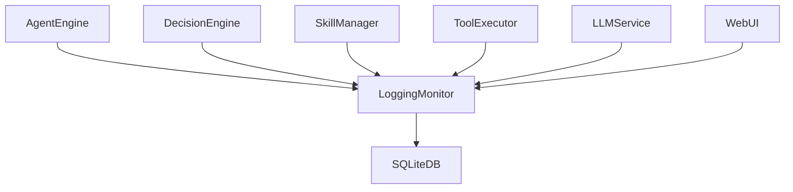

# Logging Monitor 模块特性设计文档

## 1. 模块概述

### 1.1 模块定位
Logging Monitor 是系统的日志和监控模块，负责日志记录、指标收集、性能监控和告警通知。支持三种核心日志类型：系统操作日志、外部交互日志和大模型交互日志（含Token消耗统计）。

### 1.2 核心职责
- 系统操作日志记录
- 外部交互日志记录
- 大模型交互日志记录（含Token消耗）
- 日志查询与检索（部分实现）
- 指标收集与统计（未实现/暂缓）
- 告警通知（未实现/暂缓）
- 性能监控

> 说明：实际实现中**告警通知功能未实现/暂缓**，**指标收集功能未实现/暂缓**（不存在 `MetricsCollector` 类）。当前实现聚焦于日志记录与 LLM 调用统计。

### 1.3 涉及用例
| 用例ID | 用例名称 | 关联程度 |
|--------|----------|----------|
| UC1 | 发起对话 | 中 |
| UC2 | 调用工具 | 中 |
| UC6 | 监控运行 | 强 |
| UC7 | 训练技能 | 中 |

---

## 2. 用例图



### 用例说明

| 用例 | 说明 | 前置条件 | 后置条件 | 实现状态 |
|------|------|----------|----------|----------|
| 系统操作日志 | 记录用户操作、系统事件 | 服务已启动 | 日志已记录 | 已实现 |
| 外部交互日志 | 记录外部API调用、工具执行 | 外部交互发生 | 日志已记录 | 已实现（记录） |
| LLM交互日志 | 记录LLM调用、Token消耗 | LLM调用发生 | 日志已记录（含Token） | 已实现 |
| 日志查询 | 查询历史日志 | 日志已记录 | 返回日志列表 | 部分实现 |
| 指标收集 | 收集运行指标 | 服务已启动 | 指标已收集 | 未实现/暂缓 |
| 告警通知 | 异常情况告警 | 发生异常 | 告警已发送 | 未实现/暂缓 |

---

## 3. 流程图

### 3.1 日志记录流程



> 说明：实际实现中**告警通知功能未实现/暂缓**，因此日志记录流程中不包含"检查告警条件"和"发送告警"步骤。所有日志均先写入文件日志，若 DB 可用则同时写入数据库。

### 3.2 LLM日志记录流程



---

## 4. 模型设计

### 4.1 数据库表设计

**system_logs 表 - 系统操作日志**

| 字段名 | 类型 | 约束 | 说明 |
|--------|------|------|------|
| id | INTEGER | PRIMARY KEY AUTOINCREMENT | 日志ID |
| user_id | INTEGER | FOREIGN KEY REFERENCES users(id) | 用户ID |
| session_id | INTEGER | FOREIGN KEY REFERENCES sessions(id) | 会话ID |
| log_type | VARCHAR(50) | NOT NULL | 日志类型(operation/event/error) |
| module | VARCHAR(50) | NOT NULL | 模块名称 |
| action | VARCHAR(100) | NOT NULL | 操作名称 |
| details | TEXT | NULL | 详细信息(JSON) |
| ip_address | VARCHAR(50) | NULL | 客户端IP |
| user_agent | VARCHAR(255) | NULL | 用户代理 |
| created_at | DATETIME | DEFAULT CURRENT_TIMESTAMP | 创建时间 |

**external_logs 表 - 外部交互日志**

| 字段名 | 类型 | 约束 | 说明 |
|--------|------|------|------|
| id | INTEGER | PRIMARY KEY AUTOINCREMENT | 日志ID |
| user_id | INTEGER | FOREIGN KEY REFERENCES users(id) | 用户ID |
| session_id | INTEGER | FOREIGN KEY REFERENCES sessions(id) | 会话ID |
| service_name | VARCHAR(100) | NOT NULL | 服务名称 |
| operation | VARCHAR(100) | NOT NULL | 操作名称 |
| request_url | VARCHAR(500) | NULL | 请求URL |
| request_method | VARCHAR(10) | NULL | 请求方法 |
| request_body | TEXT | NULL | 请求体 |
| response_status | INTEGER | NULL | 响应状态码 |
| response_body | TEXT | NULL | 响应体 |
| latency_ms | INTEGER | NULL | 延迟(毫秒) |
| success | BOOLEAN | NOT NULL | 是否成功 |
| error_message | TEXT | NULL | 错误信息 |
| created_at | DATETIME | DEFAULT CURRENT_TIMESTAMP | 创建时间 |

**llm_logs 表 - LLM交互日志**

| 字段名 | 类型 | 约束 | 说明 |
|--------|------|------|------|
| id | INTEGER | PRIMARY KEY AUTOINCREMENT | 日志ID |
| user_id | INTEGER | FOREIGN KEY REFERENCES users(id) | 用户ID |
| session_id | INTEGER | FOREIGN KEY REFERENCES sessions(id) | 会话ID |
| model_name | VARCHAR(100) | NOT NULL | 模型名称 |
| prompt_tokens | INTEGER | NOT NULL | 输入Token数 |
| completion_tokens | INTEGER | NOT NULL | 输出Token数 |
| total_tokens | INTEGER | NOT NULL | 总Token数 |
| request_messages | TEXT | NOT NULL | 请求消息(JSON) |
| response_content | TEXT | NULL | 响应内容 |
| tool_calls | TEXT | NULL | 工具调用(JSON) |
| latency_ms | INTEGER | NULL | 延迟(毫秒) |
| success | BOOLEAN | NOT NULL | 是否成功 |
| error_message | TEXT | NULL | 错误信息 |
| cost_usd | FLOAT | NULL | 费用(美元) |
| created_at | DATETIME | DEFAULT CURRENT_TIMESTAMP | 创建时间 |

> 说明：`SystemLog`、`ExternalLog`、`LLMLog` 均为 SQLAlchemy ORM 模型，定义于 `backend/src/db/models.py`。

### 4.2 数据模型

> 说明：实际实现中 `schemas.py` **不存在**，日志记录方法直接使用独立参数，不通过 Pydantic 模型封装。以下模型仅用于描述数据库结构，实际为 SQLAlchemy ORM 模型。

```python
from sqlalchemy.orm import Base
from datetime import datetime
from typing import Optional

# 以下均为 SQLAlchemy ORM 模型，定义于 backend/src/db/models.py
# class SystemLog(Base): ...
# class ExternalLog(Base): ...
# class LLMLog(Base): ...
```

> 说明：实际实现**不存在** `LogQuery` 模型，查询方法（如 `get_system_logs`）使用独立参数（`user_id`、`log_type`、`module`、`page`、`limit` 等）而非统一的查询模型。

---

## 5. 接口设计

### 5.1 接口列表

| API路径 | HTTP方法 | 功能描述 | 实现状态 |
|---------|----------|----------|----------|
| `/api/v1/logs/system` | GET | 查询系统操作日志 | 已实现 |
| `/api/v1/logs/external` | GET | 查询外部交互日志 | 未实现 |
| `/api/v1/logs/llm` | GET | 查询LLM交互日志 | 未实现 |
| `/api/v1/logs/llm/statistics` | GET | 获取LLM统计信息 | 已实现 |
| `/api/v1/logs/search` | GET | 搜索日志 | 未实现 |

### 5.2 接口详细设计

#### 5.2.1 查询系统操作日志

**请求**:
```json
GET /api/v1/logs/system?user_id=1&start_time=2024-01-01&end_time=2024-01-31&page=1&limit=20
Authorization: Bearer <access_token>
```

**成功响应** (200 OK):
```json
{
    "code": 0,
    "message": "success",
    "data": {
        "items": [
            {
                "id": 1,
                "user_id": 1,
                "log_type": "operation",
                "module": "auth",
                "action": "user_login",
                "details": {"username": "admin"},
                "ip_address": "192.168.1.1",
                "created_at": "2024-01-15T10:30:00"
            }
        ],
        "total": 100,
        "page": 1,
        "limit": 20
    }
}
```

#### 5.2.2 查询LLM交互日志

> 说明：`get_external_logs`、`get_llm_logs`、`search_logs` 方法**未实现**，仅 `get_system_logs` 和 `get_llm_statistics` 已实现。

#### 5.2.3 获取LLM统计信息

**请求**:
```json
GET /api/v1/logs/llm/statistics?start_time=2024-01-01&end_time=2024-01-31
Authorization: Bearer <access_token>
```

**成功响应** (200 OK):
```json
{
    "code": 0,
    "message": "success",
    "data": {
        "total_calls": 1000,
        "total_prompt_tokens": 1500000,
        "total_completion_tokens": 500000,
        "total_tokens": 2000000,
        "total_cost_usd": 60.0,
        "avg_latency_ms": 2300,
        "success_rate": 0.98,
        "model_breakdown": {
            "gpt-4o": {
                "calls": 800,
                "tokens": 1600000,
                "cost_usd": 48.0
            },
            "gpt-4o-mini": {
                "calls": 200,
                "tokens": 400000,
                "cost_usd": 12.0
            }
        }
    }
}
```

> 说明：实际实现中统计响应**不包含 `daily_stats` 字段**，仅返回上述字段。

#### 5.2.4 搜索日志

> 说明：`search_logs` 方法**未实现**。

---

## 6. 代码模型设计

### 6.1 目录结构

```
backend/src/monitoring/
├── __init__.py
└── logger.py              # 日志记录器（含系统/外部/LLM日志）
```

> 说明：实际实现仅包含 2 个文件，**不存在** `metrics.py`、`alert_manager.py`、`llm_logger.py`、`log_repository.py`、`schemas.py`。所有日志记录、查询、统计逻辑均集中在 `logger.py` 的 `Logger` 类中。

### 6.2 文件日志配置

> 说明：模块在加载时通过 `_setup_file_logger()` 配置全局文件日志记录器：
> - **日志文件路径**：`settings.LOG_FILE`
> - **日志级别**：`settings.LOG_LEVEL`（默认 INFO）
> - **双 handler**：文件 handler（`FileHandler`，UTF-8 编码）+ 控制台 handler（`StreamHandler`）
> - **全局 logger 实例**：模块级 `_file_logger`（名称为 `harnessclaw`），所有 `Logger` 实例共享该实例
> - **全局 Logger 实例**：模块级 `logger = Logger()`（不带数据库连接，仅文件日志）

### 6.3 关键类与方法

#### Logger 类

| 方法名 | 功能 | 参数 | 返回值 |
|--------|------|------|--------|
| `__init__` | 初始化日志记录器 | `db: Optional[Session] = None` | - |
| `set_db` | 设置数据库会话 | `db: Session` | `None` |
| `info` | 记录INFO级别日志 | `message: str`, `**kwargs` | `None` |
| `warning` | 记录WARNING级别日志 | `message: str`, `**kwargs` | `None` |
| `error` | 记录ERROR级别日志 | `message: str`, `**kwargs` | `None` |
| `debug` | 记录DEBUG级别日志 | `message: str`, `**kwargs` | `None` |
| `log_system` | 记录系统操作日志 | `log_type: str`, `module: str`, `action: str`, `details: Optional[Dict] = None`, `user_id: Optional[int] = None`, `session_id: Optional[int] = None`, `ip_address: Optional[str] = None`, `user_agent: Optional[str] = None` | `None` |
| `log_external` | 记录外部交互日志 | `service_name: str`, `operation: str`, `success: bool`, `request_url: Optional[str] = None`, `request_method: Optional[str] = None`, `request_body: Optional[str] = None`, `response_status: Optional[int] = None`, `response_body: Optional[str] = None`, `latency_ms: Optional[int] = None`, `error_message: Optional[str] = None`, `user_id: Optional[int] = None`, `session_id: Optional[int] = None` | `None` |
| `log_llm` | 记录LLM交互日志 | `model_name: str`, `prompt_tokens: int`, `completion_tokens: int`, `request_messages: str`, `success: bool`, `response_content: Optional[str] = None`, `tool_calls: Optional[str] = None`, `latency_ms: Optional[int] = None`, `error_message: Optional[str] = None`, `user_id: Optional[int] = None`, `session_id: Optional[int] = None` | `Optional[float]`（费用USD） |
| `calculate_cost` | 计算LLM调用费用 | `model_name: str`, `prompt_tokens: int`, `completion_tokens: int` | `float` |
| `get_system_logs` | 查询系统日志 | `user_id: Optional[int] = None`, `log_type: Optional[str] = None`, `module: Optional[str] = None`, `page: int = 1`, `limit: int = 100` | `Dict[str, Any]` |
| `get_llm_statistics` | 获取LLM统计信息 | `start_time: Optional[datetime] = None`, `end_time: Optional[datetime] = None`, `user_id: Optional[int] = None` | `Dict[str, Any]` |

> 说明：实际实现**不存在** `LLMLogger`、`LogRepository`、`MetricsCollector` 类，相关方法已合并到 `Logger` 类中：
> - **`log_llm` 返回值**：返回 `Optional[float]`（费用 USD），而非 `None`。方法内部调用 `calculate_cost` 计算费用并返回。
> - **`db` 参数可选**：`Logger.__init__` 的 `db` 参数为 `Optional[Session] = None`。**无 DB 时仅记录文件日志**，查询方法（`get_system_logs`、`get_llm_statistics`）返回空结果。
> - **`set_db` 方法**：用于在创建 `Logger` 实例后动态设置数据库会话。
> - **未实现的方法**：`get_external_logs`、`get_llm_logs`、`search_logs` **未实现**。
> - **指标收集功能未实现/暂缓**：不存在 `MetricsCollector` 类及其方法（`increment`、`gauge`、`histogram`、`record_llm_call`、`get_metrics`）。
> - **告警通知功能未实现/暂缓**：日志记录流程中不包含告警检查和通知逻辑。

---

## 7. 与其他模块的关系



| 模块 | 关系 | 说明 |
|------|------|------|
| SQLiteDB | 依赖（可选） | 存储日志数据（无 DB 时仅文件日志） |
| AgentEngine | 依赖者 | 记录执行日志 |
| DecisionEngine | 依赖者 | 记录决策日志 |
| SkillManager | 依赖者 | 记录技能执行日志 |
| ToolExecutor | 依赖者 | 记录工具执行日志 |
| LLMService | 依赖者 | 记录LLM调用日志（含Token） |
| WebUI | 依赖者 | 展示日志和监控数据 |

---

## 8. Token 消耗计算

### 8.1 费用计算公式

| 模型 | 输入Token费用($/K) | 输出Token费用($/K) |
|------|-------------------|-------------------|
| gpt-4o | 0.0025 | 0.01 |
| gpt-4o-mini | 0.00015 | 0.0006 |
| gpt-4-turbo | 0.01 | 0.03 |
| gpt-4 | 0.03 | 0.06 |
| gpt-3.5-turbo | 0.0005 | 0.0015 |

**费用计算公式**:
```
cost_usd = (prompt_tokens / 1000) * input_cost_per_k + (completion_tokens / 1000) * output_cost_per_k
```

> 说明：**未知模型按 0 费用处理**（`MODEL_PRICING.get(model_name, {"input": 0.0, "output": 0.0})`）。费用计算结果**保留 6 位小数**（`round(cost, 6)`）。

### 8.2 Token统计维度

| 统计维度 | 说明 | 实现状态 |
|----------|------|----------|
| 按用户 | 每个用户的Token消耗 | 未实现 |
| 按会话 | 每个会话的Token消耗 | 未实现 |
| 按模型 | 每个模型的Token消耗 | 已实现 |
| 按时间 | 每日/每周/每月的Token消耗 | 未实现 |

> 说明：实际实现中仅**"按模型"维度**已实现（`get_llm_statistics` 返回 `model_breakdown`），其余维度未实现。

---

## 9. 版本历史

| 版本 | 日期 | 变更说明 |
|------|------|----------|
| v1.0 | 2026-06 | 初始版本 |
| v1.1 | 2026-06 | 补充系统操作日志、外部交互日志、LLM日志（含Token消耗） |
| v1.2 | 2026-06 | 根据实现反馈更新文档以匹配实际代码 |
