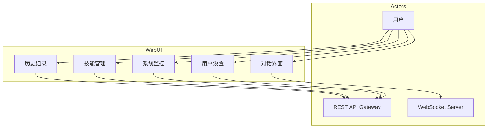
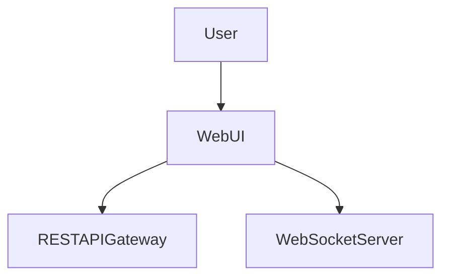

# Web UI 模块特性设计文档

## 1. 模块概述

### 1.1 模块定位
Web UI 是系统的可视化交互界面，基于 Vue 3 构建，提供对话界面、技能管理、系统监控等功能。

### 1.2 核心职责
- 对话界面展示
- 历史记录管理
- 技能管理界面
- 系统监控仪表盘
- 用户设置

### 1.3 涉及用例
| 用例ID | 用例名称 | 关联程度 |
|--------|----------|----------|
| UC1 | 发起对话 | 强 |
| UC3 | 查看历史 | 强 |
| UC4 | 管理技能 | 强 |
| UC6 | 监控运行 | 强 |

---

## 2. 用例图



### 用例说明

| 用例 | 说明 | 前置条件 | 后置条件 |
|------|------|----------|----------|
| 对话界面 | 实时消息展示、输入框、消息气泡、加载状态 | 用户已登录 | 对话已建立 |
| 历史记录 | 对话列表、会话选择、历史消息查看 | 用户已登录 | 历史已加载 |
| 技能管理 | 技能列表、新增/编辑/删除技能 | 用户已登录 | 技能已管理 |
| 系统监控 | 运行指标展示、日志查看、状态仪表盘 | 用户已登录 | 监控已展示 |
| 用户设置 | 个人信息、API配置、主题设置 | 用户已登录 | 设置已保存 |

---

## 3. 页面结构

### 3.1 页面清单

| 页面 | 路径 | 功能 |
|------|------|------|
| 登录页 | `/login` | 用户登录 |
| 注册页 | `/register` | 用户注册 |
| 对话页 | `/chat` | 主对话界面 |
| 历史页 | `/history` | 会话历史列表 |
| 技能管理页 | `/skills` | 技能管理 |
| 监控页 | `/monitor` | 系统监控 |
| 设置页 | `/settings` | 用户设置 |

### 3.2 组件结构

```
src/
├── components/
│   ├── Chat/
│   │   ├── ChatBubble.vue
│   │   ├── ChatInput.vue
│   │   └── MessageList.vue
│   ├── Layout/
│   │   ├── Sidebar.vue
│   │   └── Header.vue
│   ├── Skill/
│   │   ├── SkillList.vue
│   │   └── SkillForm.vue
│   └── Monitor/
│       ├── MetricCard.vue
│       └── LogViewer.vue
├── views/
│   ├── Login.vue
│   ├── Chat.vue
│   ├── History.vue
│   ├── Skills.vue
│   ├── Monitor.vue
│   └── Settings.vue
└── stores/
    ├── auth.js
    ├── chat.js
    ├── skills.js
    └── monitor.js
```

---

## 4. 代码模型设计

### 4.1 目录结构

```
frontend/
├── src/
│   ├── components/          # 组件
│   ├── views/              # 页面视图
│   ├── stores/             # Pinia状态管理
│   ├── api/                # API调用
│   ├── utils/              # 工具函数
│   └── App.vue
├── public/
├── package.json
├── vite.config.js
└── tailwind.config.js
```

### 4.2 关键组件与功能

#### Chat 组件

| 组件名 | 功能 | 说明 |
|--------|------|------|
| `ChatBubble` | 消息气泡 | 展示用户/Agent消息 |
| `ChatInput` | 输入框 | 消息输入、发送 |
| `MessageList` | 消息列表 | 消息滚动、加载更多 |

#### Layout 组件

| 组件名 | 功能 | 说明 |
|--------|------|------|
| `Sidebar` | 侧边栏 | 导航菜单、会话列表 |
| `Header` | 头部 | 用户信息、设置入口 |

#### Store 模块

| Store | 功能 | 状态 |
|-------|------|------|
| `auth` | 认证状态 | token, user, isLoggedIn |
| `chat` | 聊天状态 | messages, sessionId, isLoading |
| `skills` | 技能状态 | skills, selectedSkill |
| `monitor` | 监控状态 | metrics, logs, alerts |

---

## 5. 与其他模块的关系



| 模块 | 关系 | 说明 |
|------|------|------|
| RESTAPIGateway | 依赖 | 调用REST API |
| WebSocketServer | 依赖 | 实时消息推送 |
| User | 依赖者 | 用户交互 |

---

## 6. 版本历史

| 版本 | 日期 | 变更说明 |
|------|------|----------|
| v1.0 | 2026-06 | 初始版本 |