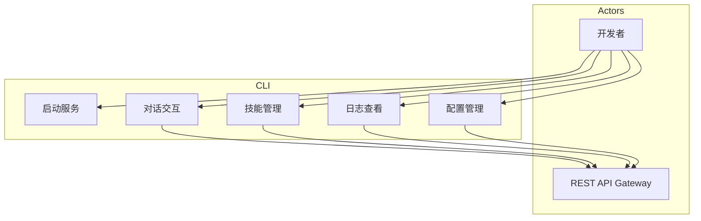
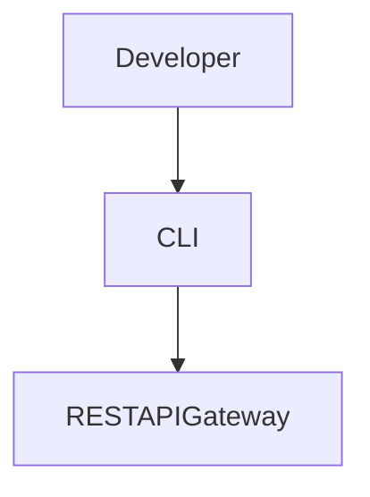

# CLI 模块特性设计文档

## 1. 模块概述

### 1.1 模块定位
CLI 是系统的命令行接口，基于 Python Click/Typer 构建，支持自动化脚本和批量操作。

### 1.2 核心职责
- 启动/停止/重启服务
- 命令行对话模式
- 技能管理
- 日志查看
- 配置管理

### 1.3 涉及用例
| 用例ID | 用例名称 | 关联程度 |
|--------|----------|----------|
| UC1 | 发起对话 | 强 |
| UC4 | 管理技能 | 强 |
| UC6 | 监控运行 | 中 |

---

## 2. 用例图



### 用例说明

| 用例 | 说明 | 前置条件 | 后置条件 |
|------|------|----------|----------|
| 启动服务 | 启动/停止/重启 Agent 服务 | 服务未启动 | 服务已启动 |
| 对话交互 | 命令行对话模式 | 用户已认证 | 对话已建立 |
| 技能管理 | 技能的增删改查 | 用户已认证 | 技能已管理 |
| 日志查看 | 查看运行日志 | 服务已启动 | 日志已显示 |
| 配置管理 | 查看/修改配置 | 用户已认证 | 配置已保存 |

---

## 3. 命令结构

### 3.1 命令清单

| 命令 | 子命令 | 功能 |
|------|--------|------|
| `agent` | `start` | 启动服务 |
| `agent` | `stop` | 停止服务 |
| `agent` | `restart` | 重启服务 |
| `agent` | `status` | 查看状态 |
| `chat` | - | 进入对话模式 |
| `skill` | `list` | 列出技能 |
| `skill` | `create` | 创建技能 |
| `skill` | `update` | 更新技能 |
| `skill` | `delete` | 删除技能 |
| `skill` | `execute` | 执行技能 |
| `log` | `tail` | 实时查看日志 |
| `log` | `show` | 查看历史日志 |
| `config` | `show` | 显示配置 |
| `config` | `set` | 设置配置 |

---

## 4. 代码模型设计

### 4.1 目录结构

```
backend/cli/
├── __init__.py
├── main.py               # 命令入口
├── commands/             # 命令实现
│   ├── __init__.py
│   ├── agent.py          # 服务管理命令
│   ├── chat.py           # 对话命令
│   ├── skill.py          # 技能管理命令
│   ├── log.py            # 日志命令
│   └── config.py         # 配置命令
└── utils/                # 工具函数
    ├── __init__.py
    └── api_client.py     # API客户端
```

### 4.2 关键命令实现

#### AgentCommand 类

| 方法名 | 功能 | 参数 | 返回值 |
|--------|------|------|--------|
| `start` | 启动服务 | `--port`, `--host` | `None` |
| `stop` | 停止服务 | - | `None` |
| `restart` | 重启服务 | - | `None` |
| `status` | 查看状态 | - | `Dict` |

#### ChatCommand 类

| 方法名 | 功能 | 参数 | 返回值 |
|--------|------|------|--------|
| `run` | 进入对话模式 | `--session-id` | `None` |
| `send` | 发送单条消息 | `--message`, `--session-id` | `str` |

#### SkillCommand 类

| 方法名 | 功能 | 参数 | 返回值 |
|--------|------|------|--------|
| `list` | 列出技能 | `--page`, `--limit` | `List[Dict]` |
| `create` | 创建技能 | `--name`, `--description`, `--prompt` | `Dict` |
| `update` | 更新技能 | `--id`, `--name`, `--description`, `--prompt` | `Dict` |
| `delete` | 删除技能 | `--id` | `None` |
| `execute` | 执行技能 | `--id`, `--input` | `Dict` |

---

## 5. 与其他模块的关系



| 模块 | 关系 | 说明 |
|------|------|------|
| RESTAPIGateway | 依赖 | 调用REST API |
| Developer | 依赖者 | 命令行交互 |

---

## 6. 版本历史

| 版本 | 日期 | 变更说明 |
|------|------|----------|
| v1.0 | 2026-06 | 初始版本 |