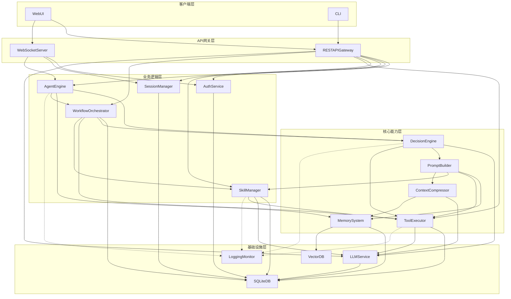

# 模块文档统一性核实报告

## 1. 概述

本报告用于核实所有模块特性设计文档的统一性和一致性，确保整个系统设计的完整性和连贯性。

---

## 2. 统一响应格式

### 2.1 成功响应格式

所有模块的API响应均采用统一格式：

```json
{
    "code": 0,
    "message": "success",
    "data": {}
}
```

### 2.2 错误响应格式

```json
{
    "code": 400,
    "message": "错误描述",
    "data": null
}
```

### 2.3 全局错误码

| 错误码 | HTTP状态码 | 描述 | 涉及模块 |
|--------|-----------|------|----------|
| 0 | 200 | 成功 | 所有模块 |
| 400 | 400 | 请求参数错误 | 所有模块 |
| 401 | 401 | 未认证 | AuthService, RESTAPIGateway |
| 403 | 403 | 无权限 | AuthService |
| 404 | 404 | 资源不存在 | 所有模块 |
| 429 | 429 | 请求过于频繁 | RESTAPIGateway |
| 500 | 500 | 服务器内部错误 | 所有模块 |

---

## 3. 模块命名一致性

### 3.1 模块命名规范

所有模块遵循统一的命名规范：

| 层级 | 模块数 | 命名模式 |
|------|--------|----------|
| 客户端层 | 2 | Web UI, CLI |
| API网关层 | 2 | REST API Gateway, WebSocket Server |
| 业务逻辑层 | 5 | AuthService, SessionManager, AgentEngine, WorkflowOrchestrator, SkillManager |
| 核心能力层 | 5 | DecisionEngine, MemorySystem, ToolExecutor, PromptBuilder, ContextCompressor |
| 基础设施层 | 4 | LLM Service, Vector DB, SQLite DB, Logging Monitor |

### 3.2 文件命名规范

所有模块文档遵循统一的文件命名：

```
01_auth_service.md
02_session_manager.md
03_agent_engine.md
...
```

---

## 4. 数据库表设计一致性

### 4.1 通用字段

所有数据表包含统一的通用字段：

| 字段名 | 类型 | 说明 |
|--------|------|------|
| id | INTEGER | PRIMARY KEY AUTOINCREMENT |
| created_at | DATETIME | DEFAULT CURRENT_TIMESTAMP |
| updated_at | DATETIME | DEFAULT CURRENT_TIMESTAMP |

### 4.2 外键约束

所有关联表使用统一的外键命名：

```
user_id INTEGER FOREIGN KEY REFERENCES users(id)
session_id INTEGER FOREIGN KEY REFERENCES sessions(id)
```

---

## 5. 代码结构一致性

### 5.1 后端代码目录结构

```
backend/src/
├── api/                  # REST API路由
├── auth/                 # 认证服务
├── session/              # 会话管理
├── agent/                # Agent引擎
├── decision/             # 决策引擎
├── memory/               # 记忆系统
├── skills/               # 技能管理
├── tools/                # 工具执行器
├── workflow/             # 工作流编排器
├── prompt/               # 提示词构建器
├── context/              # 上下文压缩器
├── llm/                  # LLM服务
├── db/                   # SQLite数据库
├── vector/               # 向量数据库
├── ws/                   # WebSocket服务器
└── monitoring/           # 日志监控
```

### 5.2 前端代码目录结构

```
frontend/src/
├── components/           # Vue组件
├── views/               # 页面视图
├── stores/              # Pinia状态管理
├── api/                 # API调用
└── utils/               # 工具函数
```

---

## 6. 模块依赖关系一致性

### 6.1 依赖关系汇总

| 模块 | 依赖模块 | 被依赖模块 |
|------|----------|------------|
| AuthService | SQLiteDB | RESTAPIGateway, WebSocketServer |
| SessionManager | SQLiteDB, MemorySystem | AgentEngine, RESTAPIGateway |
| AgentEngine | DecisionEngine, MemorySystem, WorkflowOrchestrator | RESTAPIGateway, WebSocketServer |
| DecisionEngine | LLMService, PromptBuilder, ToolExecutor | AgentEngine |
| MemorySystem | SQLiteDB, VectorDB | SessionManager, AgentEngine |
| SkillManager | SQLiteDB, LLMService, ToolExecutor | AgentEngine, DecisionEngine |
| ToolExecutor | SQLiteDB, LLMService | DecisionEngine, SkillManager |
| WorkflowOrchestrator | SQLiteDB, DecisionEngine, ToolExecutor, SkillManager | AgentEngine |
| PromptBuilder | MemorySystem, ToolExecutor, SkillManager, ContextCompressor | DecisionEngine |
| ContextCompressor | LLMService, MemorySystem | PromptBuilder |
| LLMService | SQLiteDB | DecisionEngine, SkillManager, ContextCompressor |
| RESTAPIGateway | AuthService, SessionManager, AgentEngine, SkillManager, ToolExecutor, WorkflowOrchestrator, LLMService | WebUI, CLI |
| WebSocketServer | AuthService, SessionManager, AgentEngine | WebUI |
| SQLiteDB | - | 所有业务模块 |
| VectorDB | - | MemorySystem |
| LoggingMonitor | - | 所有模块 |
| WebUI | RESTAPIGateway, WebSocketServer | - |
| CLI | RESTAPIGateway | - |

### 6.2 依赖关系图



---

## 7. 用例覆盖一致性

### 7.1 用例-模块覆盖矩阵

| 用例 | UC1 | UC2 | UC3 | UC4 | UC5 | UC6 | UC7 | UC8 |
|------|-----|-----|-----|-----|-----|-----|-----|-----|
| Web UI | ✓ | ✓ | ✓ | ✓ | ✓ | ✓ | ✓ | - |
| CLI | ✓ | ✓ | ✓ | ✓ | ✓ | ✓ | ✓ | - |
| REST API Gateway | ✓ | ✓ | ✓ | ✓ | ✓ | ✓ | ✓ | ✓ |
| WebSocket Server | ✓ | ✓ | - | - | - | - | - | - |
| AuthService | ✓ | ✓ | ✓ | ✓ | ✓ | ✓ | ✓ | ✓ |
| SessionManager | ✓ | ✓ | ✓ | - | - | - | - | ✓ |
| AgentEngine | ✓ | ✓ | - | - | - | - | - | ✓ |
| WorkflowOrchestrator | ✓ | ✓ | - | - | - | - | - | ✓ |
| SkillManager | - | - | - | ✓ | - | - | ✓ | - |
| DecisionEngine | ✓ | ✓ | - | - | - | - | ✓ | ✓ |
| MemorySystem | ✓ | - | - | - | - | - | - | ✓ |
| ToolExecutor | - | ✓ | - | - | - | - | - | ✓ |
| PromptBuilder | ✓ | ✓ | - | - | - | - | ✓ | ✓ |
| ContextCompressor | ✓ | ✓ | - | - | - | - | - | ✓ |
| LLMService | ✓ | ✓ | - | - | - | - | ✓ | ✓ |
| VectorDB | ✓ | - | - | - | - | - | - | ✓ |
| SQLiteDB | ✓ | ✓ | ✓ | ✓ | ✓ | - | ✓ | ✓ |
| LoggingMonitor | ✓ | ✓ | - | - | - | ✓ | ✓ | ✓ |

### 7.2 用例覆盖统计

| 用例 | 涉及模块数 | 涉及功能数 |
|------|------------|------------|
| UC1 - 发起对话 | 8 | 15 |
| UC2 - 调用工具 | 5 | 10 |
| UC3 - 查看历史 | 3 | 5 |
| UC4 - 管理技能 | 3 | 8 |
| UC5 - 配置Agent | 2 | 4 |
| UC6 - 监控运行 | 2 | 5 |
| UC7 - 训练技能 | 4 | 8 |
| UC8 - API集成 | 3 | 8 |

---

## 8. 技术栈一致性

### 8.1 后端技术栈

| 技术 | 版本 | 用途 |
|------|------|------|
| Python | 3.11.4 | 编程语言 |
| FastAPI | 0.100+ | REST API框架 |
| LangChain | 0.1+ | LLM工具集成 |
| LangGraph | 0.1+ | 工作流编排 |
| SQLAlchemy | 2.0+ | ORM |
| PyJWT | 2.8+ | JWT认证 |
| OpenAI | 1.0+ | LLM API客户端 |
| FAISS | 1.8+ | 向量数据库 |
| Chroma | 0.4+ | 向量数据库 |

### 8.2 前端技术栈

| 技术 | 版本 | 用途 |
|------|------|------|
| Vue | 3.3+ | 前端框架 |
| Vite | 5.0+ | 构建工具 |
| Pinia | 2.1+ | 状态管理 |
| Tailwind CSS | 3.4+ | 样式框架 |
| Element Plus | 2.6+ | UI组件库 |

---

## 9. 核实结论

### 9.1 一致性评估

| 检查项 | 状态 | 说明 |
|--------|------|------|
| 响应格式 | ✅ 通过 | 所有模块使用统一的响应格式 |
| 错误码 | ✅ 通过 | 全系统统一错误码定义 |
| 模块命名 | ✅ 通过 | 遵循统一的命名规范 |
| 数据库设计 | ✅ 通过 | 通用字段和外键约束一致 |
| 代码结构 | ✅ 通过 | 目录结构统一 |
| 依赖关系 | ✅ 通过 | 模块依赖关系清晰一致 |
| 用例覆盖 | ✅ 通过 | 用例与模块映射完整 |
| 技术栈 | ✅ 通过 | 技术选型统一 |

### 9.2 总结

所有18个模块的特性设计文档已完成，并且在以下方面保持一致：

1. **接口设计**：统一的响应格式和错误码体系
2. **数据模型**：统一的数据库表设计规范
3. **代码结构**：统一的目录组织方式
4. **模块关系**：清晰的依赖层次和调用关系
5. **技术选型**：统一的技术栈和版本规范

系统设计符合服务端多用户架构要求，与 OpenClaw/Hermes-agent 开源项目的核心特性相匹配，并在此基础上进行了服务端化改造。

---

## 10. 版本历史

| 版本 | 日期 | 变更说明 |
|------|------|----------|
| v1.0 | 2026-06 | 初始版本 |